# 안드로이드 스튜디오

* AVD : 안드로이드 테스트용 가상 스마트폰
* 안드로이드는 코틀린( 구글 ), java를 주로 쓴다. 
* android 내부에서 ai 기능을 지원할 수 있도록 최신 버전으로 계속 업데이트 

### 안드로이드의 특징 

* 안드로이드 시스템 내부에서 Life cycle을 관리한다.

* **컴포넌트 기반**
  * Activity  : 화면
  * service : 화면 없이 back 단에서 실행되는 기능
  * Content Provider : 앱에서 발생하는 데이터를 다른 앱에서도 사용할 수 있는 기능.
  * Broad Cast Reciever : ??

* **리소스**의 **외부화** 

  * 리소스 : 정적 요소 (문자열 , 이미지 , 화면 디자인 등... )

    * 이러한 리소스를 정의하는 파일을 따로 둔다.*(R.java)*
    
  * 기존의 웹은 문서마다 경로 설정을 따라다니면서 주었는데, 안드로이드는 편리하게 수정 가능하다.
  
  * 100% 외부화 성공
    
    

## 안드로이드 설치

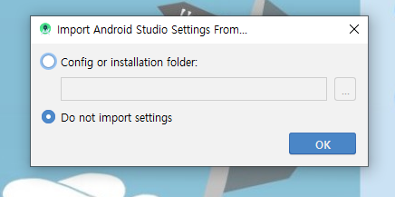

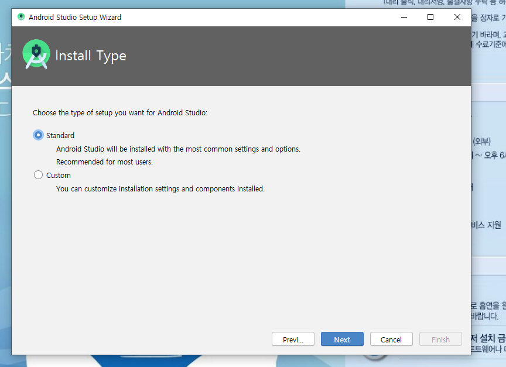

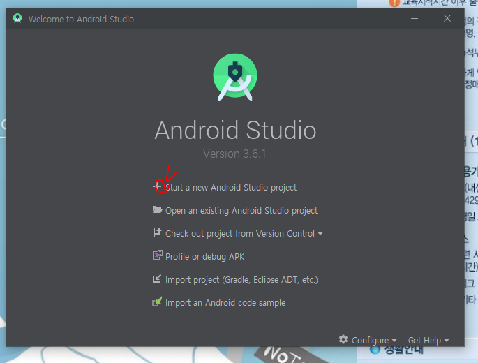

* package 이름 : market에서 어플을 식별할 수 있는 코드 

  * 회사명.프로젝트명.작업명
  * minimum SDK : 최소 사양

  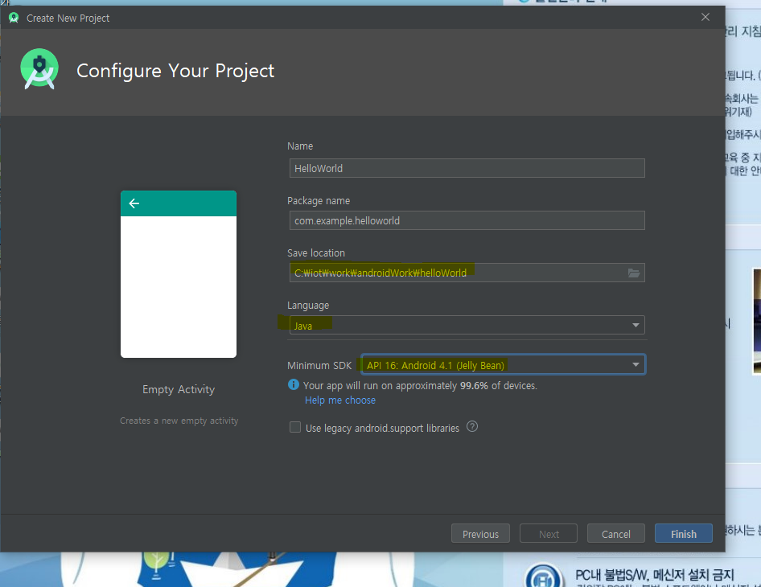

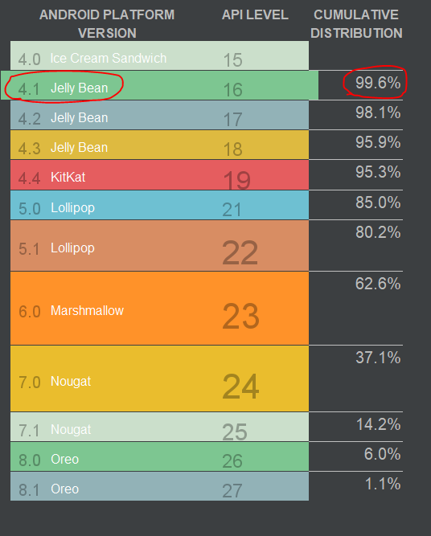

* gradle 기반 작업 ( cf, sts - maven)

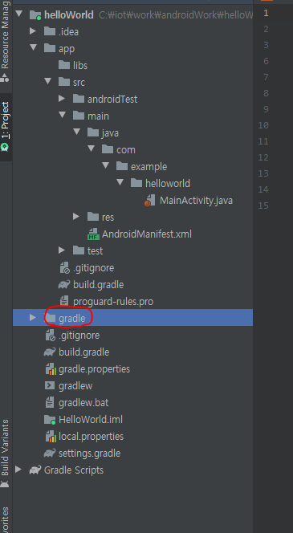

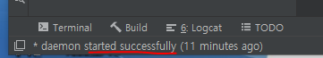

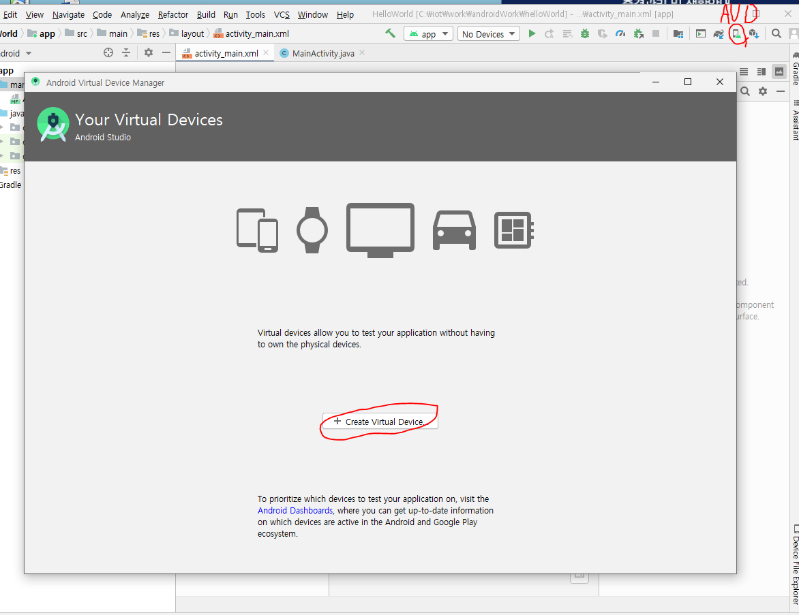

* 가장 기본의 형태로 구현

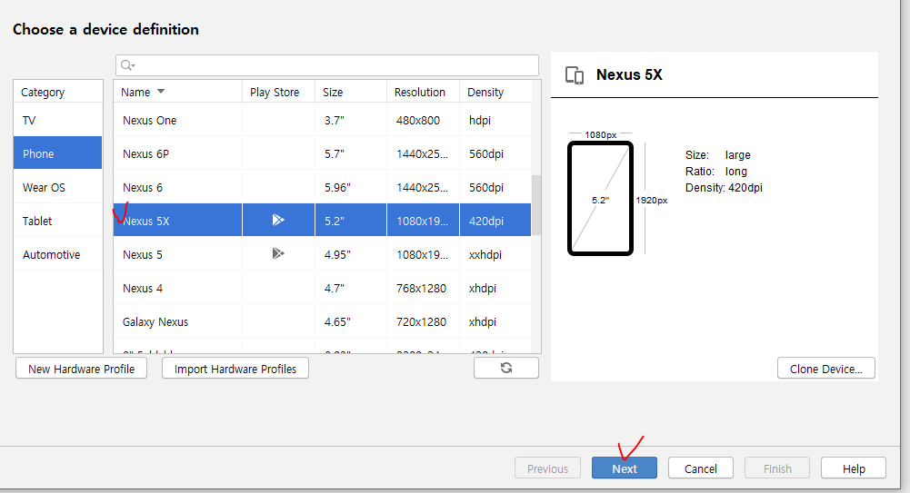

*

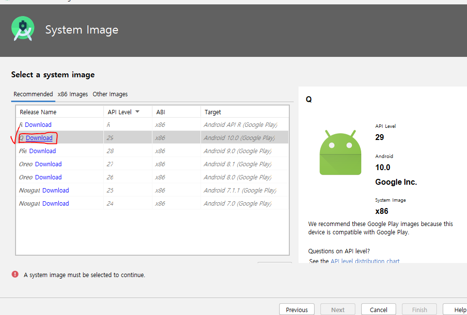

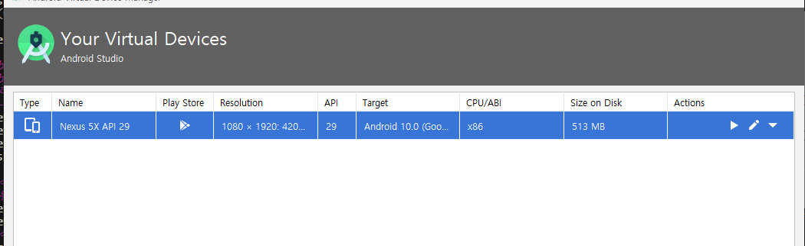

* 목록에 올라온 것 확인

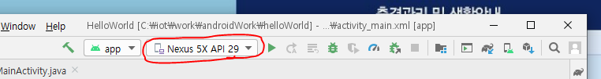