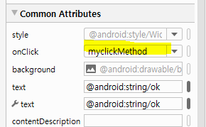

# 안드로이드 스튜디오

* AVD : 안드로이드 테스트용 가상 스마트폰
* 안드로이드는 코틀린( 구글 ), java를 주로 쓴다. 
* android 내부에서 ai 기능을 지원할 수 있도록 최신 버전으로 계속 업데이트 

### 안드로이드의 특징 

* 안드로이드 시스템 내부에서 **Life cycle**을 관리한다.

* **컴포넌트 기반**
  
  * Activity  : 화면
  * service : 화면 없이 back 단에서 실행되는 기능
  * Content Provider : 앱에서 발생하는 데이터를 다른 앱에서도 사용할 수 있는 기능.
* Broad Cast Reciever : ??
  
* **리소스**의 **외부화** 

  * 리소스 : 정적 요소 (문자열 , 이미지 , 화면 디자인 등... )

    * 이러한 리소스를 정의하는 파일을 따로 둔다.*(R.java)*
    
  * 기존의 웹은 문서마다 경로 설정을 따라다니면서 주었는데, 안드로이드는 편리하게 수정 가능하다.
  
  * 100% 외부화 성공
    
    

## 안드로이드 설치


* package 이름 : market에서 어플을 식별할 수 있는 코드 

  * 회사명.프로젝트명.작업명
  * minimum SDK : 최소 사양

  


* gradle 기반 작업 ( cf, sts - maven)


* 가장 기본의 형태로 구현


*


* 목록에 올라온 것 확인


* 

* 

  * onCreate : 반드시 호출해야 하는 메소드. (Override)

  * *R.layout.activity_main* : 리소스

  * view 는 xml 기반으로 작성된다.

    * TextView : lable - 디스플레이 용도 

    

* AndroidManifest : 앱에 대한 설명서(명세 파일)라고 생각하면 된다. 


* 


* resource 파일들의 이름은 내부에서 설정되어 있기 때문에 절대로 바꾸면 안된다. 

  * 해상도에 따라 이미지가 매칭되어 보인다.
  * **Strings** 화면에 찍을 문자열 정의
  * 작성 시 자동으로 generate 된다.

  * 

  

  

  

* eventlog : 실행. 에러 기록들이 담긴다. 


* 화면 디자인 - 속성 설정 


* 공통 속성 설정


* Ok 버튼 활성화 시키기


```java
Toast.LENGTH_LONG : 토스트 메세지가 길게 화면에  나타남
Toast.LENGTH_SHORT : 토스트 메세지가 짧게 화면에  나타남
```




[결과]


* [새로운 프로젝트 작성 실습 ] 

  * Package : exam.day01.first
  * 프로젝트 명 : firstPro
  * 화면에 표시된 레이블을 지우고 버튼 세개 추가 (확인, 취소, 삭제)
  * 글꼴 변경
  * avd 실행

  


*  eclipse에서와 달리 Sysout 으로는 디버깅이 어렵다. 
  * `Log.d()` 를 사용하여 콘솔창에 띄운다. 


* 메소드 오버라이딩


### LifeCycle

* 시작
  * onCreate(생성) - > onStart - > onResume
  * onCreate(생성) : 생성될 때(시작할 때) 뜨는 화면 구현 / 초기화 / Setting
  * onStart : 서버 구현 / 재시작


* 일시정지 
  * onPause - > onStop
  * 다시 시작 시, onStart로 시작.
  * onPause : 작업 중지
  * onDestroy : 반납

