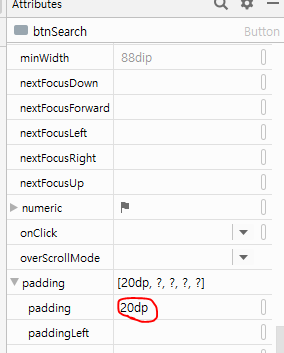
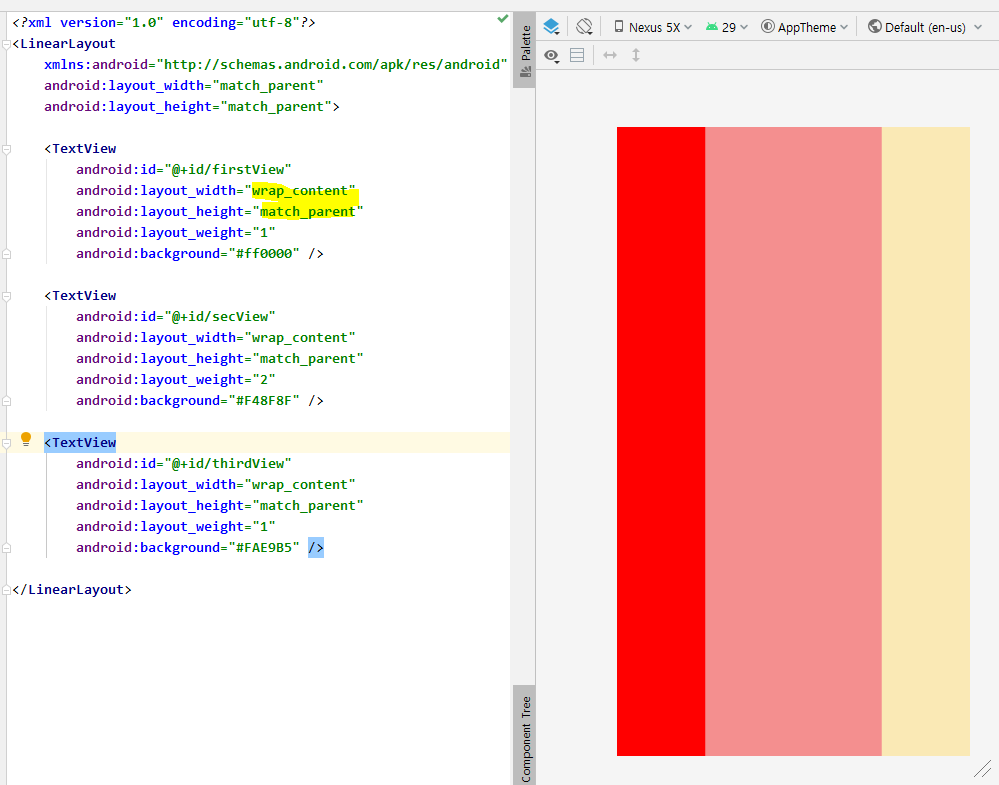

## Android View

> View : 일반적으로 컨트롤이나 위젯으로 불리는 UI  구성 요소.
>
> ​				즉, 사용자의 눈에 보이는 화면의 구성 요소들. 
>
> ViewGroup 은 뷰를 상속하여 뷰그룹도 뷰처럼 다룰 수 있다.

* View :mobile_phone_off: : 화면을 디자인하는 구성 요소
  * ViewGroup : View를 여러 개 담고 있는 모음
    * Layout : View를 어떻게 배치할 지 
  * Widget
    * TextView
    * Button


### widget :phone:

​                 화면을 디자인 할 때는 Layout객체 위에 view를 올려놓아야 한다... 


* LinearLayout : 순서대로 배치되는 것.
  * **Layout_width** : View의 너비
  * **Layout_height** : View의 높이
  * **orientation** : 배치 방향
  * **id** : 각 위젯을 식별할 수 있는 이름
  * **margin** : 주위 여백
  * **padding** : 내부 컨텐츠와 border 사이의 간격
  * **layout_weight** : 여백을 해당 view의 사이즈로 포함
  * **Layout_gravity** : parent 내부에서 View의 정렬
  * **gravity** : view 내부에서의 정렬 *(ex . 글자 정렬)*
* android:layoutXXX : 지정한 영역만 보여준다
  * **match_parent** : 부모의 width 사이즈만큼 그린다. 
  * **wrap_content** :  원래 가지고 있는 정 사이즈


* orientation = " vertical "


* 버튼 3개의 너비와 높이가 부모에 맞게 꽉 차게 그려져서 1개만 나온다.


* activity (xml) 파일 **rename** 방법 : refactor


* id  설정 : 식별성을 주기 위한 속성 


* 버튼 사이즈 설정 - `dp`라는 단위를 지정해주어야 한다.   - `dpi` 의미
  * `dp`를 사용하게 되면 다른 크기의 diplay에서 깨질 수 있다. 
  * 웬만하면 match 와 wrap 이용하기


* padding 설정



* layout_weight

  * 만약 1로 설정 시 여백을 전체 다 차지한다. 
  * 전체 다 1로 설정 시 ( 1: 1: 1)

  

  * 2: 1: 1 로 설정시 

* Layout_gravity


* gravity


###  레이아웃 추가


* TextView : 기능 없이 그냥 보여지는 글자 
  * 글자 없이 wrap_content 만 잡힌 상태




* 하나의 화면에 여러개의 레이아웃 중첩하기

  * 전체 outer : vertical
  * 내부 : horizontal
  * 버튼은 무조건 wrap...

  ```xml
   <Button
              android:layout_width="wrap_content"
              android:layout_height="wrap_content"
              android:text="버튼3"/>
  ```

  

  


* MainActivity에 layout이 올라오지 않을 경우

* 

### Constraint

* RelativeLayout : 상대적으로 상위 컴포넌트, 이웃 컴포넌트의 위치를 가지고 상대적으로 배치시키는 것 
* Constraint_Layout : 제약사항 ( 왼쪽, 위쪽 )을 주어 위치를 지정해준다
  * 기준이 되는 뷰 (Parent xxx) 를 잡아놓고 그에 따라 움직인다.
    * 이동 시 같이 이동된다. 


* 기준 선 만들기


* 첫번째 실행되는 Activity임을 나타내는 구간


* gradle: build tool


* 
  * Activity 수정


* import 세팅


* android:id 

  

  * @id: 식별자 
  * @android : 내부에서 제공해주는 식별 값 참조해서 쓸 때 

* 런쳐 갯수만큼 생성

