# 안드로이드 레이아웃

### - Market

shift + shift 누를 시 검색 가능

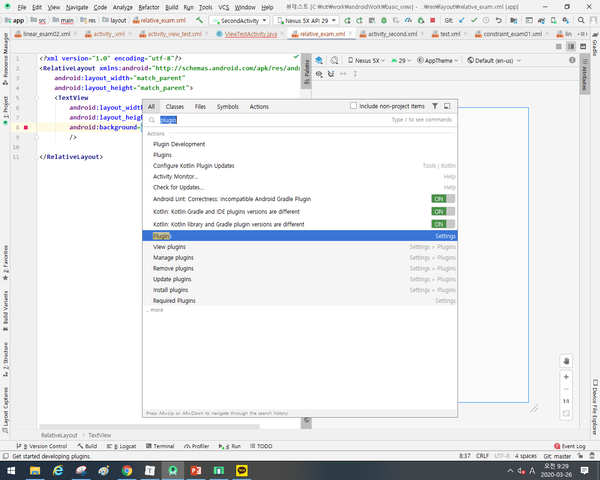

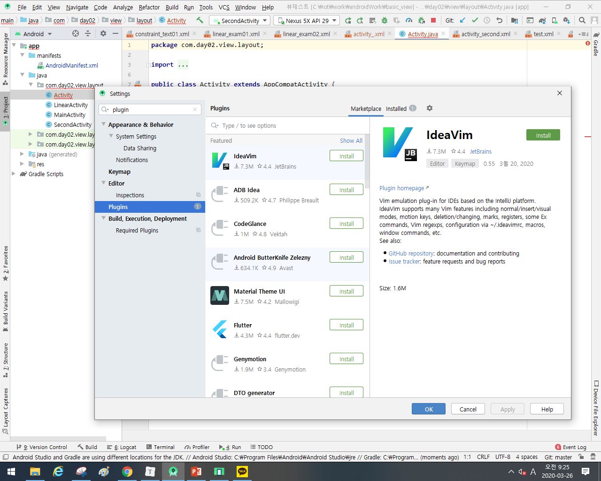

### - 뷰의 영역

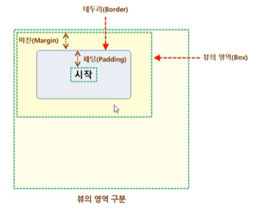


## 1. 상대 레이아웃

* parent View나 다른 View와의 상대적인 위치 계산
* 안에서 위치 값 계산을 위한 연산이 있기 때문에 성능 저하가 발생한다.
* 부모 기준으로 가운데 이동

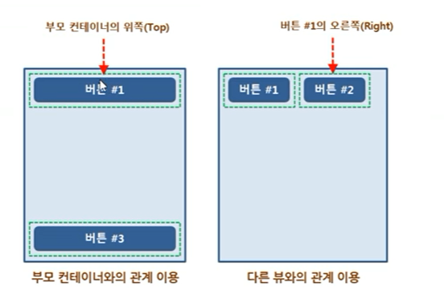

```xmlk
android:layout_centerInParent="true"
```

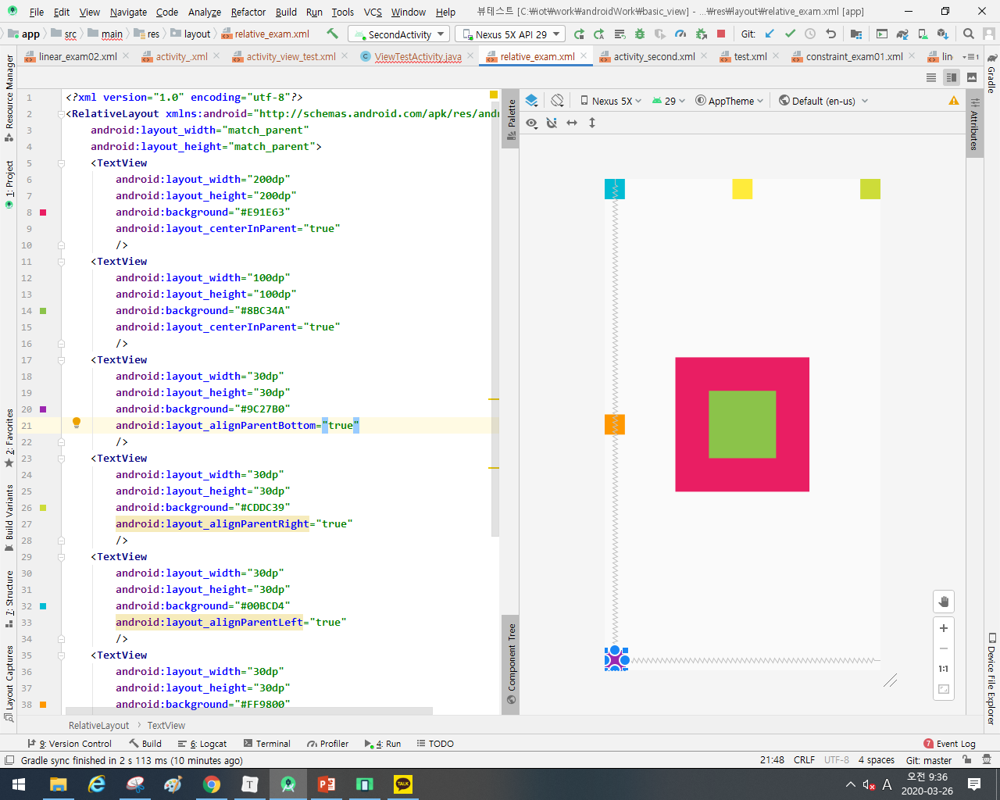


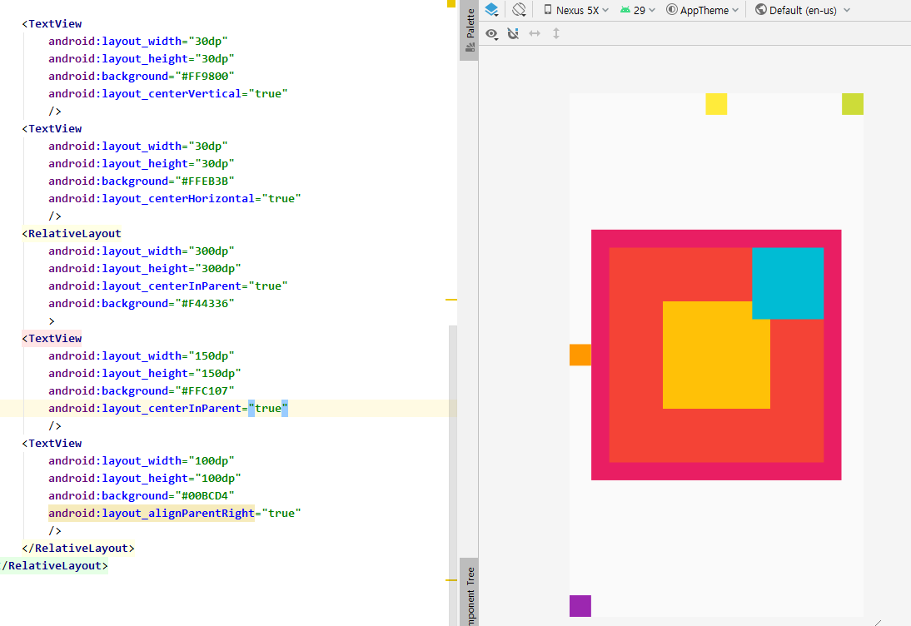

*  layout_toRightOf : @id 를 기준으로 오른쪽에 배치시킨다. 

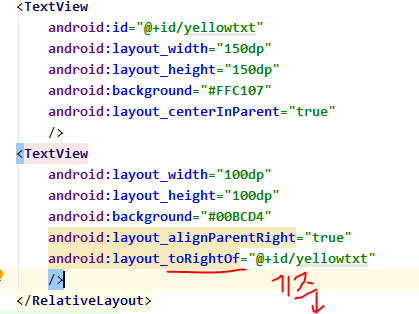

## 2. 테이블 레이아웃

* 격자(Grid) 모델

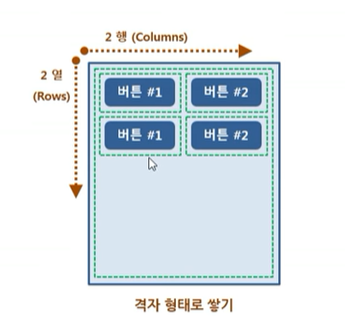

> 표나 엑셀 시트와 같은 형태로 화면을 구성하도록 
>
> linear 로는 weight를 각각 주어야 하는 상황을 stretchColumn을 통해서 간편하게 줄 수 있다.

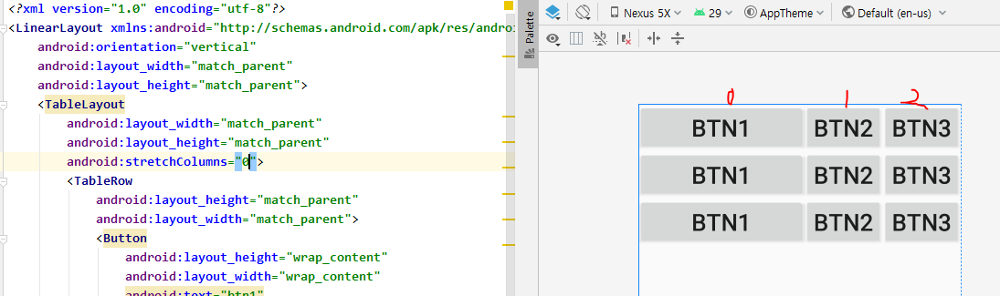

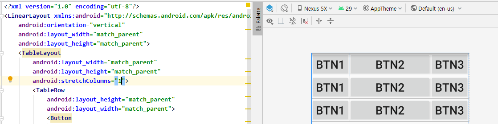

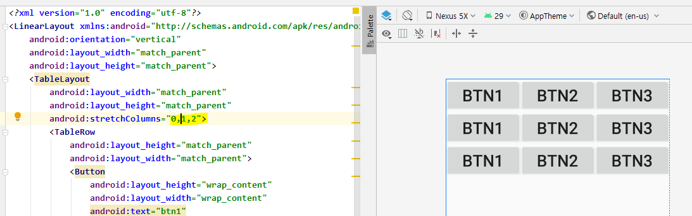


## 3. 이미지 뷰

* 가운데에서 이미지를 당긴 것 같은 기능으로 주로 쓰임.

```xml
android:scaleType="centerCrop"
```

* matrix : 원본 사이즈 그대로 
  * 왼쪽 상단에 붙는다. 

```xml
android:scaleType="matrix"
```


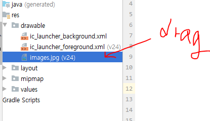

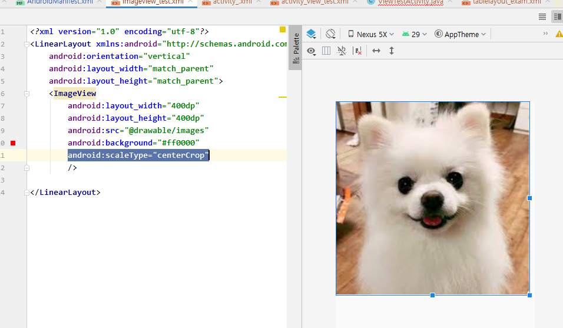

## 4. 프레임 레이아웃

* Single 모델
* **가장 상위에 있는 하나의 뷰** OR 뷰 그룹만 보여주는 방법
* 여러 개의 뷰가 들어가면 **중첩**하여 쌓이게 된다. 
  * 가장 단순하지만 여러 개의 뷰를 중첩한 후 각 뷰를 전환하여 보여주는 방식이다. 

*cf ) LinearLayout : 순서대로 배치되는 것.*

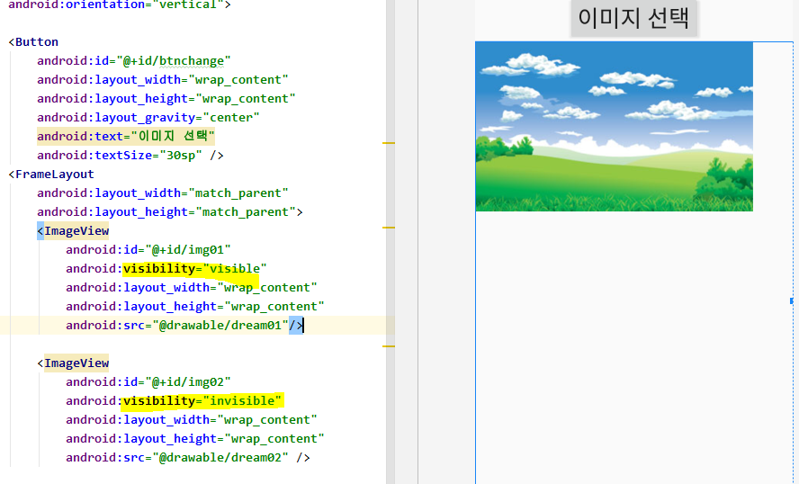

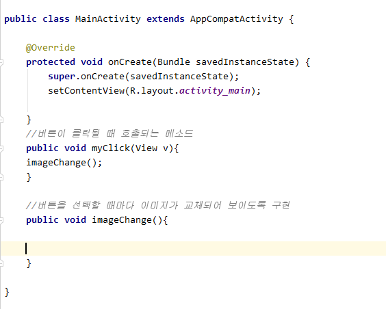

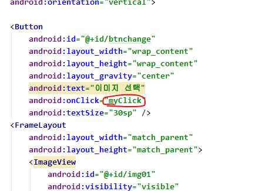

* 버튼이 눌릴 때마다 index가 바뀌면서 이미지의 visibility 속성을 바꾸어 준다.

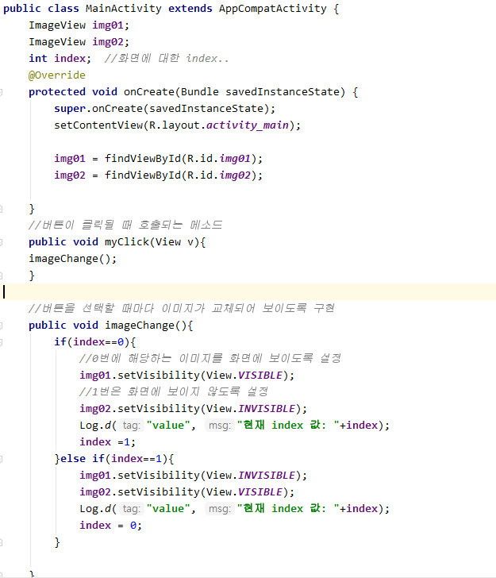

* Logcat 디버깅을 통해 확인

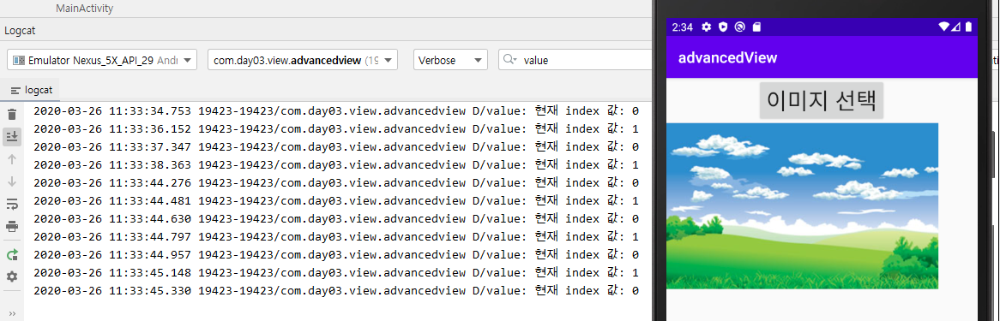

## 5. 스크롤 뷰

* 자식이 딱 한개여야 한다.
* 기본적으로 스크롤은 수직이다. 

```xml
  <ScrollView
        android:layout_width="match_parent"
        android:layout_height="600dp">
    </ScrollView>

```

* android:fillViewport  : 추가된 속성이 화면에 꽉 차게 보여지는 것으로 ScrollView 추가시 항상 넣어준다.
  * 속성을 true로 추가
* 수평, 수직을 모두 감싸고 싶을 때.

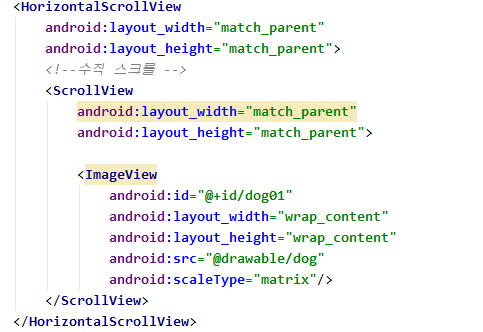

* 실행할 클래스 : 리스터

## 6. 이벤트

* **이벤트 소스** : 이벤트를 발생시킨 객체 (ex. 버튼) 
* 소스코드에서 클릭 이벤트를 처리하도록 하려면 **SetOnClickListener()** 메소드 사용

#### 클래식한 방법

* ```
  //이벤트를 발생시킬 소스 객체가 있는 액티비티에서 이벤트를 처리하는 작업도
  //같이 할 수 있도록 구현
  //1.이벤트에 반응하는 (미리 정해져 있다.) 클래스를 상속받는다.
  //2.메소드를 오버라이딩 한다.
  //    Ex) 버튼을 클릭할 때
  //          실행 될 리스너 = > View.OnclickListner의 onClick메소드가 호출
  ```

  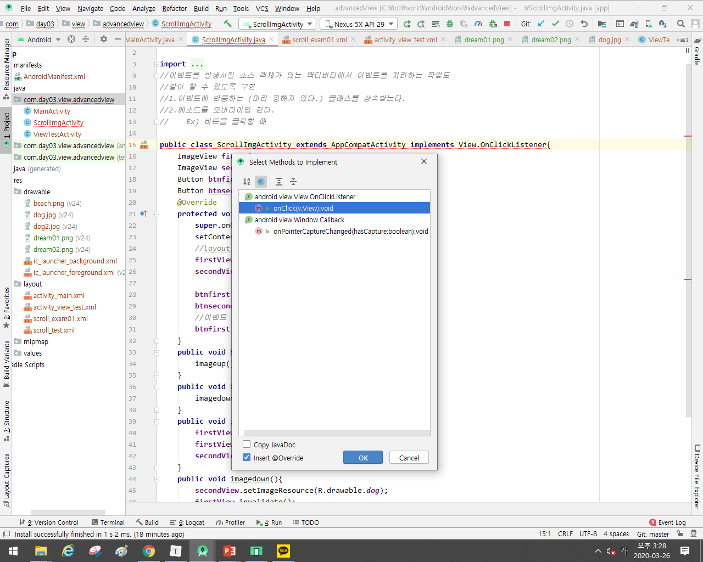

  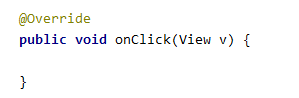

* 이벤트 구현할 리스너 상속받이서 만들어야 한다.

* setOnClickListener라는 메소드를 이용해서 이벤트 소스에 이벤트가 발생했을 때 처리할 기능이 구현된 리스너 객체가 어떤 것인지 등록.

  

```java
btnfirst.setOnClickListener(this); 
//this - activity이면서 이벤트 처리하는 리스너 객체 (implement했기 때문)
btnsecond.setOnClickListener(this);
```

* 버튼에 반응이 오는 지 확인

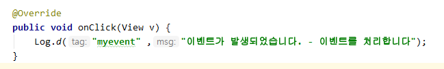

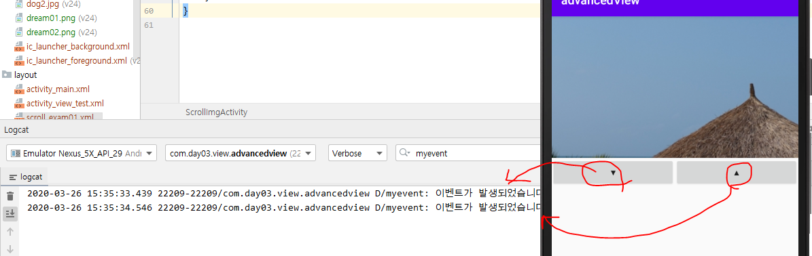