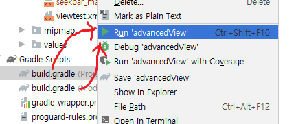

## 1. Drawable

* 뷰에 설정할 수 있는 객체이며, 그 위에 그래픽을 그릴 수 있다.
* 드로어블 XML 파일은 이미지를 버튼 배경으로 설정한 것처럼 `/app/res/drawable` 폴더 안에 넣어 버튼(뷰)의 배경으로 설정

* 

##  

**안드로이드는 API 레벨 별로 이용할 수 있는 클래스와 메서드가 다르다.** 

안드로이드의 정적 메소드 이용해서 텍스트 작성 

### 채팅창 만들기

* LinearLayout  지정해주기.

* AVD에 에러가 생길 때

* 데이터 초기화

## 2. ETC - event 처리

* `Activity`는 화면이라고 생각
* Activity1 에서 Activity2화면 변경 할 때 new 해서 하지 않고 **component 기반**으로 연동
* 모든 activity 는 Manifest에 저장되어야 한다.
* `<intent-filter>`가 가장 먼저 실행되는 것.

### 1. SeekBar

* 설정을 나타낼 때
* 사용자가 값 변경이 가능하다.

* AppCompat : 호환성

* layoutXml

[결과]

* 버튼으로 설정 값 변경하기

* 리스너 연결

* 모든` id`는 int형 상수
  * 
* SeekBar 값 불러와서 setting 하기

* touch 처리
  * web의 keypress up/down 과 비슷

### 2. ProgressBar

* 진행 상황을 나타내준다.
* `read-only` - 사용자가 수정이 불가능하다.

*  ProgressBar 증가/감소/설정시키는 버튼 만들기

* 만약 0~100부터 증가시키고 싶으면 for문을 돌려서 동작시키면 된다.

### 3.  [etc](https://developer.android.com/guide/components/activities/intro-activities)

* DatePicker

* CalendarView

#### Layout 인식 에러 발생시

* gradle이랑 sync 맞춰주기

