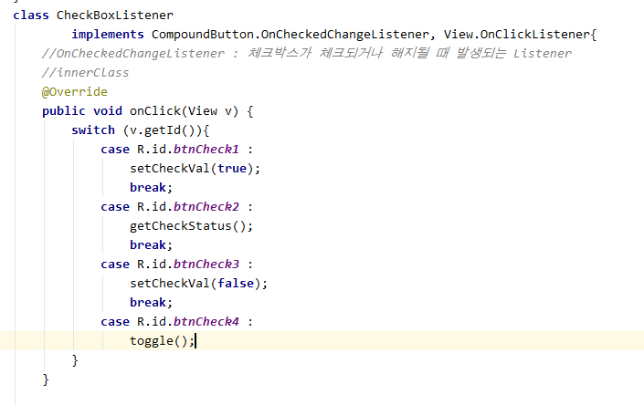
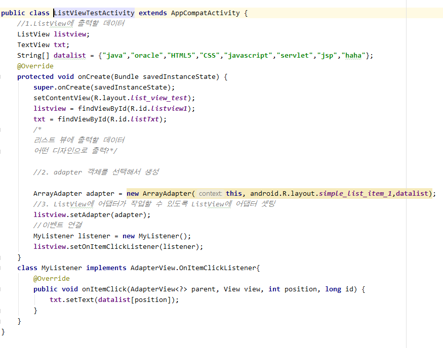
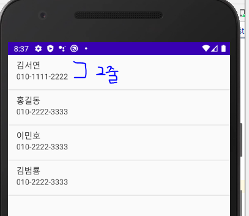

# 기능 View

## 1. ETC


## 2. 선택 widget

### 1. CheckBox


* Checkbox

  * if / else 이벤트 처리
  * checkbox 3개를 각각 배열로 관리해 준다.

  ```java
   CheckBox[] checkArr = new CheckBox[3];
  ```

  * XML


* ACTIVITY


* 기능 구현 





[실습]

*체크박스의 상태가 변경될 때 호출되는 메소드*
*체크박스와 스위치가 선택되면 toast로 "xxx체크 박스 선택"*
*해제되면 "xxx체크 박스 해제"*
*스위치도 체크 해제에 따라 토스트 출력*


### 2. RadioBox


## 3. Adapter

* 많은 정보를 효과적으로 처리하기 위해, View에 직접 정보를 주입하지 않고, `Adapter`라는 중간 매개체를 이용.

  * `ListAdapter`, `SpinnerAdapter `,....

### 1. ListView

* ListView에 담길 데이터를 String[] 타입의 datalist에 넣어 출력하기
* ArrayAdapter  :  `T 타입의 배열 데이터`를 이용한 Adapter. `List`, `T[]`



* list_view_test.xml


* ListView  클릭 시  TextView 내용 변경


### 2. ArrayAdapter 

* simple_list_item_1 : **한 줄씩 출력** 
* `View view`매개변수가 목록을 구성하는 하나의 데이터가 출력되는 row를 구성하는 TextView

```java
public ArrayAdapter (Context context, 
                int resource, 
                int textViewResourceId, 
                List<T> objects)
```


```java
 listview.setOnItemClickListener(new AdapterView.OnItemClickListener() {
      @Override
            public void onItemClick(AdapterView<?> parent, View view, int position, long id) {
                
                TextView listTxt = (TextView)view;
                txt.setText(listTxt.getText());
            }
 }
```


* array.xml


[결과]


* **두 줄 텍스트**로 리스트뷰를 구성하기 : `simple_list_item2` 

  * ```java
     ArrayList<HashMap<String,String>> listdata =
                new  ArrayList<HashMap<String,String>>();
    ```

  


[결과]

