# Inflation

* **인플레이션** : 앱이 실행될 때 XML레이아웃의 내용이 메모리에 객체화되는 과정  

* 전체 화면이 아닌 부분 화면을 xml 레이아웃에 정의한 후 불러와서 보여줄 때 사용한다

  * `setContentView()` 메서드는 activity  화면 전체를 설정하는 역할만 수행하므로, `setContentView() `메서드는 부분 화면을 메모리에 객체화할 수 없다. 
  * 즉, **부분화면을 메모리에 객체화**하려면 인플레이터를 사용해야 한다.
  * 안드로이드는 이를 위해 `LayoutInflater` 클래스를 제공한다. 
  * `LayoutInflater` 는 시스템 서비스로 제공하는 클래스이므로 **getSystemService()**메서드를 이용하여 사용

  ```java
  getSystemService(Context.LAYOUT_INFLATER_SERVICE)
  ```

  

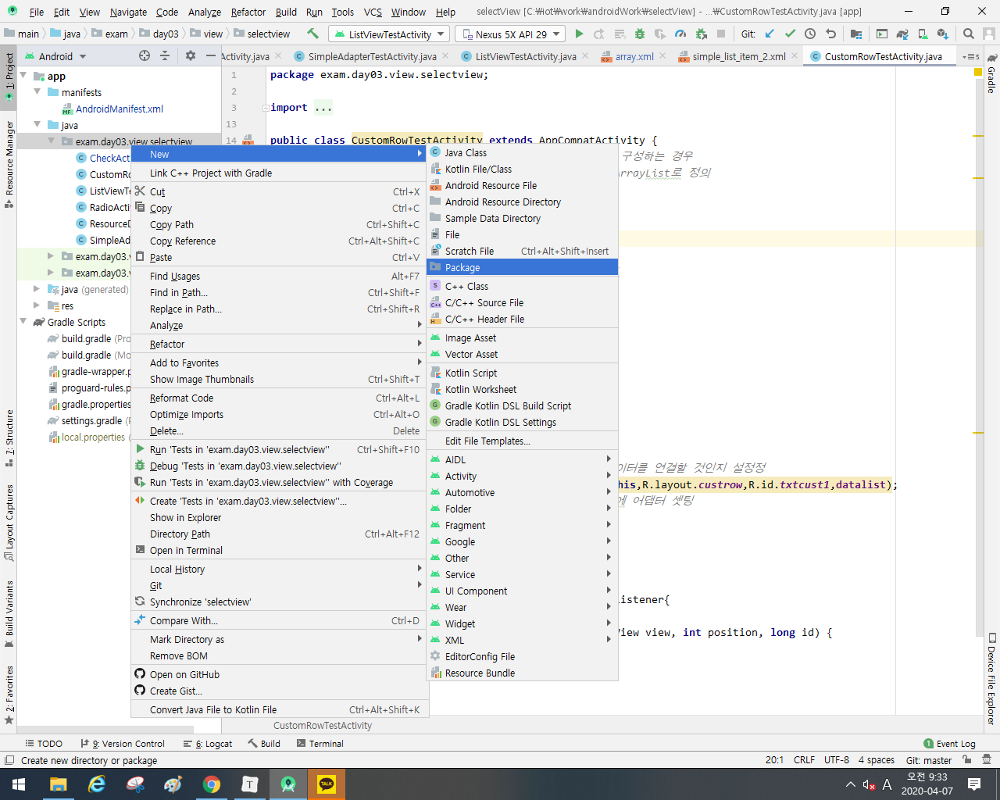

* package를 product별로 나누는 것이 아니라 성격 별로 나눈다고 생각하면 된다.

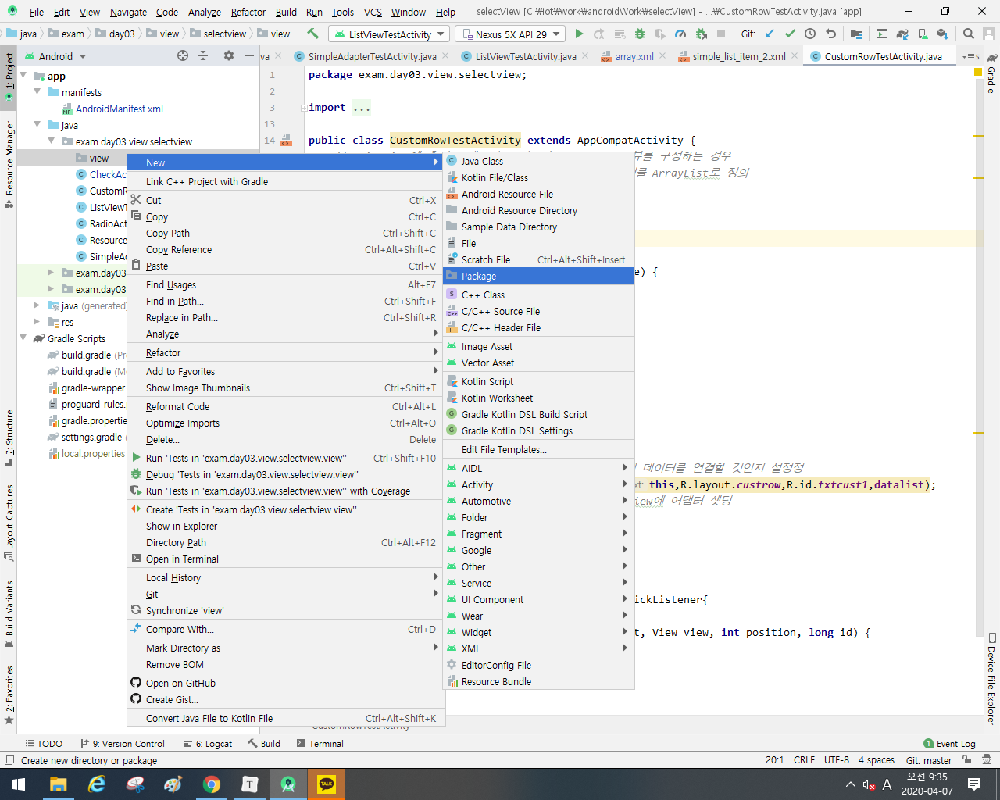

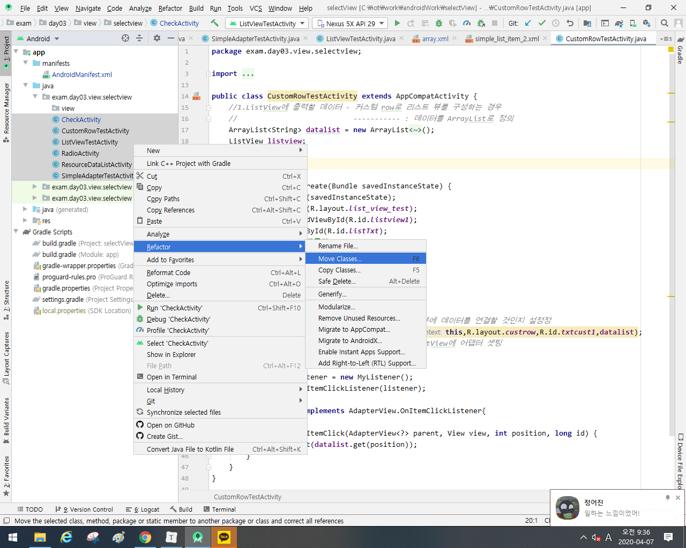

* 클래스 이동

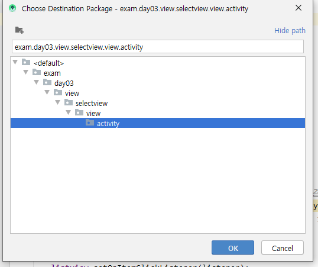

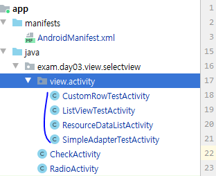

* 기능 별 package 구성

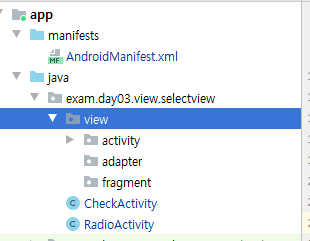

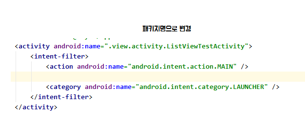


Ctrl  + 함수 클릭시 함수 정보를 얻을 수 있다.

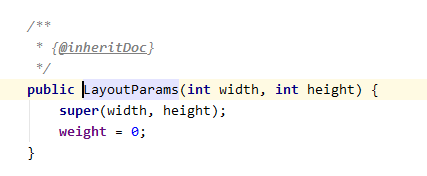

## 1. 코드로 Layout 작성시

* android 내부에서 사용할 정보가 setting 된 것이 **context**
  * 즉 ,설정 값

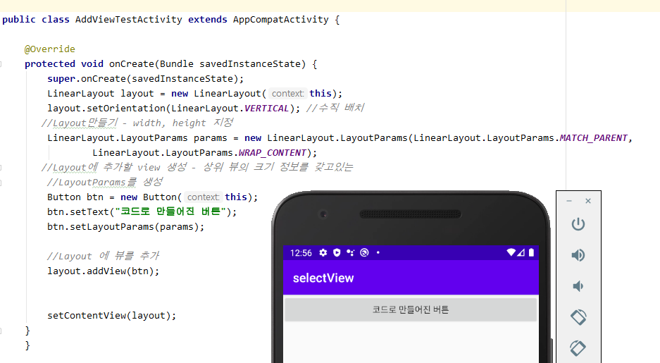

* 보통 인플레이터 (xml)을 사용하지만 이렇게 코드를 작성해야 할 때가 있음
  * 

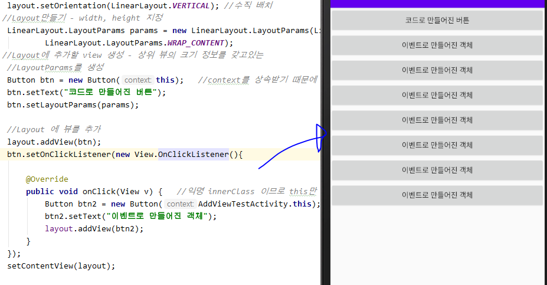

* setOnClickListener는 익명 innerClass 이므로 this만 호출 시 에러발생

* *inflation 예제*
  * *버튼을 누르면 include_view.xml을 파싱해서 붙이는 작업*

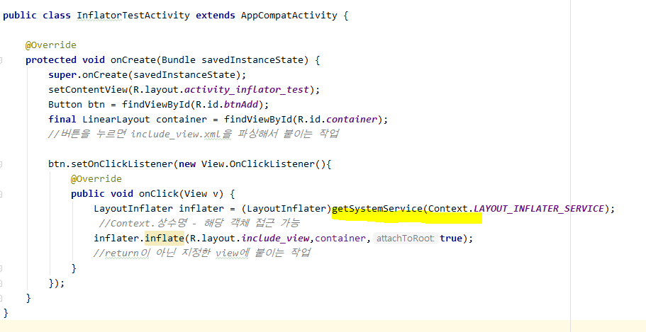

*[결과]*

*지정한 xml을 객체로 만든 뒤, Parent View에 붙이는 작업*

*버튼 두개 생성*

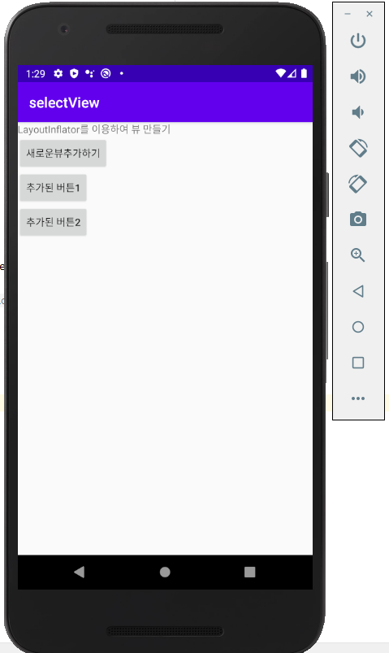


## 2. 사용자 정의 Adapter

애뮬레이터 실행 시, 오류가 나서 꺼질 때가 있다.

이는 메모리에 객체화되지 않은 버튼 객체를 참조하려 했기 때문이다.

* run 확인하기

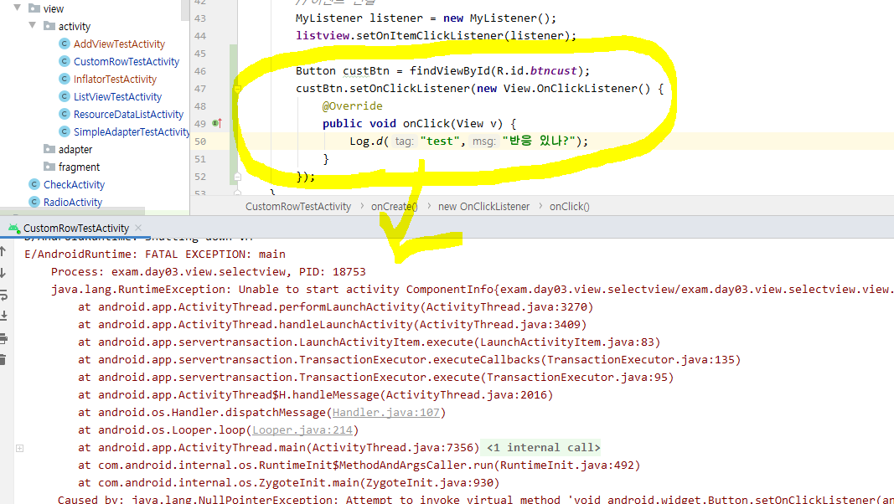

따라서,  adapter 커스터마이징 필요하다.


* 안드로이드에서 앱 구성할 때 목록 형식을 가장 많이 사용

* 사용자 정의로 디자인한 뷰를 목록으로 사용하고 싶은 경우
* 안드로이드 내부에서 제공하는 Adapter로 표현하고 싶은 내용을 모두 표현할 수 없다.
  * 이벤트 연결, 각 목록의 구성을 다르게 생성

### [ 구성 요소 ]

* Adapter를 이용해서 출력할 데이터를 저장하는 객체 (DTO)
  * row에 출력할 데이터 정보를 담는 객체 생성


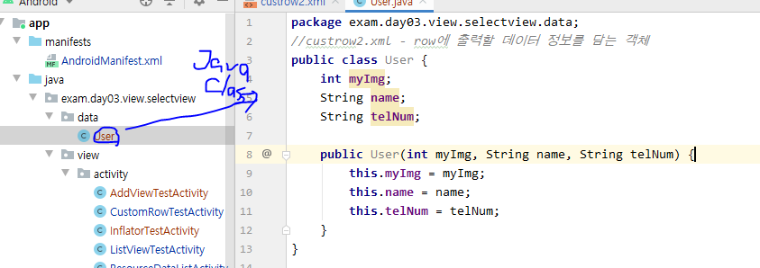

#### :star:사용자 정의 Adapter 

1. **안드로이드에서 제공하는 Adapter클래스를 상속**

   * 리스트 뷰를 만들 때 필요한 정보를 저장할 수 있도록 멤버변수 정의

   ```java
   (Context , row 디자인 리소스 , 데이터)
   ```

   

2. **생성자 정의**

   * 상속받고 있는 ArrayAdapter의 생성자 호출

3. **`ArrayAdapter`에 정의되어 있는 메소드를 오버라이딩**

   * Adapter를 통해 만들어진 리스트 뷰를 보여줄 Activity
   * main Layout 필요

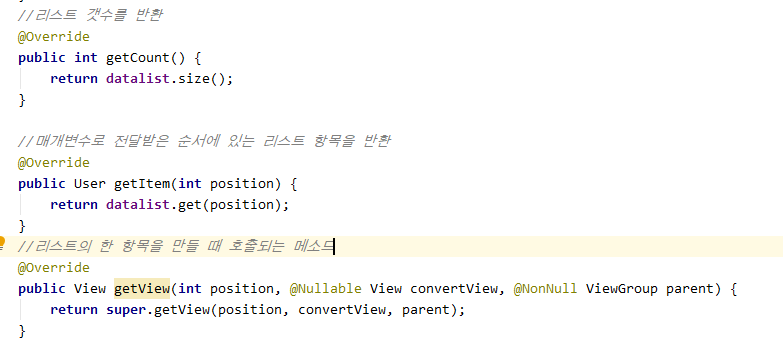

* **getView** : 리스트뷰의 한 항목이 만들어질 때마다 호출

  * 즉,  리스트 항목이 100개면 100번 호출
* 전달된 리소스를 이용해서 뷰를 생성 (LayoutInflator)
  * 한 row를 구성하는 뷰를 찾아서 데이터와 연결 작업

  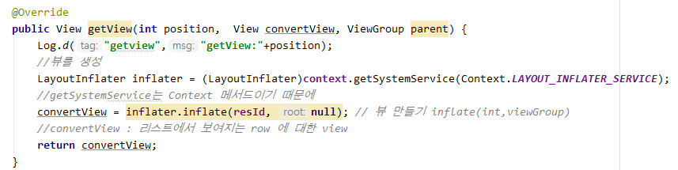

  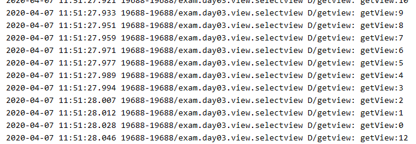

  * 매번 이렇게 getView를 호출한다. 하지만 효율이 떨어짐을 알 수 있다. 

  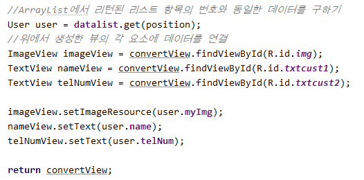

  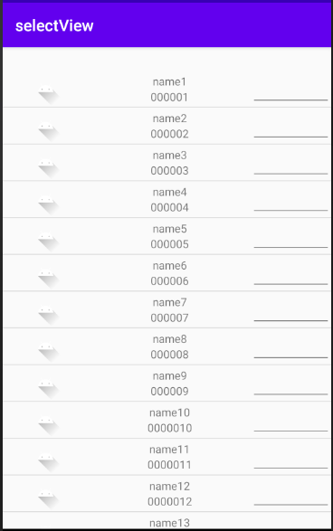
  
  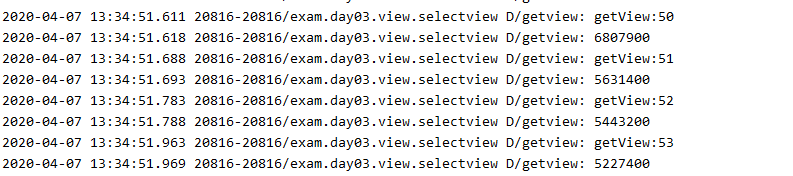

#### :eagle: 수행 속도 개선

4. **getView 메소드에서 성능 개선을 위한 코드 작성**
   * 한 번 생성한 view 재사용
   * findViewById는 한 번만 찾아오기

* 한번도 만들어 진 적이 없을 때만(null)  inflate 시킨다.

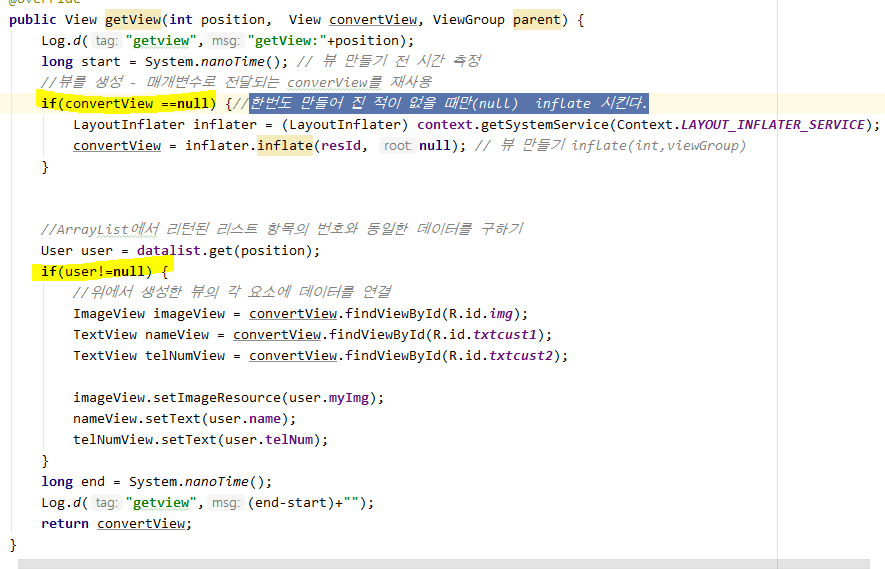

5.  **ViewHolder 객체 생성**

* 목록 형식의 View, adapter 이용한 view에서 반드시 해주어야 한다.

   * row를 구성하는 뷰를 한 번 findViewById하기
   * row에 대한 구성 View를 멤버 변수로 선언
   * 생성자에서 findViewById 처리 구현
   * 최초로 뷰를 만들 때 (row에 대한 뷰) 이 객체를 생성해서 활용

   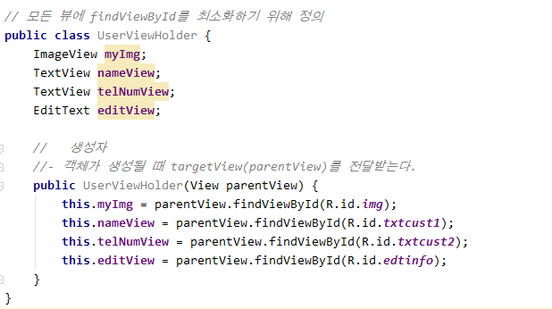


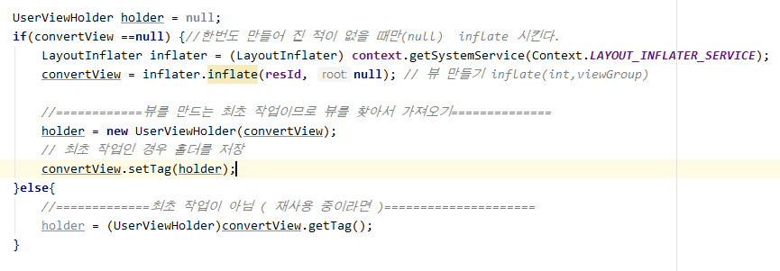

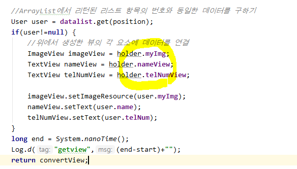

6. **row를 구성하는 뷰에 상태값을 저장하기**
   - 각 뷰의 이벤트를 통해 저장
   - 각 뷰의 상태 값을 저장할 수 있도록 객체를 만든다.
     - 다른 작업을 하더라도 데이터가 남아있어야 한다. 
     - 상태 값을 저장한 객체를 자료 구조에 저장.
   - focus를 잃어버릴 때 상태를 저장
   - row마다 사용자가 설정한 값을 position과 함께 데이터 저장

```java
//해당 position에 대한 설정 값을 같이 출력
//저장하는 시점은 사용자가 설정을 끝낸 시점 - focus를 잃어버리는 시점
HashMap<Integer,SaveUserState> saveData = new HashMap<Integer, SaveUserState>();
//데이터가 하나면 <Integer,String>으로 해주어도 된다.
```

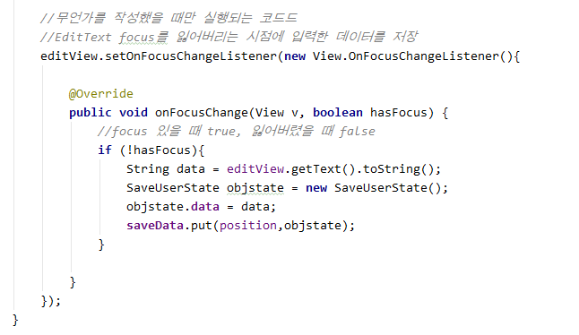

#### Spinner

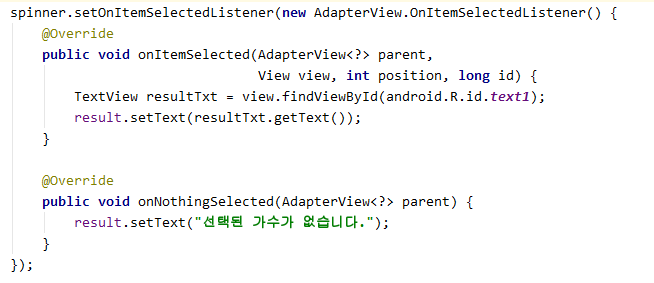

[결과]

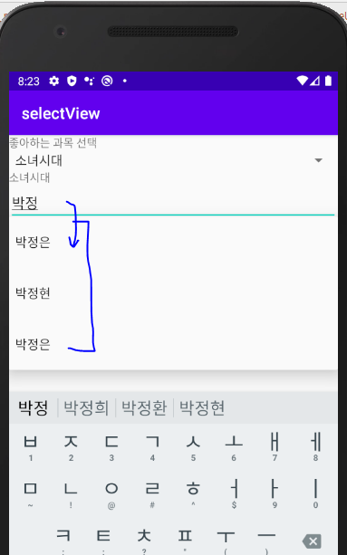

# intent

>  **intent** : 여러 화면 만들고 화면 간 전환을 해준다.
>
> ​				다른 컴포넌트를 실행시켜준다.

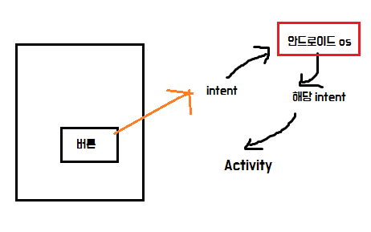

## 안드로이드 앱 구성 요소

* **액티비티** : View
* **service** :  back 단
* **브로드캐스트 수신자** : device에서 발생되는 모든 사건.
* **내용 제공자** : 데이터 공유