# Intent 

혼자서 실행되지 않고, 안드로이도 os에 의해서 실행된다.

## [기본 실행]

**1. 인텐트 객체를 센팅하고 실행할 액티비티의 정보와 데이터를 셋팅**

```java
            Intent intent = new Intent(MainActivity.this,
                    SecondActivity.class);
```

* 값 : `putExtra` 메소드를 이용
* 객체 : 

**2. 안드로이드 Os에 인텐트 객체 넘기며 의뢰**

* 액티비티 실행

```java
 startActivity(intent);
```

**3.인텐트에 설정되어 있는 액티비티 호출**

**4.호출된 액티비티에서는 안드로이드OS가 넘겨준 인텐트를 가져오기** 

**5. 인텐트에 셋팅된 데이터를 꺼내서 활용**(get)

```java
	     Intent intent = getIntent();
        bt2.setOnClickListener(new View.OnClickListener() {
            @Override
            public void onClick(View v) {
                finish(); // 액티비티 종료
            }
        });
```

 

* 모든 액티비티는 Manifest에 등록되어 있어야 한다.

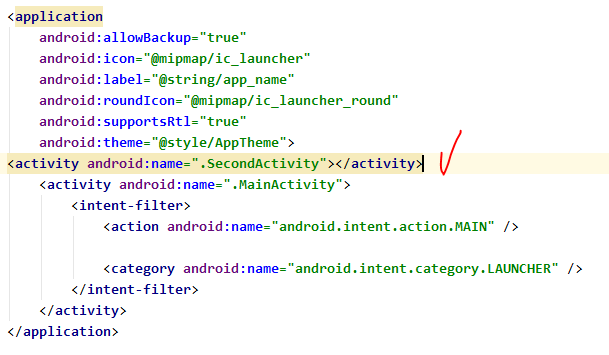

* MainActivity
  * `putExtra` : key,value 같이 넣어준다. 

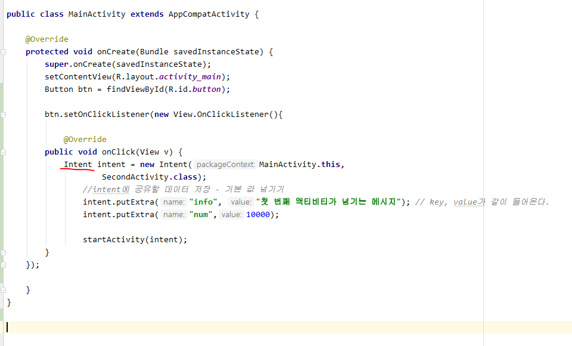

* SecondActivity

  * intent로부터 값 가져온다.

  * ```java
    public int getIntExtra(String name,int defaultValue)
    ```

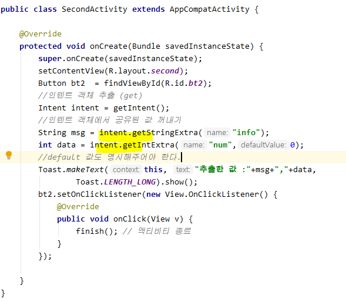

* `startActivityForResult`: 되돌아 올 때 사용되는 메소드


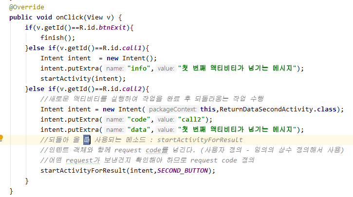

* 인텐트 객체와 함께 `request code`를 넘긴다. (사용자 정의 - 임의의 상수 정의해서 사용)

  * 어떤 request가 보낸건지 확인해야 하므로 `request code` 정의

* `onActivityResult`  : 되돌아와서 마무리하는 메서드
  * 인텐트를 통해서 액티비티를 호출하고 되돌아오는 경우 메소드 추가해서 작업
  * `onActivityResult`를 오버라이딩해서 처리할 작업 구현
* requestCode - 요청을 헸던 뷰를 구분하기 위한 코드
* resultCode - 결과코드
* data - intent

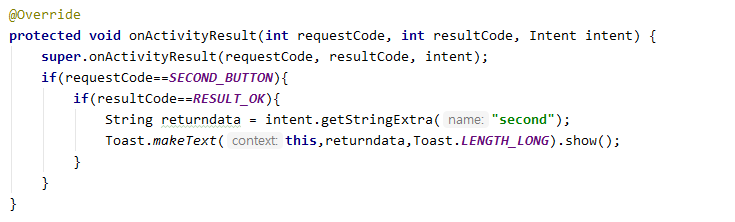

[결과]

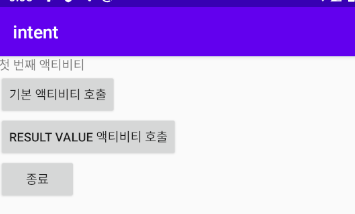

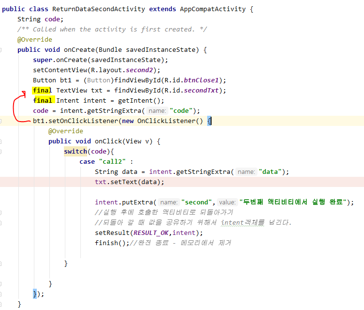

[결과]


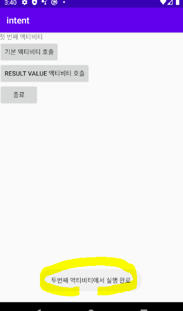

## [기본 실습] :derelict_house:

* **명시적 intent** 

```java
 Intent intent = new Intent(ExamFirstActivity.this, ExamSecondActivity.class);
```

* `getText()`는 **Editable**형태이기 때문에 **toString**처리 해주어야 한다.


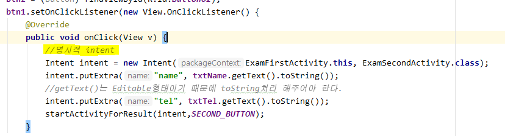

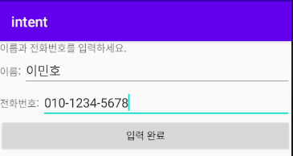

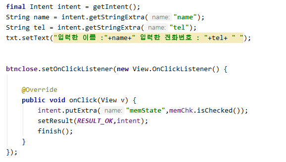


*Object 형이 있으면 최상위 이기때문에 그 메소드를 사용하면 된다.*


## 1. Parcelable

* 기본 타입 뿐 아니고 커스텀 클래스나 오브젝트를 다른 컴포넌트에 전달해 줘야 할 경우

* 안드로이드에서 인텐트에 **객체를 공유**하고 싶은 경우에는 반드시 Parcelable타입으로 정의
  *  Parcelable를 implements 하고 메소드를 적절하게 오버라이딩!

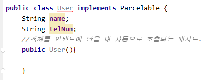

* 안드로이드 Os가 객체를 복원할 때 `CREATOR`를 찾아서 CREATOR에 **createFromParcel** 를 호출한 후 반환되는 값을 이용해서 사용

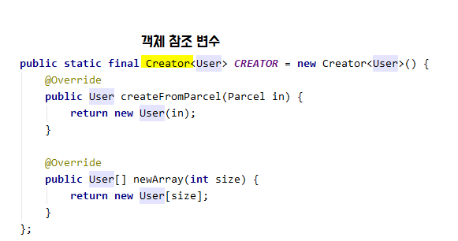

```java
    @Override
    public void writeToParcel(Parcel dest, int flags) {
        dest.writeString(name);
        dest.writeString(telNum);
    }
```

* Activity에서 User 공유


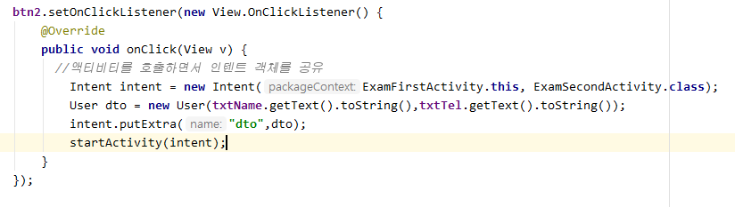

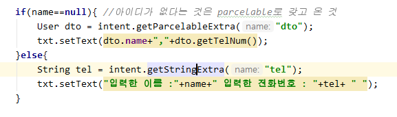

* parcelable을 통해 다른 앱에서도 데이터 공유가 가능하다.


## 2. Action? 

* `action` - component 중 main activity / 이런 일을 하는 액티비티 임을 명시
  * category - luncher에 의해서 실행되는 앱

`<intent-filter>`로 실행에 확실한 기능을 제공해준다

```xml
<category android:name="android.intent.category.DEFAULT"/>
<!--일반 적인 component 임을 나타냄--> 
```

* 명시적 INTENT

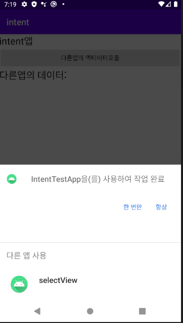

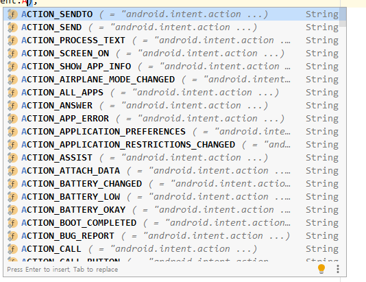


## 3. intent로 다른 애플리케이션 열기

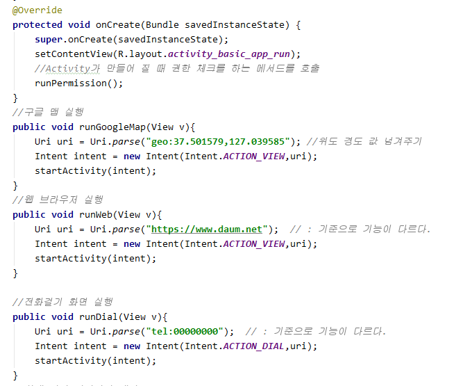

### :star:전화 걸기

* 개인 정보, 요금 등의 이유로 권한 부여 및 체크 /승인 필요
  * RUN에서 AVD의 번호를 알 수 있다.

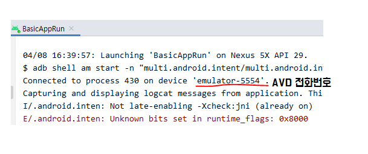

* 전화걸기 권한 부여

```xml
<uses-permission android:name="android.permission.CALL_PHONE"></uses-permission>
```

* 승인받을 권한의 목록
  * 권한 - String 상수

```java
    String[] permission_list = {
            Manifest.permission.CALL_PHONE
    };
```

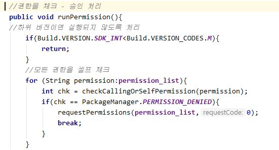

* 새로 실행한 AVD 전화번호
  * AVD끼리 연결되는 것을 볼 수 있다.

Connected to process 7505 on device 'emulator-5556'.

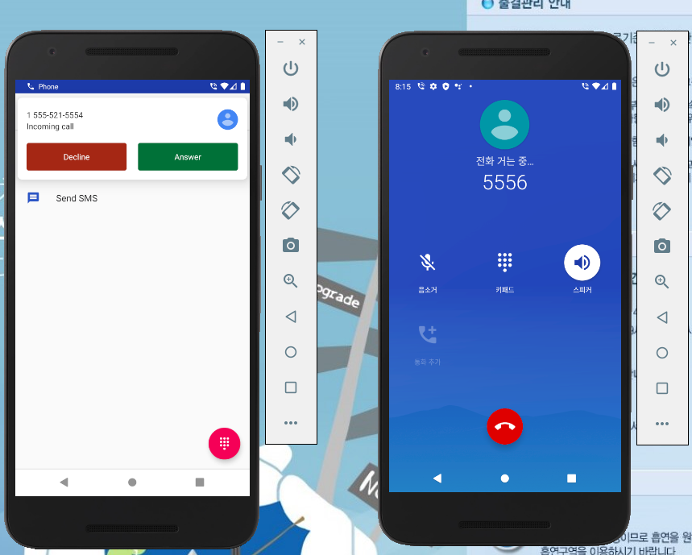