* 실행 오류는 - run에서

* Log.d() - logcat에서 

# [위임 권한](https://developer.android.com/guide/topics/permissions/overview?hl=ko) 부여하기


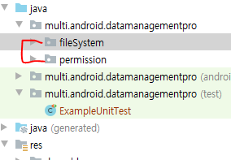

* [주의] AVD 경로 오류 발생시
  * .lock 모두 지우기

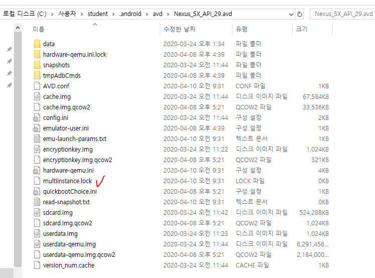

* 정적인 문자열 관리 (string.xml)

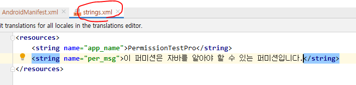

## 1. 일반 권한(normal)

* 낮은 수준의 보안이다. 

* 앱 설치 시 사용자에게 권한이 부여되어야 함을 알려주고 설치할 것인지를 물어본다.
* 사용자가 수락하면 앱이 설치되고 앱에는 INTERNET권한 부여됨

* permission 설정

  * permission android:name 이름은 아무거나 설정 가능
  * 기본 권한 부여 : **use-permission**을 이용해 permission을 사용할 수 있다.

  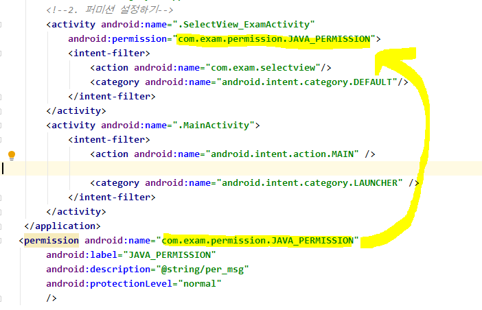

* 사용자 permission 사용
  
  * 프로젝트 소스 코드에 위험권한을 부여해달라는 소스코드

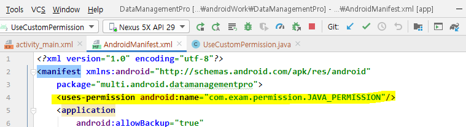

[결과]

​	*- permission 사용 가능 (Pro가 뜨는 것을 볼 수 있음)*

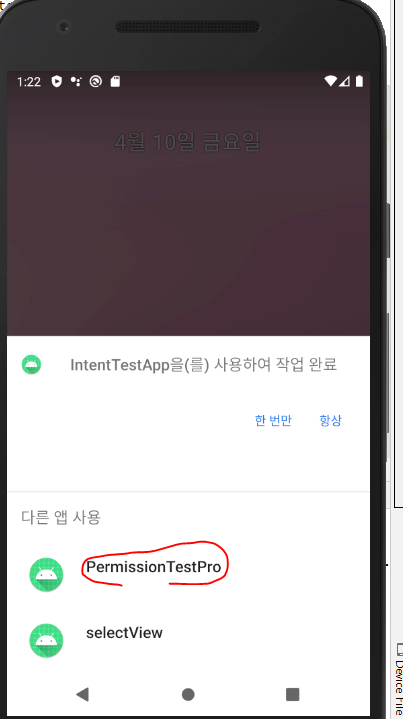


* 위험 권한이 아니기 때문에 Manifest에 작성하여 권한을 부여하는 것 : [**시스템 권한**](https://developer.android.com/guide/topics/security/permissions?hl=ko)

## :man_mechanic:2. 위험 권한(Dangerous)

> 액티비티를 실행하거나 버튼을 누르거나 어떤 기능을 사용할 때 **권한에 대한 처리**를 할 수 있도록 구현

* 설치 시 부여한 권한은 의미가 없으며, 실행 시에 사용자에게 권한을 부여할 것인지 물어본다.
  * 사용자가 권한을 부여하지 않으면 해당 기능이 동작하지 않음.
* 위험 권한으로 분류된 권한들에 대해서는 앱을 설치할 때가 아니라 **앱을 실행할 때** 권한을 부여하도록 변경됨.

###  1. 사용 메소드

* `checkSelfPermission` : 퍼미션의 현재 상태를 확인하는 메서드 (int 리턴)
  * `PERMISSION_GRANTED` : 퍼미션이 부여되어 있는 상태
    `PERMISSION_DENIED` : 퍼미션이 부여되지 않은 상태
* `requestPermissions` : `checkSelfPermission` 의 리턴값이 `PERMISSION_DENIED` 인 경우
  * 권한이 체크되어 있지 않은 경우에 권한을 요청하는 메시지 표시
  * 이 메소드 이외에도 제공되는 메소드는 여러개
* onRequestPermissionsResult : requestPermission의 결과로 호출되는 메소드 
  * 퍼미션 설정 정보를 매개변수로 넘긴다
  * `requestCode` : 퍼미션 요청할 때 넘긴 요청 코드
  * `permissions` : 요청 퍼미션 목록
  * `grantResults` : 퍼미션 설정 성공 결과
* `shouldShowRequestPermissionRationale()` : 왜 권한이 필요한지 나타내주는 함수

### 2. 처리 순서

1. 현재 사용하려고 하는 권한이 설정되어 있는지 체크
   * `checkSelfPermission`를 이용
2. 1번에서 리턴값이 `PERMISSION_DENIED` 인 경우 사용자가 권한을 설정할 수 있도록 메시지를 표시
   * `requestPermissions`
3. 요청 처리 후 자동으로 호출되는 메소드를 통해 다음에 어떤 처리를 할 것인지 정의
   * **권한 성공** => 기능이 실행되도록 
   * **권한 실패** => Preference를 통해 설정할 수 있도록 액티비티를 이동하거나 안내 메시지 출력

## :star: UsePermission 

### 1. Webview

* `Webview` 권한 설정
* `Webview`  : 앱에서 인터넷 사이트를 연결할 때 사용한다. 
  * 안드로이드에서 web을 사용하기 위해서는 정보를 세밀하게 셋팅해주어야 한다.

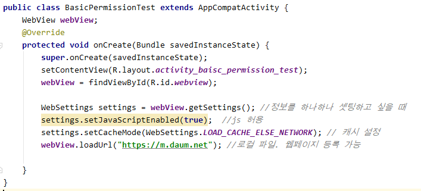


* 인터넷 권한을 주지 않아서 에러 발생

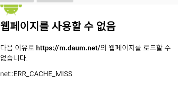

* use-permission 

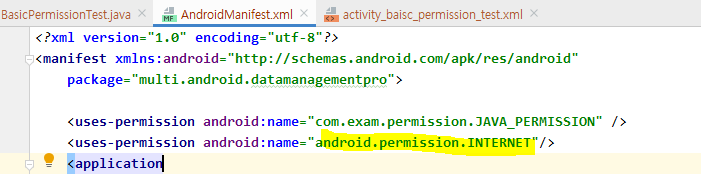

* access_denied

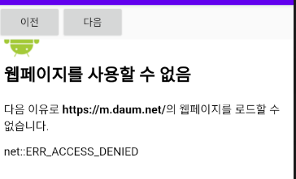

* https 통신을 위해 걸어주어야 할 조건

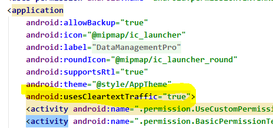

* 권한을 설정해주었을 때는 앱을 삭제해주고 실행해주어야 된다. 

  * 기본권한은 바로  run시켜도 실행이 가능.
  
  [결과]

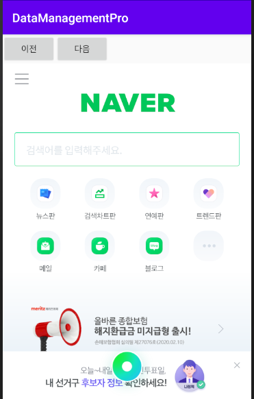

### 2. Camera

* 기본 권한 중 SD 카드를 접근하는 권한은 위험 권한이다.

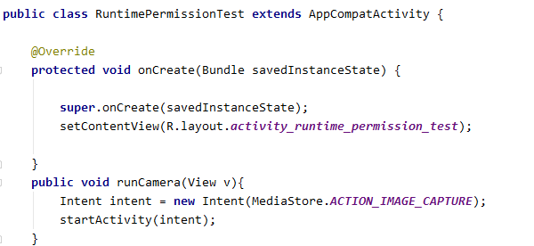

```xml
 <uses-permission android:name="android.permission.CAMERA"/>
```

* Permission 상태 확인

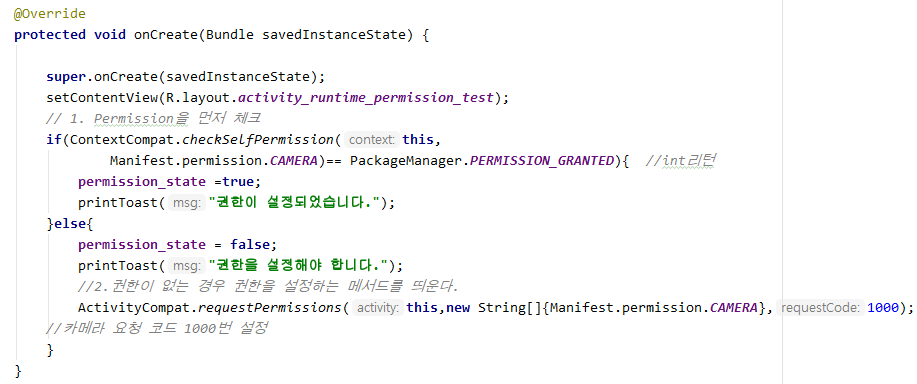

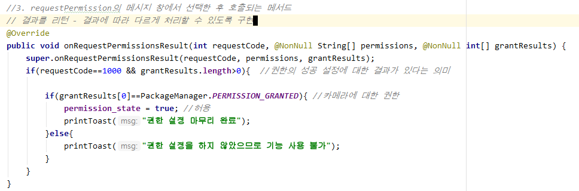

## IO 입출력

안드로이드 내부 Linux 형태

### 1. 내부 저장소

* 외부에서 접근이 불가능한 fileSystem 형태
  * 오로지 안드로이드 내부에서만 접근 가능하다.
  * 안드로이드 내부에서만 사용하므로 권한을 체크해주지 않아도 된다. 

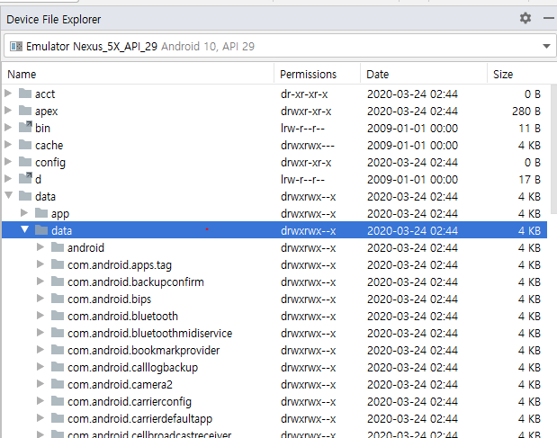

#### output

* try/catch

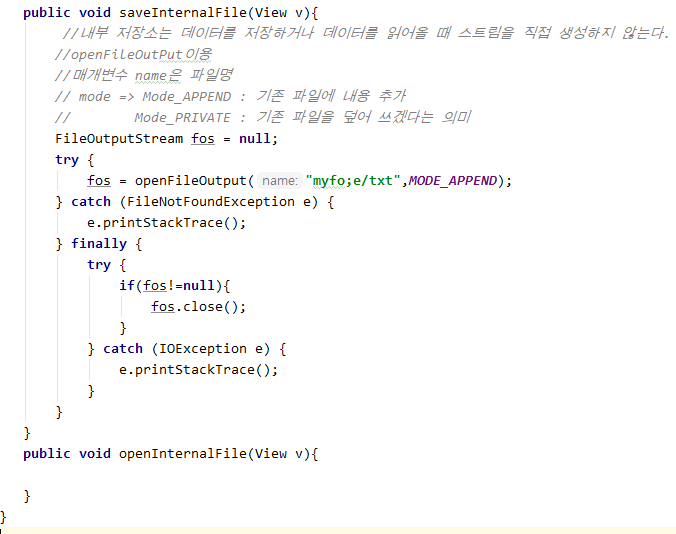

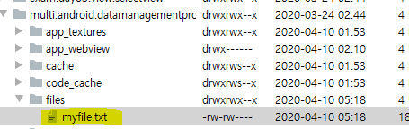

### readUTF

* try/catch
  * 데이터 읽기

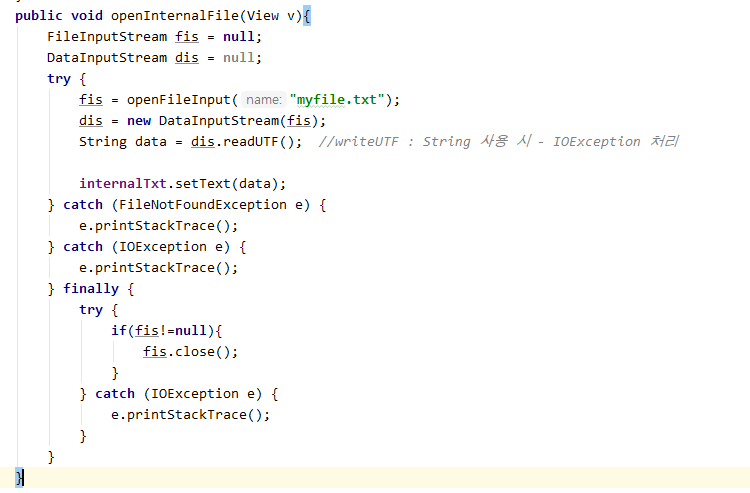

### 2. 외부 저장소

* **sdcard**

* 애플리케이션이 삭제되더라도 기록이 남아있다. 
  * 하지만 패키지 명과 같게 만든다면 삭제가 된다. 

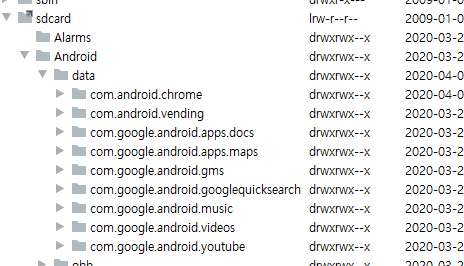

* 작업 방법 java.io 특성 그대로 사용 가능하다.
* 외부저장소 접근 시, 다른 파일을 건드리지 않도록 권한체크를 해주어야 한다. 
* 권한 설정
  * 지금 버전에서는 write에서는 권한이 필요 없다. (READ시에만 필요.)
  * 예전에는 READ, WRITE 둘 다 필요했다. 
  * 이전 버전 그대로 사용하겠다는 LegacyExternalStorage true해준다.

```xml
<uses-permission android:name="android.permission.WRITE_EXTERNAL_STORAGE"/>
```

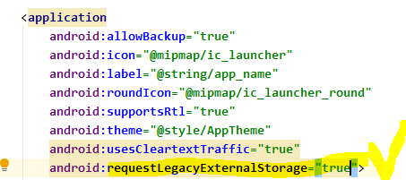


*[실습 1]*

*권한 체크는 액티비티*

*저장 버튼을 눌렀을 때 권한 설정 : Toast("권한 설정 완료")*

*권한 설정이 안된 경우 : Toast("권한 설정 하세요")*

 : **WRITE_EXTERNAL_STORAGE** 사용

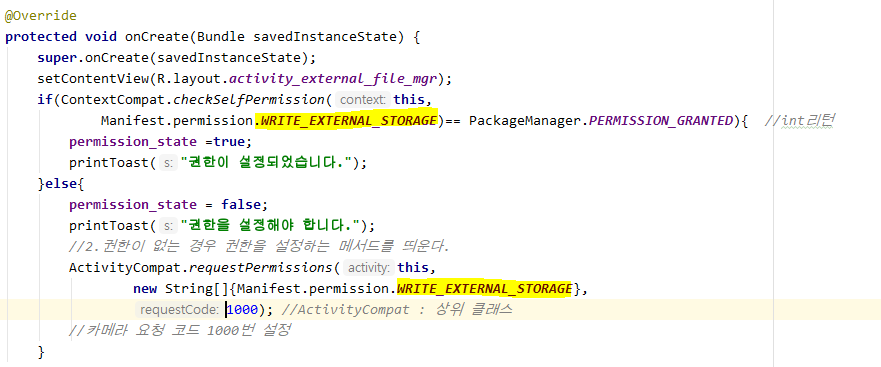


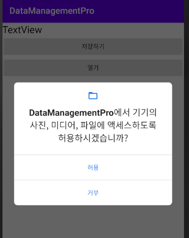

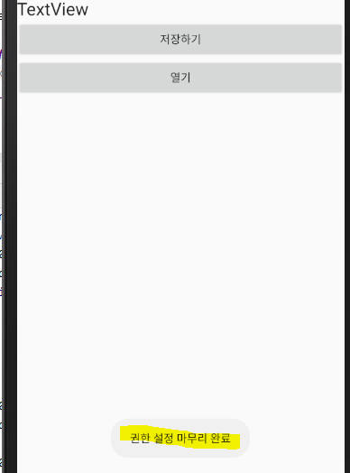


[실습 2]

지금은 안드로이드 외부저장소에 파일을 저장하고 저장된 파일을 오픈하는 연습을 하는 시간입니다.

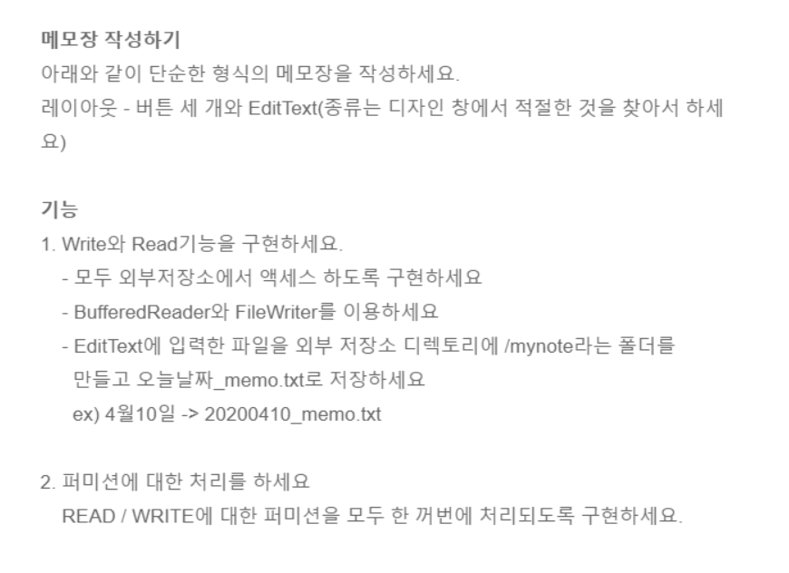

* 날짜 출력

```java
 Date date = new Date();
    SimpleDateFormat nowDate = new SimpleDateFormat("yyyyMMDD");
    String time = nowDate.format(date);
```


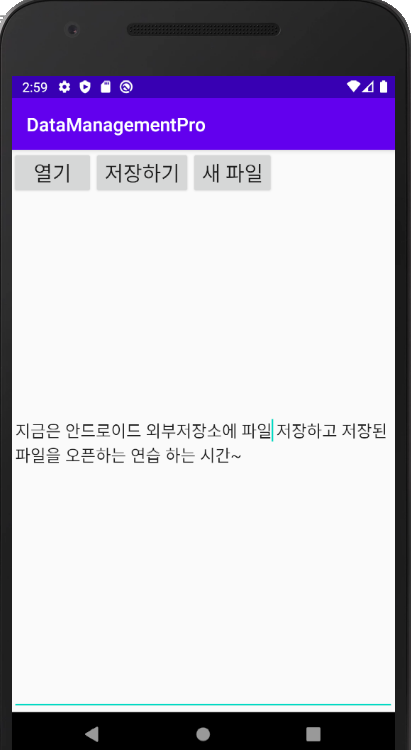

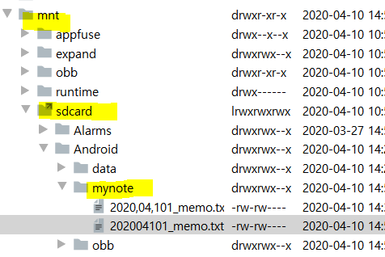