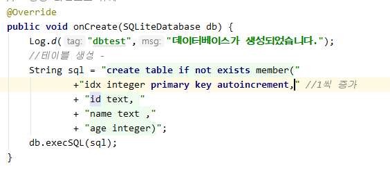
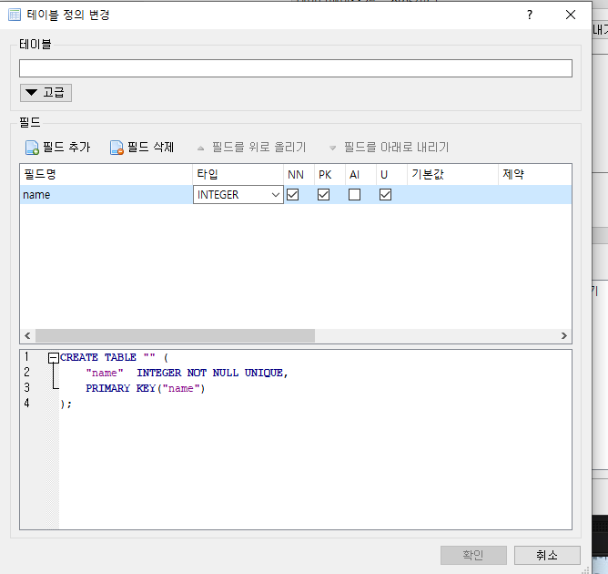

# 설정정보

* `SharedPreferences` : 설정 정보를 저장할 수 있도록 지원되는 객체 

  * 설정 정보를 내 앱 안에 있는 다른 액티비티와 공유하지 못한다.

  * 설정 정보는 xml 파일로 저장 - `액티비티명.xml`

  * ```java
    setting = getPreferences(Context.MODE_PRIVATE);
    ```

  * `Context.MODE_PRIVATE`은 다른 앱과 공유가 안된다.

```java
  setting = getSharedPreferences("setting",Context.MODE_PRIVATE);  //name : 파일명
  editor = setting.edit();
```


* 내부저장소 - data - data


# DB Browser for SQLite

> 임베디드 데이터베이스로 개발된 경량급 관계형 데이터베이스
>
> 데이터를 간단하게 저장하고 싶을 때는 (SharedPreference) - but, 설정용 저장이다.

* library형태로 동작
* 누구나 공통으로 볼 수 있는 데이터 (공유)- 서버 
* 앱에 저장되는 것: 어플이 지워지면 데이터도 삭제 (내부 저장소)
  * 전화, 문자, 접속 기록.... 


안드로이드 , ios 같이 사용할 수 있는 어플: 하이브리드


### 헬퍼 클래스

* 앱 별로 한개씩 존재한다.
* onCreate() : 앱이 설치되고 SQLiteOpenHelper가 최초로 호출될 때 한 번만 실행
  * 다시 앱을 키거나 run을 시켜도 db가 생성되지 않는다.
  * 즉 , 데이터베이스가 **업데이트** 되거나  db를 **처음 생성**할 때


* DB연결

```JAVA
public DBHelper(Context context){   //이 자체가 db를 오픈하고 연결
        super(context,"test.db",null,DB_VERSION); //" " :db네임
    }
```

* 테이블이 생성되고 필요하면 초기화작업
  * **onCreate()** : 앱을 최초로 다운받는 사람들을 위해서 만들어 놓은 메소드 - 항상 최신으로 유지

```java
@Override 
    public void onCreate(SQLiteDatabase db) {
        Log.d("dbtest","데이터베이스가 생성되었습니다."); 
    }
```

* **onUpgrade()** : 데이터베이스의 버전이 변경될 때 호출되는 메소드
  * 스키마가 변경되면 호출되어 업데이트에 관련된 여러가지 처리를 구현
  * 기존 사용자들이 변경된 내용을 반영하려 할 때 호출되는 메소드

```java
@Override
public void onUpgrade(SQLiteDatabase db, int oldVersion, int newVersion) {
    Log.d("dbtest","데이터베이스의 스키마가 변경되었습니다.");
}
```


* database 폴더를 만들어서 파일의 형태로 저장된다. 


* DB_VERSION 을 바꾸어 줬을 때


*  변경될 때 해야하는 처리
  * 변형해서 작업해주면 된다. 


* 테이블 생성 
  * 기존의  database 지워줘야 생성 가능




* 테이블 생성 가능 




* 삽입 :exec