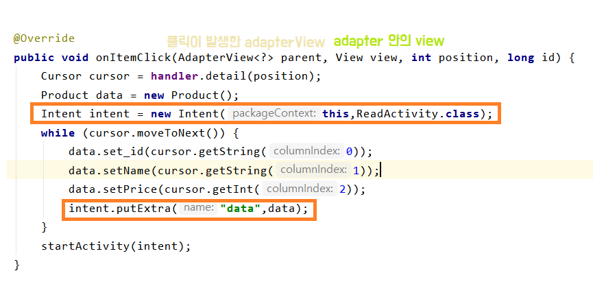

# SQLite

## 1. Helper 이용하여 DB생성

* Android는 데이터베이스를 앱의 비공개 폴더에 저장
* `SQLiteOpenHelper` 클래스에는 DB 관리를 위한 API 포함.
  * `getWritableDatabase()` or `getReadableDatabase()` 호출
*  `onCreate()` 및 `onUpgrade()` 콜백 메서드를 재정의하는 서브클래스를 생성

```java
public class ExamDBHelper extends SQLiteOpenHelper {
    public static final int DB_VERSION = 1;

    public ExamDBHelper(Context context) {
        super(context,"product.db",null,DB_VERSION);
    }
    @Override
    public void onCreate(SQLiteDatabase db) {
        String sql = "create table if not exists product("
                + "_id integer primary key autoincrement,"
                + "name text not null, "
                + "price integer not null, "
                + "su integer not null, "
                + "totPrice integer not null)";
        db.execSQL(sql);

    }
```

```java
 @Override
    public void onUpgrade(SQLiteDatabase db, int oldVersion, int newVersion) {
        switch (oldVersion){
            case 1:
            case 2:
            case 3:

        }
```


## 2. Handler

* 데이터베이스에 액세스하려면  `SQLiteOpenHelper`의 서브클래스를 인스턴스화

  * ```java
    ExamDBHelper helper = new ExamDBHelper(getContext());
    ```

```java
public class DBHandler {
    static ExamDBHelper examDBHelper; // 객체를 매개변수화
    static SQLiteDatabase db;
    Context context;
    
    public DBHandler(Context context){
        this.context = context;
        examDBHelper = new ExamDBHelper(context);
        //`SQLiteOpenHelper`의 서브클래스를 인스턴스화
        db = examDBHelper.getWritableDatabase();
        // Gets the data repository in write mode
    }
    ...
}
```

### 1. Insert

* `ContentValues` 개체를 `insert()` 메서드에 전달하여 데이터를 데이터베이스에 삽입

  * Create a new map of values, where column names are the keys

  * ```java
    contentValues.put("Column_name",title);
    ```
    
  * `nullColumnHack` : ContentValues 가 비어있을 때 , 어떤 값도 삽입(put) 하지 않았을 때 실행할 작업 
  
    *  `null`을 지정하면 프레임워크는 값이 없는 경우에 행을 삽입x


* Activity 

  * 매개변수 전달

  

### 2. Read

* 데이터베이스에서 정보를 읽어오려면 `query()` 메서드를 사용

*  쿼리 결과는 `Cursor` 개체로 반환

  * ```java
    db.query ("Table_Name","리턴되는 컬럼배열",
             where절 colums, where절 값,
             group, filter, sort order);
    ```

  * `selection` 및 `selectionArgs`가 결합되어 WHERE절 생성

  * `Cursor` :  이동 메서드

    * 값을 읽기 전에 먼저 호출되어야 한다. 


* Activity

  * Cursor 

    * 커서는 `-1` 위치에서 시작하므로 `moveToNext()` 호출 시 결과의 첫 번째 항목에 읽기 위치가 배치
    * 각 행에 관해 `getString()` , `getInt()`와 같은 `Cursor `가져오기 메서드를 호출함으로서 열의 값 읽어올 수 있음
    * 위치는 `getColumnIndex()` 또는 `getColumnIndexOrThrow()`를 호출하여 가져올 수 있음

  * *예시*

    ```java
    List itemIds = new ArrayList<>();
    while(cursor.moveToNext()){
        long itemIds = cursor.getLong(cursor.getColumnIndexOrThrow("_id"));
        itemIds.add(itemIds);
    }
    cursor.close();
    ```


* Adapter - simple_list_item2

  * Activity

  

  * Handler

  


### 3. Search

* Activity

  

  * Handler

  


### 4. Detail

* list 클릭시 세부 사항 볼 수 있도록 코드 작성

* Activity
  *  `startActivity(Intent)`에 사용할 `Intent` 객체를 생성할 때 `putExtra()` 메서드를 사용하여 매개변수를 전달



* Handler


* product class

```java
public class Product implements Parcelable {
    String _id;
    String name;
    int price;
}
```


* CREATOR는 `Parcel`을 현재 객체로 다시 변환
  * `createFromParcel()` 메서드를 사용하는 `Parcelable.Creator` 인터페이스를 구현

* ReadActivity


[결과]


## Parcelable 

> 인텐트가 있는 활동 간에 사용하고 구성 변경 시 일시적인 상태를 저장

* 프로세스 간 데이터 전송 
* intent를 통해서 Activity로 데이터 전달 시 객체로 전달해야 할 때 **parcelable** 사용
* **CREATEOR** : Parcelable에서 필수적으로 가지는 non-null static 필드
* writeToParcel : 객체가 직렬화되어 보내지기 이전에 데이터를 직렬화
  * dest에 순차적으로 class 내부에 있는 데이터 저장