# [ 구글 라이브러리](https://console.developers.google.com/apis/library?hl=ko&supportedpurview=project)

## Map

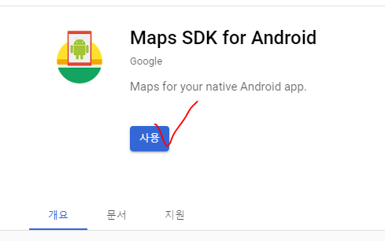

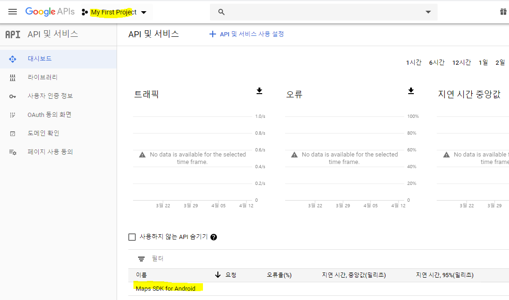

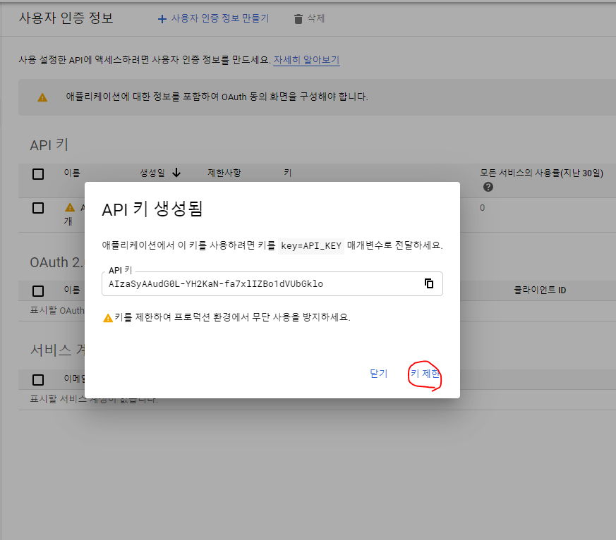

* market에서는 어플을 패키지명으로 구분한다.

  * 따라서, package명과 인증서 명을 등록해주어야 한다.

*  play service 등록해 주어야 한다.

  * version 확인

    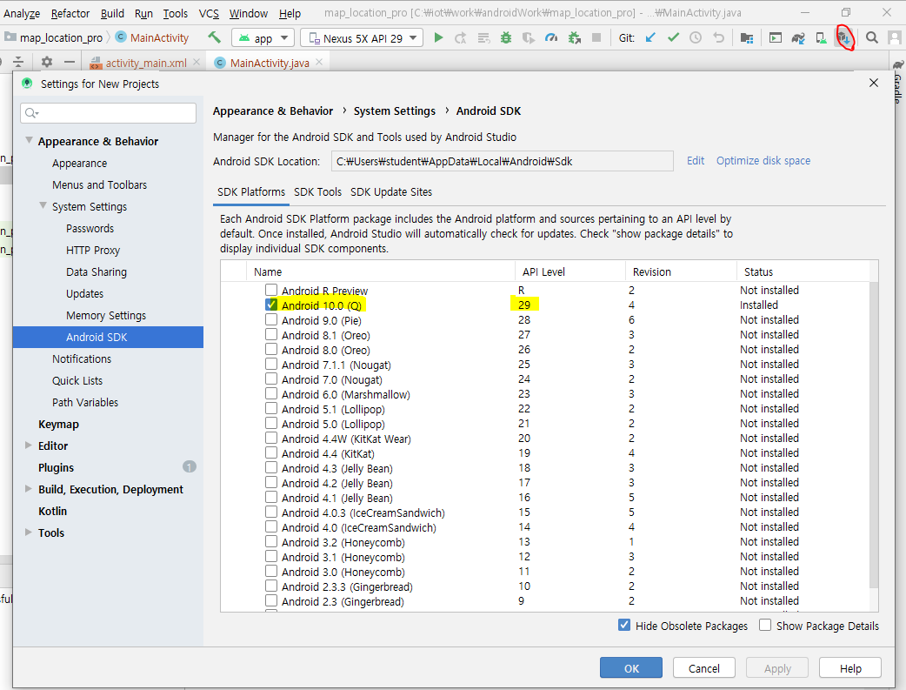

  * SDK Tool

    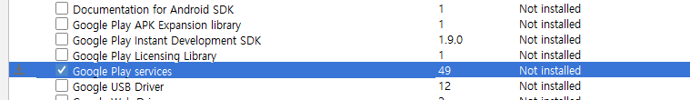

  * 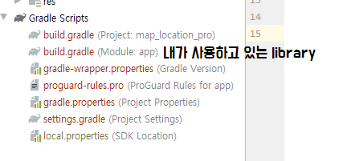

    * pom.xml 과 같은 기능
    * sync now를 눌러 다운로드 받는다.

    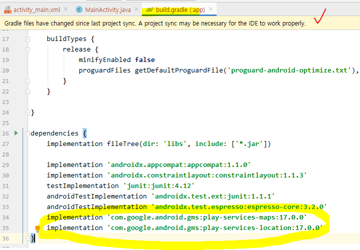

* dependancy 목록 확인

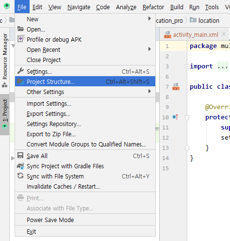

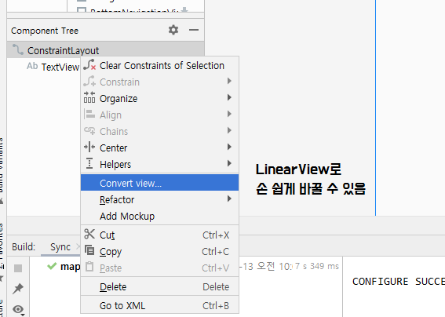


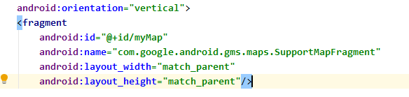

* interner에서 google지도를 받아올 것이므로 permission이 잇어야 한다.

  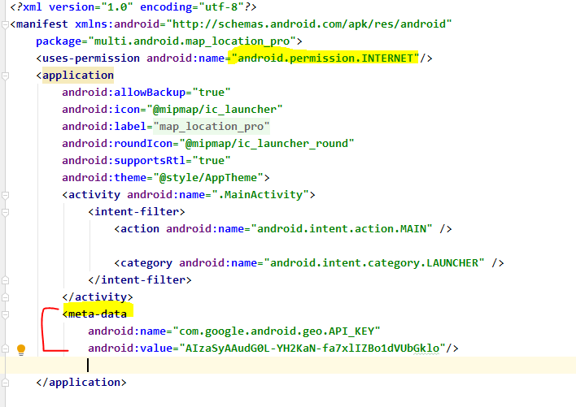

[결과]

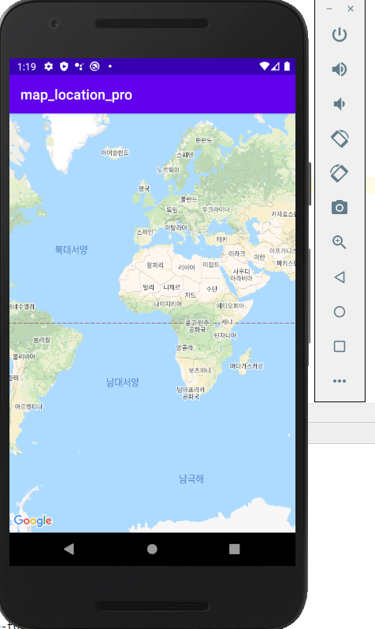

### 위치 정보 가져오는 방법 (1)

* 표준방법인 LocationManager를 통해 가져오기
  * 위치정보를 제공하는 객체의 종류와 현재 사용할 수 있는 위치정보 제공자를 확인
* 오류상황 - AVD에서 gps모듈을 제공하지 않는다.


>  위치정보를 제공하는 제공자로부터 위치정보를 담고 있는 Location객체를 가져오기 
>
> ACCESS_FINE_LOCATION : GPS
>
> ACCESS_COARSE_LOCATION: NETWORK

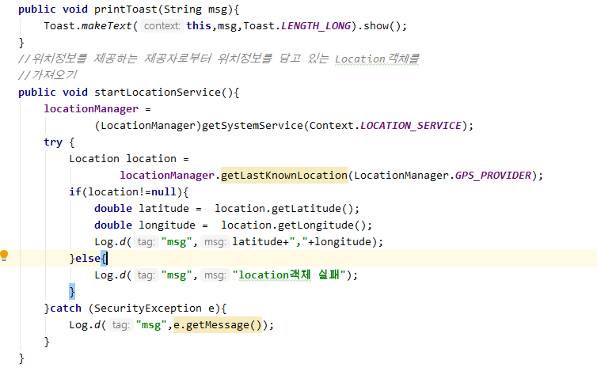

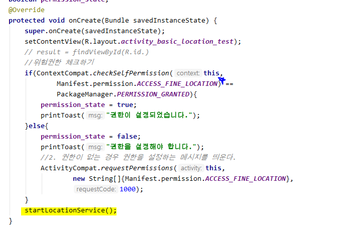

### (2)

다른 `provider`정보를 확인하고 사용할 수 있도록 작업

* `gps`, `network` 모듈을 함께 호출해서 먼저 받아지는 Provider를 이용해서 작업할 수 잇도록 구현

```java
    List<String> provider_list ; //전체 위치 제공자 목록
    List<String> enableProvider_list; // 사용가능한
```

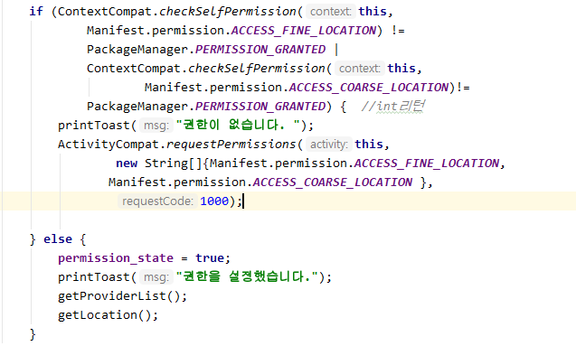

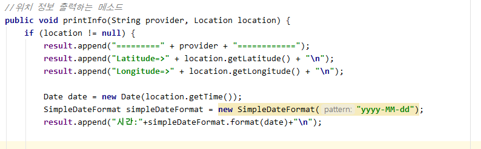

* 지도 활용
  * override 

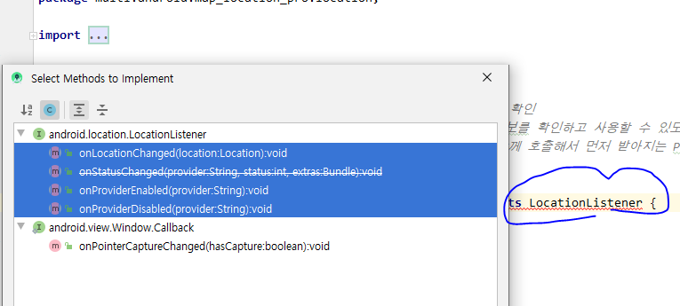

* [google 지도](https://www.google.com/maps/d/edit?hl=ko&hl=ko&mid=1-omrjOaLzLCMyBoi4K01cInUYDR1S394&ll=38.79725058767069%2C125.38974110451045&z=7)

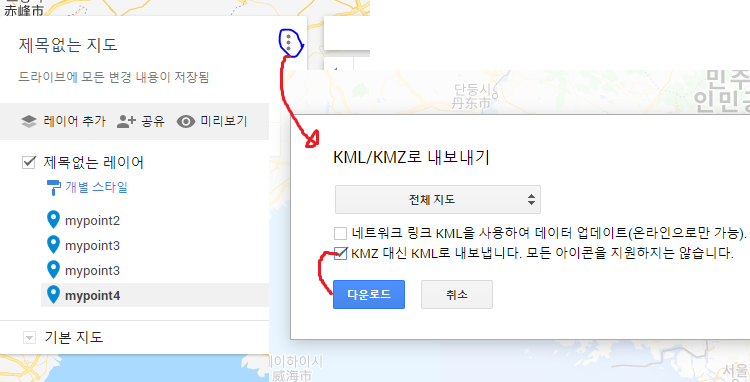

* import

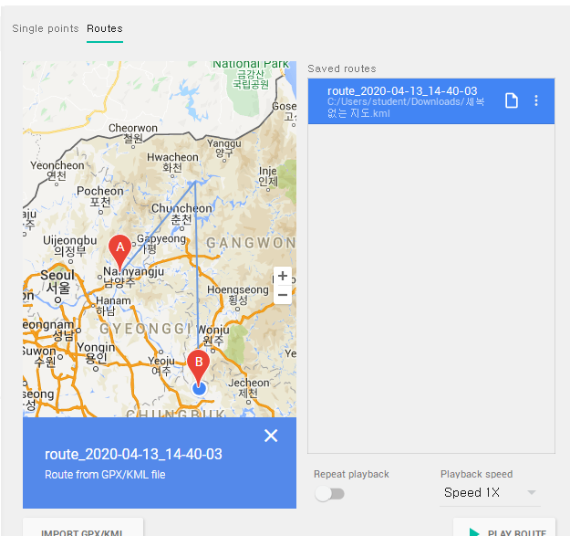

## Fragment

> 화면의 **일부분**만 다른 화면으로 구성하고 싶을 때
>
> 하나의 화면을여러 부분으로 나눠서 보여주거나, 각각의 부분 화면 단위로 바궈서 보여주고 싶을 때 
>
> 분할된 화면을 **독립적**으로 구성하고 그 상태를 관리
>
> fragment는 항상 Activity 위에 있어야 한다.

* FrameLayout 시 Activity 가 많아지면 메모리를 많이 차지하기 때문에 fragment를 이용해서 작업해준다.
* 페이지를 쌓아 놓는 것이 아니라 교체를 하는 것.

* fragment는 name을 꼭 설정해주어야 한다.

### [예시]

* 화면에 연결할 프레그먼트 객체를 생성한다.

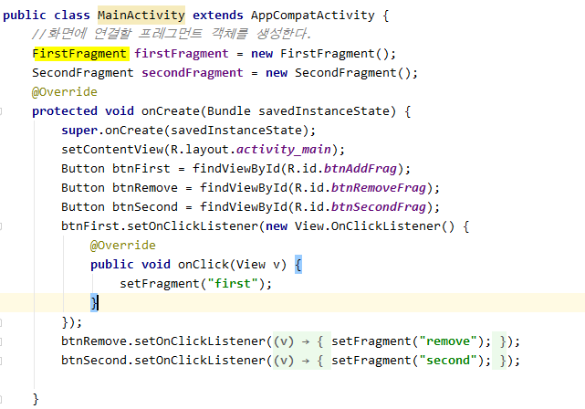

* **FragmentManager** getFragmentManager()
  * 프래그먼트를 폼함하는 Activity에서 프래그먼트 객체들과 의사소통하는 FragmentManager 반환
  * FragmentManager 객체는 프래그먼트를 액티비티에 추가, replace, 삭제할 때 주로 사용
  * `getSupportFragmentManager` 와 ` getFragmentManager()`는 같다.
    * `getSupportFragmentManager` 가 이전 버전과 호환됨 - 권장.
* **FragmentTransaction** beginTransaction()
  * 프래그먼트를 변경하기 위한 트랜잭션 시작.

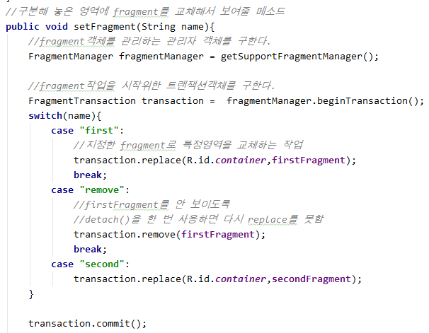

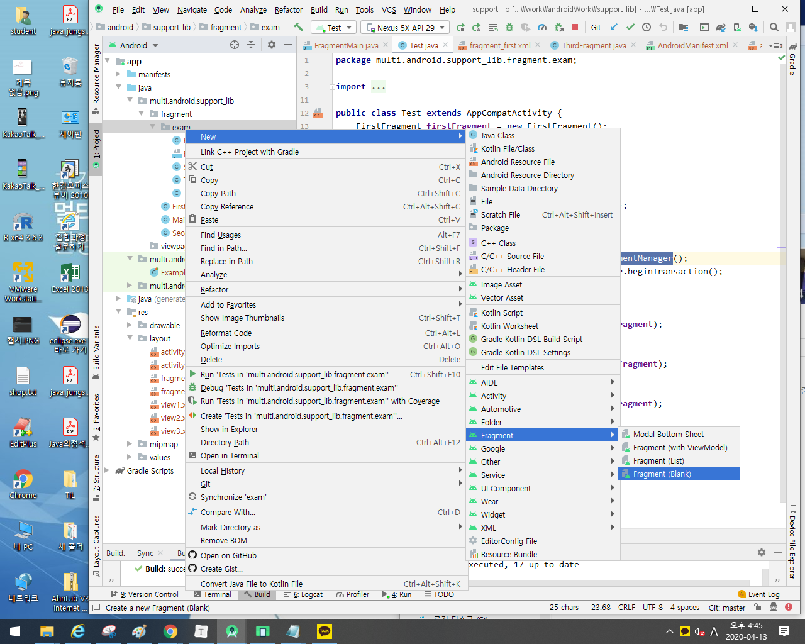


* fragment 에는 setContentView() 메서드가 없다.
  *  인플레이션 객체인 **LayoutInflater**를 이용해 인플레이션 진행
  * xml 레이아웃 파일의 내용을 인플레이션 후, 클래스에서 사용하도록 하는 메서드 `onCreateView()`
  * 인플레이션이 끝나면 프래그먼트가 하나의 뷰처럼 동작.

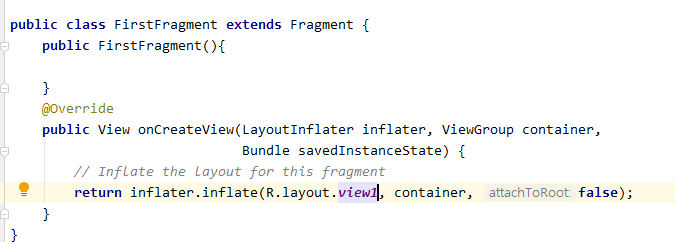

* fragment는 뷰와 달라서 뷰를 담고있는 **공간**만 확보한다.
  * xml에 fragment를 추가하면 동적(코드)로 제어가 어렵다.

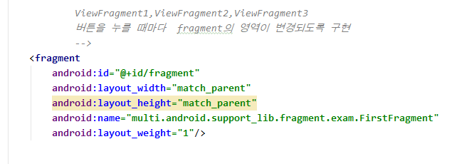

* FrameLayout - fragment 
  * Activity로 나눈 뒤 조각 코드 식으로 붙여 넣는다.

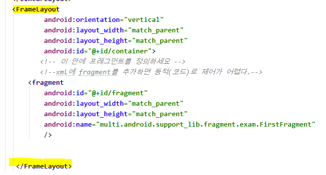

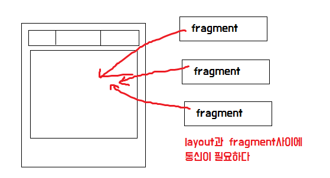