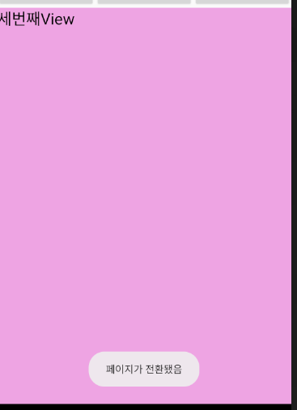
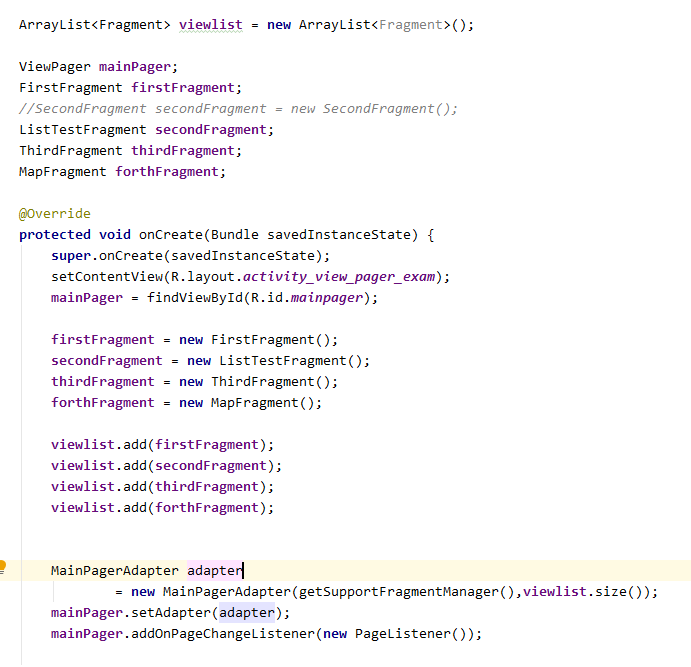
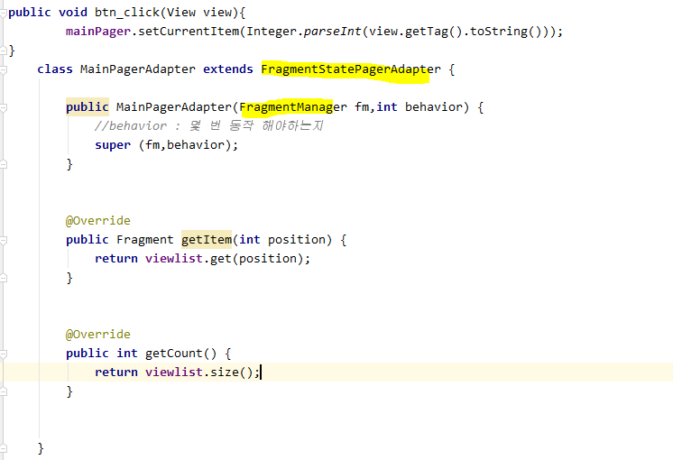
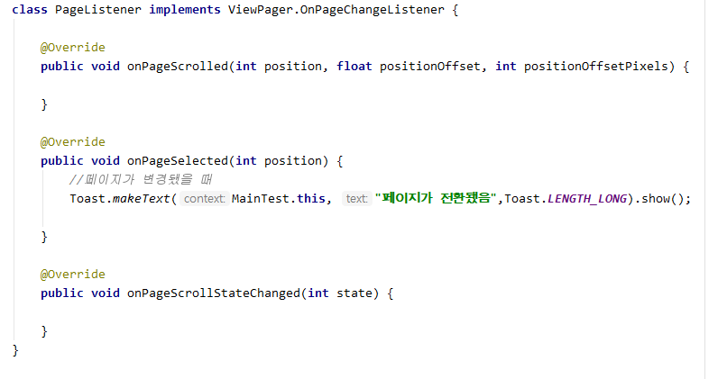
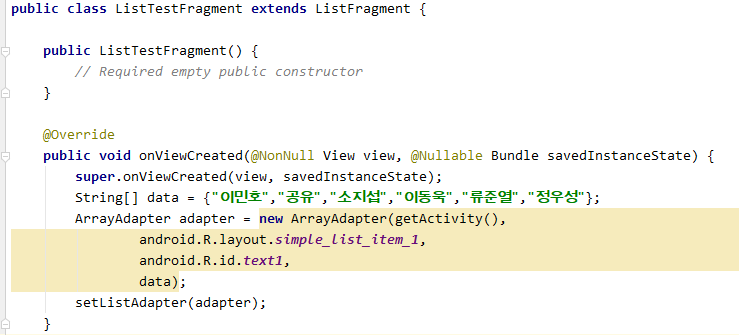
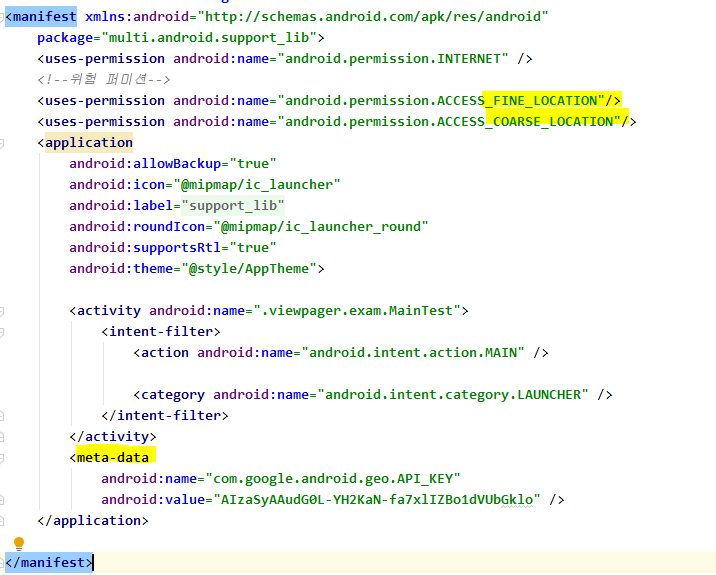
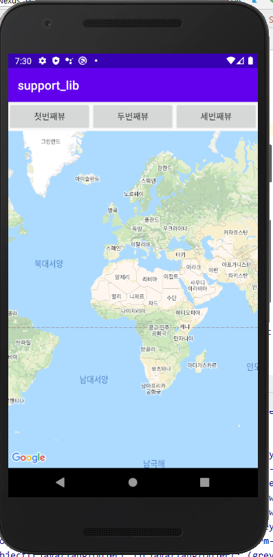
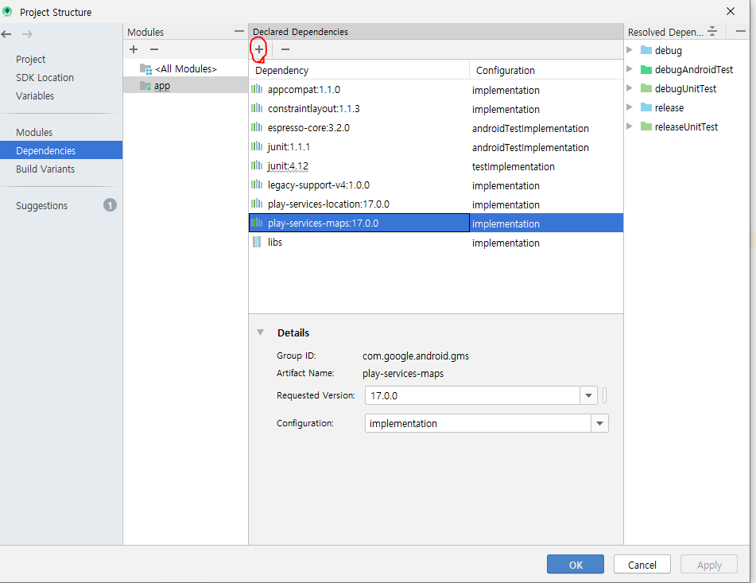

# ViewPager

화면 전환을 위해서 ViewPager를 사용하는 경우 (ListView와 동일)

>1. ViewPager에 담을 데이터 - View, Fragment
>
>2. Adapter 커스터마이징
>
>3. ViewPAger에 Adapter연결하기

1. **ViewPager에 담을 데이터**


2. **Adapter 커스터마이징**


3. **ViewPager에 어댑터 연결**

```java
        MainPagerAdapter adapter = new MainPagerAdapter();
        mainPager.setAdapter(adapter);
```



## FragmentPagerAdapter



```java
 MainPagerAdapter adapter
                = new MainPagerAdapter(getSupportFragmentManager(),viewlist.size());
        mainPager.setAdapter(adapter);
        mainPager.addOnPageChangeListener(new PageListener());
```






## ListFragment

* List를 뿌려주는 Fragment



* Manifest



* 위치 기반 서비스 맵을 사용하는 앱이 없도록 map 사용하는 앱은 삭제해주어야 한다.



* 안드로이드 앱을 설치할 때 Library를 같이 설치하도록 한다.
* 라이브러리 확인하기 - library dependency

