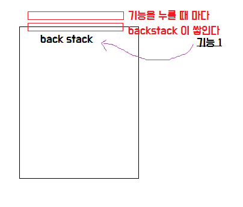
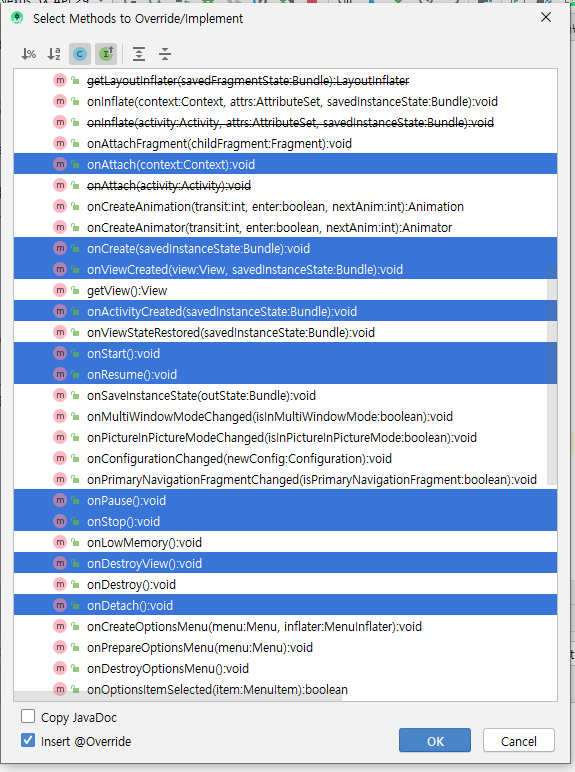
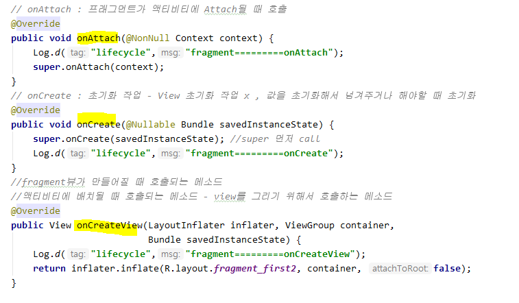
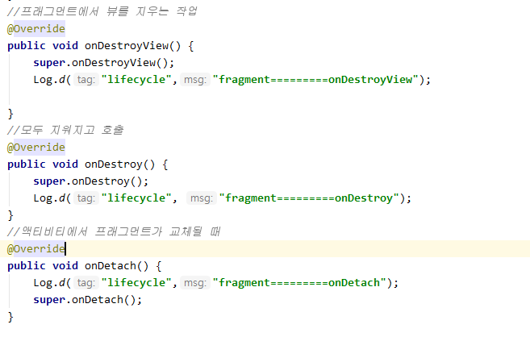
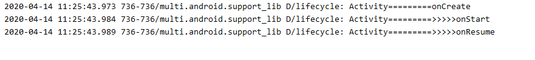
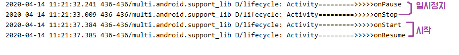
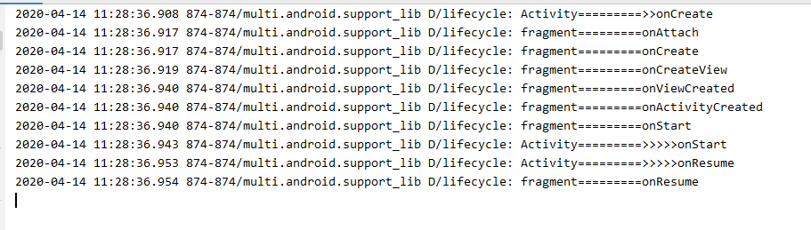
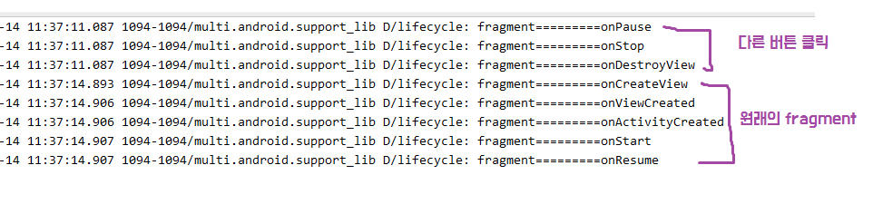

# Fragment 

* 하나의 화면에서 복잡한 기능을 전부 담아야 할 때 **fragment**사용
  * 전혀 다른 화면을 띄워줄 때 새로운 Activity 필요
  * detail한 기능 - Activity

> fragment는 종속적이지만, activity 처럼 동작하도록 만들어 줄 수 있다.
>
> 이전의 기록으로 찾아서 돌아가고 싶거나 , 데이터 유지시키고 싶을 때 framelayout 사용해준다.



* `add`메소드를 이용하면 프레그먼트 객체를 생성한다.
  *  => 똑같은 객체는 한 개만 생성할 수 있다.
  * 리니어레이아웃에 추가하면 레이아웃의 특성 상 영역 바깥에 추가되어 안보임
* `addToBackStack` - fragment는 액티비티의 lifecycle에 종속적이나, 액티비티처럼 동작할 수 있도록 backstack에 등록

```java
 public void first_click(View v){
        //이 4개는 꼭 만들어주어야 한다.

        FragmentManager manager = getSupportFragmentManager();
        FragmentTransaction transaction = manager.beginTransaction();
        transaction.replace(R.id.container,firstFragment);
        transaction.addToBackStack("first"); //이름
        transaction.commit();
    }
```

* replace는 있으면 있는 객체를 연결, 없으면 새로 생성해서 연결
  * Activity  삭제 시 fragment도 같이 삭제 (종속적으로 동작)

## Lifecycle

>  이전에 실행한 액티비티는 액티비티 스택에 보관하다가 현재 화면에 보이는 액티비티가 사라지면 다시 이전 액티비티가 동작하는 과정 
>
> ------------- 이러한 과정을 시스템이 관리하며 각각의 상태에 해당하는 메서드를 자동으로 호출한다. 

> **Running**(실행) : 화면상에 액티비티가 보이면서 실행되어 있는 상태. ( 액티비티 스택의 최상위 )
>
> **Paused**(일시 정지) : 사용자에게 보이지만 다른 액티비티가 위에 있어 포커스를 받지 못하는 상태.
>
> **Stopped**(중지) : 다른 액티비티에 의해 완전히 가려져 보이지 않는 상태

* Lifecycle 메소드 ( 10개 )



## [메소드]

* `onCreate()` : 액티비티가 만들어질 때 시스템이 자동으로 호출하는 메서드
  * 이 메서드 다음에는 항상 `onStart()` - > `onResume()`
* `onPause()` : 메서드 일시정지, 중지
* `onDestroy()` : 액티비티가 메모리에서 없어질 경우



* `onSaveInstanceState()` : 액티비티를 중지시키기 전에 호출되는 메서드
  * 파라미터로 전달되는 번들 객체를 이용해 데이터가 그대로 전달된다. 





* 처음 run 시킬 때



* 일시정지
  * 다른 앱을 사용했다가 다시 되돌아올 때 원래의 상태로 돌아갈 수 있어야 한다. 



* fragment 버튼 클릭시


*  실제 lifecycle



* backstack 추가시




