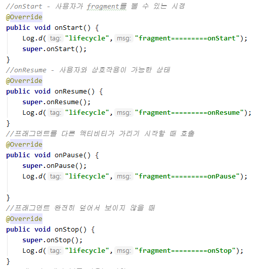
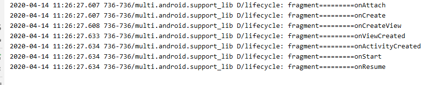

# Fragment 

* 하나의 화면에서 복잡한 기능을 전부 담아야 할 때 **fragment**사용
  * 전혀 다른 화면을 띄워줄 때 새로운 Activity 필요
  * detail한 기능 - Activity

> fragment는 종속적이지만, activity 처럼 동작하도록 만들어 줄 수 있다.
>
> 이전의 기록으로 찾아서 돌아가고 싶거나 , 데이터 유지시키고 싶을 때 framelayout 사용해준다.


* `add`메소드를 이용하면 프레그먼트 객체를 생성한다.
  *  => 똑같은 객체는 한 개만 생성할 수 있다.
  * 리니어레이아웃에 추가하면 레이아웃의 특성 상 영역 바깥에 추가되어 안보임
* `addToBackStack` - fragment는 액티비티의 lifecycle에 종속적이나, 액티비티처럼 동작할 수 있도록 backstack에 등록

```java
 public void first_click(View v){
        //이 4개는 꼭 만들어주어야 한다.

        FragmentManager manager = getSupportFragmentManager();
        FragmentTransaction transaction = manager.beginTransaction();
        transaction.replace(R.id.container,firstFragment);
        transaction.addToBackStack("first"); //이름
        transaction.commit();
    }
```

* replace는 있으면 있는 객체를 연결, 없으면 새로 생성해서 연결
  * Activity  삭제 시 fragment도 같이 삭제 (종속적으로 동작)

## Lifecycle

* Lifecycle 메소드 ( 10개 )


## [메소드]





* 처음 run 시킬 때


* 일시정지


* fragment 버튼 클릭시



*  실제 lifecycle


* backstack 추가시


# 


