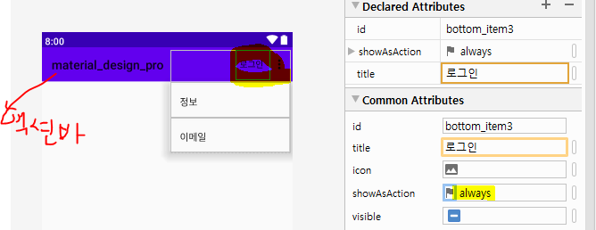
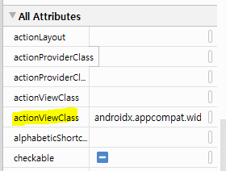
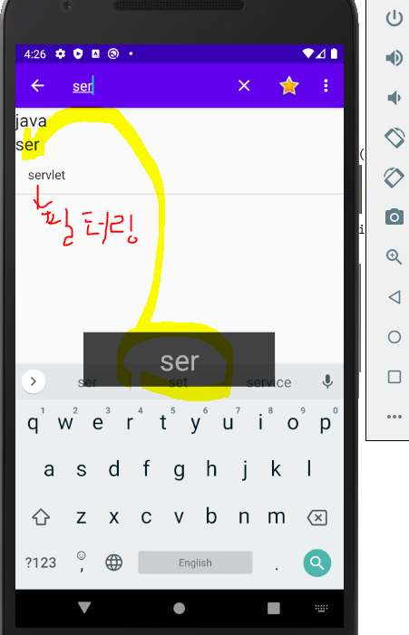
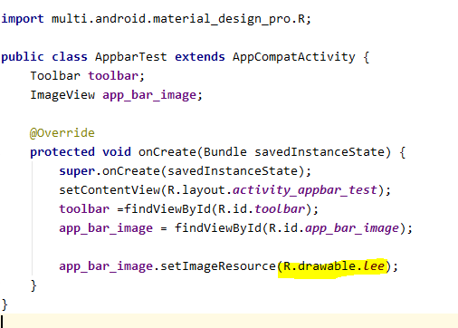
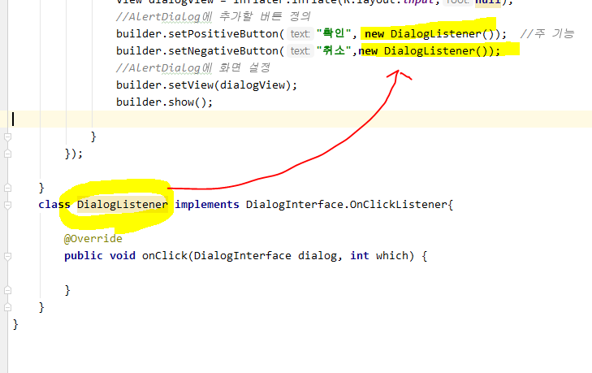
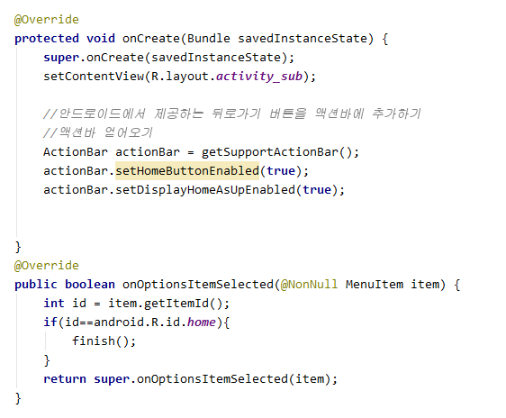

# 머티리얼 디자인

* 플랫폼 및 기기 전반의 시각적 요소, 움직임 및 상호작용 디자인을 위한 포괄적인 가이드

* Library dependendcy 다운로드


* dependency 추가 확인


## 1. TabLayout


```xml
app:tabMode="fixed"       --- tab이 고정될 때
app:tabMode="scrollable"  --- tab이 많을 때 scroll 이동
             
```
* 탭 추가

```java
tabLayout.addTab(tabLayout.newTab().setText("설정"));
```

* 처음 실행할 때 보여줄 프래그먼트 지정

```java
        getSupportFragmentManager().beginTransaction().
                replace(R.id.content_container,firstFragment).commit();
```

* 탭에 이벤트 연결하기 *- setOnTabSelectedListener는 deprecated된 메서드로 addOn~ 써주기!*


## 2. BottomNavigationView


* LinearLayout의 layout_weigth = 1을 주어야 bottomlayout이 밑으로 붙을 수 있다.


* resource 생성




* 아이콘 변경


* layout에 삽입


*[결과]*

*이렇게 BottomLayout에 아이콘과 text로 삽입되어 들어온다*


* `BottomNavigationView`이벤트 연결

```java
bottomNavigationView.setOnNavigationItemSelectedListener(new BottomNavigationView.OnNavigationItemSelectedListener() {
            @Override
            public boolean onNavigationItemSelected(@NonNull MenuItem menuItem) {
                if(menuItem.getItemId()==R.id.bottom_item2){
                    getSupportFragmentManager().beginTransaction().
                            replace(R.id.content_container,secondFragment).commit();
                }
                return false;
            }
        });
```

## 3. OptionMenu

* 액티비티가 만들어질 때 자동으로 호출되는 메소드 - 이 메소드 안에서 메뉴를 생성
  * true 만 리턴하면 메뉴를 만든다


* 옵션 메뉴의 아이템을 선택하면 자동으로 호출되는 메소드


## 4. Action Bar

* **ListView**
  * adapter: 항목에 대한 리스트를 리스트 뷰 데이터의 형식에 맞게 뿌려주는 역할


* **showAsAction**


* `always` : 메뉴를 항상 액션바에 표시하겠다
* `collapseActionView` : 접었다 폈다 할 수 있는 메뉴
* `withText` : 텍스트와 아이콘을 같이 보여줄 수 있는 기능

*[always + withText]*


* `app:actionViewClass="androidx.appcompat.widget.SearchView` : 선택되면 해당 클래스를 열겠다는 의미
  * 


## 5. AppBar 

> ActionBar + ToolBar





## 6. Toolbar

* 10 버전 라이브러리인지 확인 잘 하기

* Toolbar는 find해서 사용해야 하며 직접 만든 디자인을 연결할 수 있다.

  * 같은 기능이지만 확장 가능성이 있음

  * ```java
    import androidx.appcompat.widget.Toolbar;
    ```

  * 

* 

* ActionBar 없애기
  
  * res - values - styles.xml


* Toolbar가 사라진 것을 볼 수 있음


* 액션바 대신 툴바를 사용하겠다고 정의

  ```javascript
  setSupportActionBar(toolbar);
  ```

* ActionBar와 같은 기능이 가능함을 볼 수 있음


### 1. :jack_o_lantern: :AppBarLayout




* floatingActionButton


* abbBar이용한 floating Action button
  * NestedScrollView 기본 설정됨


### 2. 대화 상자 만들기 :iphone:


* FloatingActionButton을 눌렀을 때 대화상자가 뜨고 입력한 데이터가 리스트 뷰에 추가가 되도록 구현
  * xml을 객체로 만들어 펼쳐놓을 `LayoutInflater` 사용


[결과]





### 3. with Tabs


* new Fragment

  * 액티비티와 통신하는 방법

  

  * inflate시켜놓은 view로 부터 findViewById

  * fragment를 만들면서  title을 setting시킬 수 있도록 작업

    

  * 탭 생성

  

  [결과]

  

  * FragmentStatePagerAdapter

    

    * TabLayout과 ViewPager를 연결

      - ViewPager의 getPageTitle메소드를 호출해서 탭의 문자열을 셋팅
      - getPageTitle 이 없다면 Tab과 연결된 문자열이 출력되지 않는다.
      - `setupWithViewPager` 메소드 내부에서 **탭의 문자열을 출력하기 위해서** 호출된다

      ```java
      tabLayout.setupWithViewPager(pager);
      ```

      

  
  
  [실습]
  
  * layout  - TabLayout 추가
  
  
  
  * TabList  추가
  
  
  
  * Tab과 문자열 연동
  
  
  
  

## HomeButton

* 안드로이드에서 제공해주는 id는` android.R.id.~` 로 작성




