## 1. 바로가기 메뉴

* Design - Layout - convert View
  * dependency - library - Design 추가하기

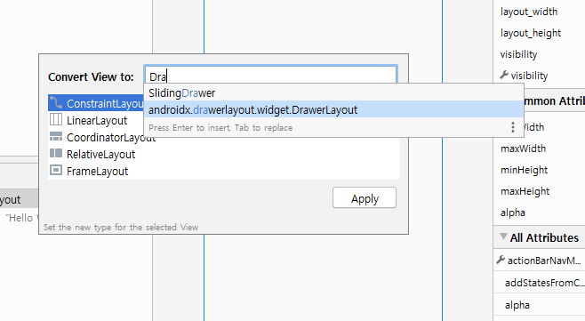

* layout

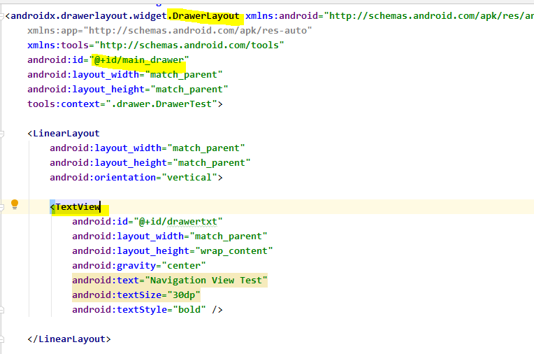

* NavigationView는 숨겨진 뷰
  * width : wrap_content

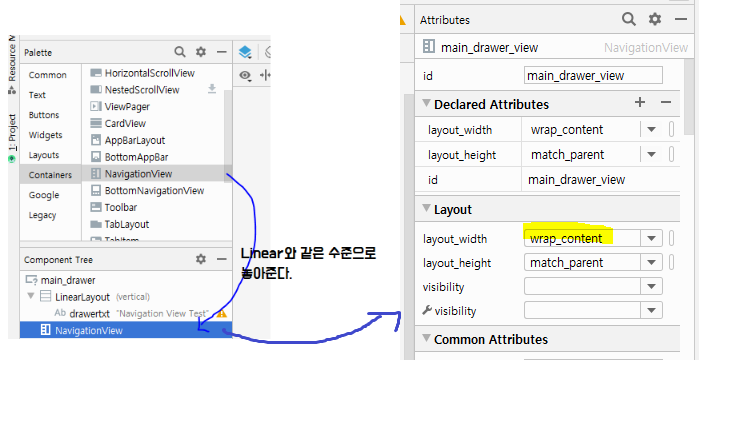

* backgroud 뷰에 글씨 써진 layout_header

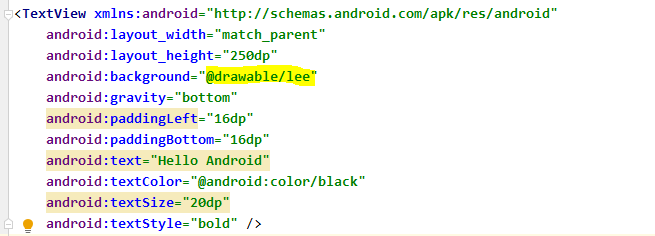

* Menu 만들기
  * new - android resource directory - menu 폴더
  * 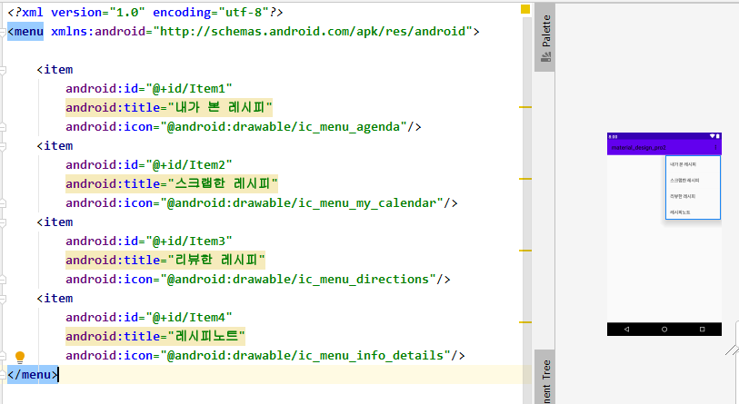
* main_layout
  * 만든 headerLayout과 menu 배치하기
  * 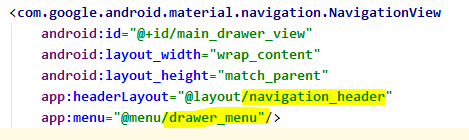

[결과]


* ```xml
  <com.google.android.material.navigation.NavigationView
      android:id="@+id/main_drawer_view"
      android:layout_width="wrap_content"
      android:layout_height="match_parent"
      app:headerLayout="@layout/navigation_header"
      app:menu="@menu/drawer_menu"
      android:layout_gravity="start"/>
  <!-- android:layout_gravity="start" 를 통해 왼쪽에서 튀어나오는 기능 구현 가능 -->
  ```

* toggle

  * vlaues- string 설정

  * ```java
     toggle = new ActionBarDrawerToggle(this,
                        drawerLayout,R.string.open_str,R.string.close_str);
    ```

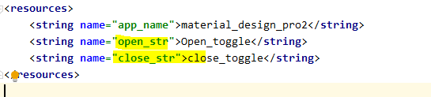

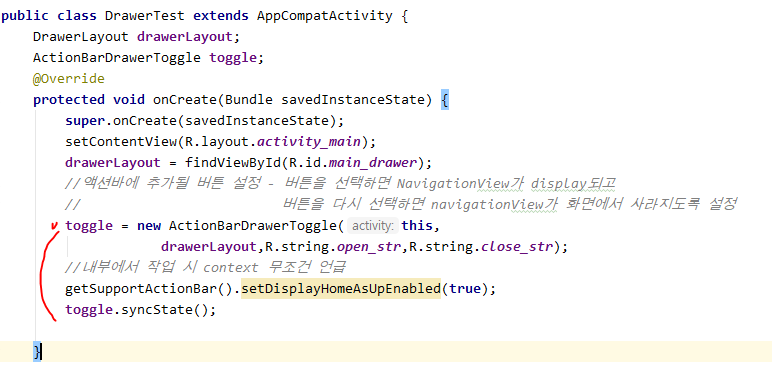

* navigation bar가 생겼지만 활성화가 되지 않음

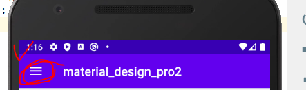


* onOptionsItemSelected 메소드 구현해 주어야 사용할 수 있다.

```java
 @Override
    public boolean onOptionsItemSelected(@NonNull MenuItem item) {
        Toast.makeText(this,"선택",Toast.LENGTH_LONG).show();
        if(toggle.onOptionsItemSelected(item)){
            Toast.makeText(this,"if",Toast.LENGTH_LONG).show();
        }
        return super.onOptionsItemSelected(item);
    }
```

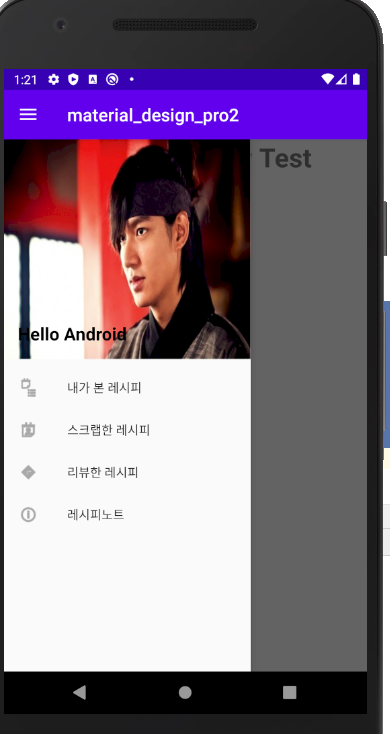

* view 활성화

```java
NavigationView navigationView = findViewById(R.id.main_drawer_view);
navigationView.setNavigationItemSelectedListener(new NavigationView.OnNavigationItemSelectedListener() {
            @Override
            public boolean onNavigationItemSelected(@NonNull MenuItem menuItem) {
                int id = menuItem.getItemId();
                if(id == R.id.Item1){
                Toast.makeText(DrawerTest.this,"내가 본 레시피",Toast.LENGTH_LONG).show();
                }
                return false;
            }
        });
```

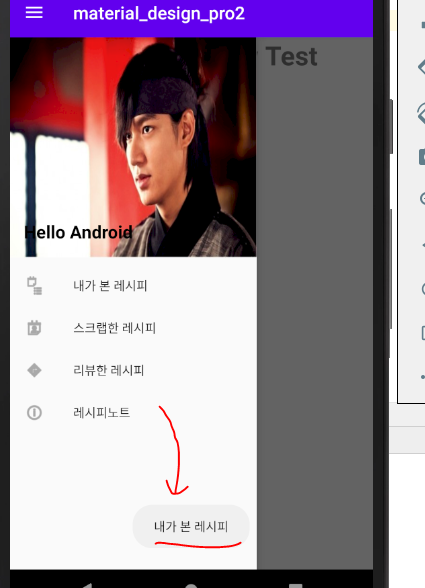


## 2. Bottom_Appbar

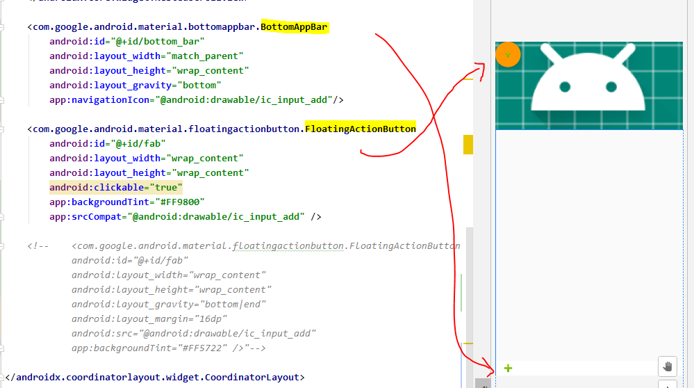

* app:layout_anchor : 어떤 것과 연결할건지 나타내준다.(정렬) 
  * bottomappbar 와 floating 을 붙여서 표현

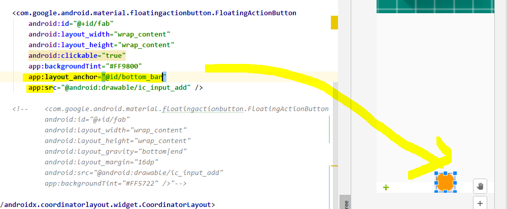

```java
 		bottomAppBar.setFabAlignmentMode(BottomAppBar.FAB_ALIGNMENT_MODE_CENTER);
        //bottomAppBar의 floating action을 가운데로 맞춰준다.
        bottomAppBar.setFabCradleRoundedCornerRadius(100);
        bottomAppBar.setFabCradleMargin(20);
```

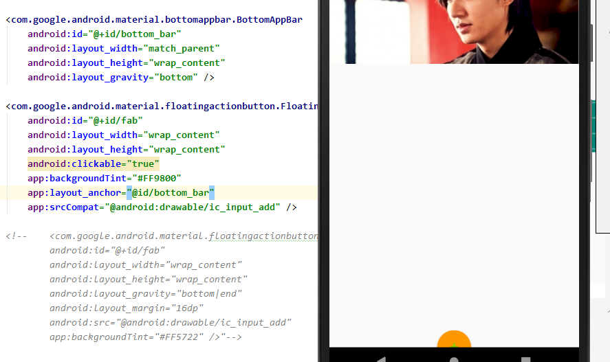

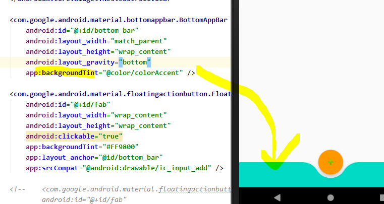

* 테마 설정
  * values - style.xml

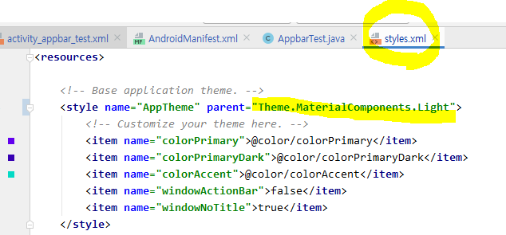


## 3. CardView

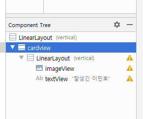

* `card_view:cardElevation` : 음영 설정
* `card_view:cardCornerRadius`  : 레이아웃에서 모서리 반경을 설정 
* `CardView.setRadius`: 코드에서 모서리 반경을 설정
*  `card_view:cardBackgroundColor`: 카드의 배경색을 설정

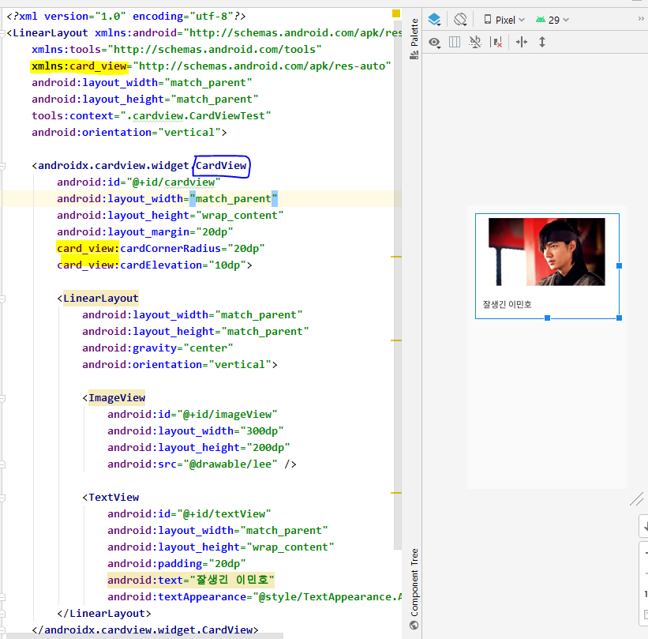

* app-modules

  * Circle 이미지 지원해주는 tool

  * ```xml
    implementation 'de.hdodenhof:circleimageview:3.0.1'
    ```

    

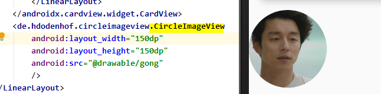


## 4. RecyclerView

앱에서 **대량의 데이터 세트 또는 자주 변경되는 데이터에 기반한 요소의 스크롤 목록을 표시해야 한다면** 이 페이지에서 설명하는 대로 `RecyclerView`를 사용

* `RecyclerView` 위젯은 `ListView`가 더 진보하고 유연해진 버전
* 뷰 홀더 객체는 `RecyclerView.Adapter`를 확장하여 만든 **어댑터**에서 관리합니다. 
  * 어댑터는 뷰 홀더를 데이터에 바인딩합니다. 이 작업은 뷰 홀더를 특정 위치에 할당하고 어댑터의 `onBindViewHolder()` 메서드를 호출하여 실행
  * 이 메서드는 뷰 홀더의 위치를 사용하여 목록 위치를 기반으로 콘텐츠를 결정

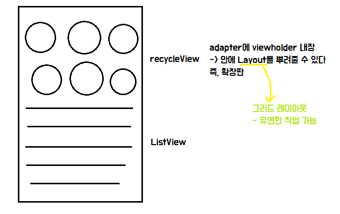

* 모바일 단말에서 가장 많이 사용되는 UI모양 : 리스트

* getView : List 항목 하나를 만들 때 마다 호출되는 메소드

### SimpleItemActivity

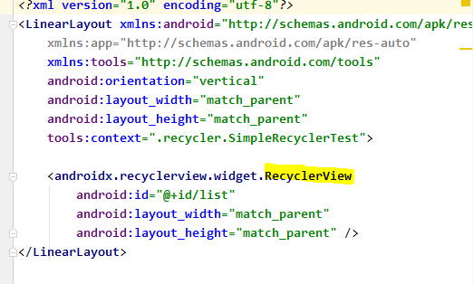

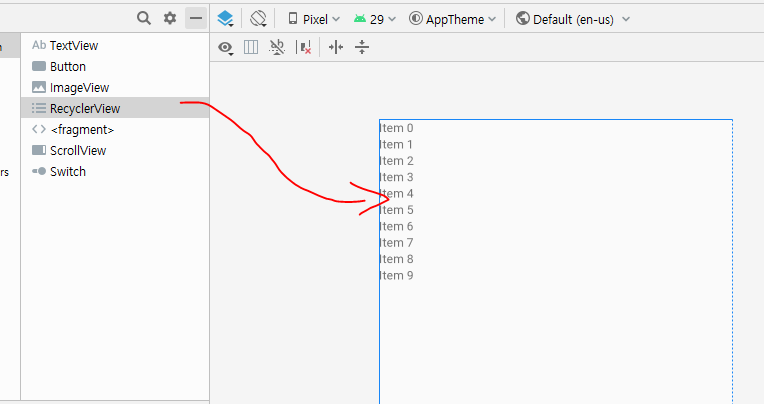

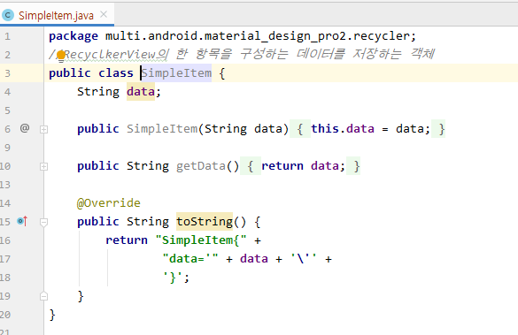

1. Recycler에 츌력할 데이터 준비 ( db or local 저장소)

```java
List<SimpleItem> recycler_simple_data = new ArrayList<SimpleItem>();
for (int i=0; i<10;i++){
    SimpleItem item = new SimpleItem("simple_item"+i);
    recycler_simple_data.add(item);
}
```
2. Adapter 생성
```java
SimpleitemAdapter adapter = new SimpleitemAdapter(
        this, R.layout.simple_item,recycler_simple_data);
```

3. Recycler에 레이아웃을 설정

   * LinearLayout, GridLayout

   ```java
   // RecyclerView에 설정할 레이아웃 객체 생성
   LinearLayoutManager manager = new LinearLayoutManager(getApplicationContext());
   manager.setOrientation(LinearLayoutManager.VERTICAL);
   list.setLayoutManager(manager); //vertical Linearlayout에 셋팅
   ```

4. Recycler와 Adapter를 연결

```java
list.setAdapter(adapter);
```


### SimpleItemAdapter

```text
RecyclerVeiw에서 사용하는 Adapter를 커스트마이징
Adapter안에 ViewHolder포함 - 정의 (ListView 사용할 때와 동일한 역할)
			----------
                  ^
                  |_Inner class로 정의
```

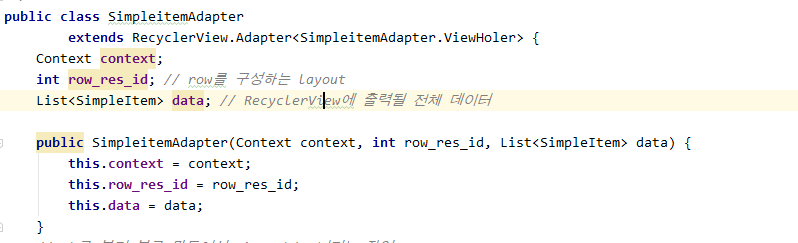

1. **onCreateViewHolder에서 Row에 대한 view를 inflate해서 생성**
2. **ViewHolder 객체를 만들어서 1번에서 생성한 뷰를 넘긴다.**
3. **ViewHolder 객체 안에서 onCreateViewHolder메소드에서 리턴받은 객체에서 데이터를**
   **연결할 뷰를 찾는다(findViewById)**
4. **onBindViewHolder가 갖고있는 구성요소에 데이터를 연결하기**

```java
 @NonNull
    @Override
    public ViewHoler onCreateViewHolder(@NonNull ViewGroup parent,
                                        int viewType) {
        View view = LayoutInflater.from(context).inflate(row_res_id,null);
        return new ViewHoler(view);
    }
```

```java
@Override
public void onBindViewHolder(@NonNull ViewHoler holder, int position) {
    Log.d("recycler","onBindViewHolder"+position);
    //ViewHolder가 찾아놓은 TextView를 꺼내고
    TextView row_text_view = holder.textView;
    //꺼낸 TextView에 데이터 연결
    row_text_view.setText(data.get(position).getData());
    //TextView에 클릭이벤트 연결
    row_text_view.setOnClickListener(new View.OnClickListener(){

        @Override
        public void onClick(View v) {
            Toast.makeText(context,"데이터 연결 완료",
                    Toast.LENGTH_LONG).show();
        }
    });
}
```

* 객체를 부모 클래스의 변수에 담아 생성자 안에서 super() 메서드 호출
  * `getItemCount` : 리사이클러뷰에서 어댑터가 관리하는 아이템의 갯수를 알아야 할 때 사용
  * 

```java
//RecyclerView에 출력할 데이터의 갯수 리턴
@Override
public int getItemCount() {
    return data.size();
}

class ViewHoler extends RecyclerView.ViewHolder{
    TextView textView;
    public ViewHoler(@NonNull View itemView) {
        super(itemView);// 전달받은 row 객체
        textView = itemView.findViewById(R.id.itemview);

    }
}
```

* CircleImageActivity

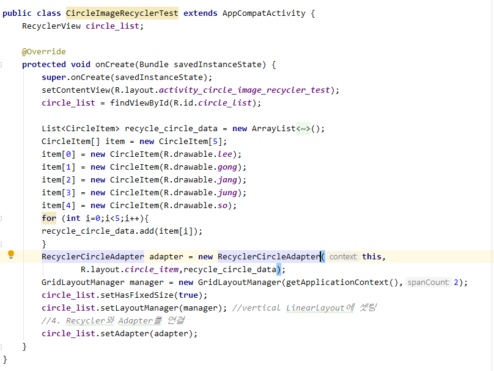

* CardViewActivity

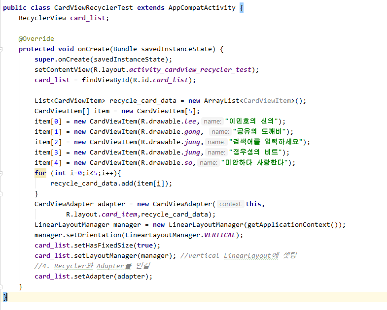