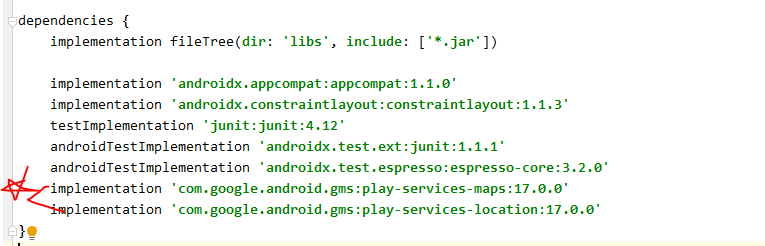

# Map



* Manifest - <!-- 위험 퍼미션 -->

```xml
    <uses-permission android:name="android.permission.INTERNET" /> 
    <uses-permission android:name="android.permission.ACCESS_FINE_LOCATION" />
    <uses-permission android:name="android.permission.ACCESS_COARSE_LOCATION" />
```


> **SupportMapFragment**로부터 지도 객체를 추출해야 지도에 여러가지 작업을 처리할 수 있다.
> 구글 맵은 카메라로 지도를 비추고 있는 형태가 모델링 되어있기 때문에 이 위치를 찾는데 시간이 걸린다.
> ∴  내부에서 자동으로 전달될 수 있도록 작업 - version 2로 바뀌면서 (2016년 이후 문서)

0. **FragmentManager를 이용해서 supportMapFragment를 find**
1. **OnMapReadyCallback을 구현하고(implements) onMapReady 메소드를 오버라이딩**
2. **SupportMapFragment객체에 getMapAsync메소드를 이용해서 1번에서 구현한**
   **OnMapReadyCallback 객체를 연결**
3. **맵이 준비되었을 때 자동으로 onMapReady메소드가 호출되면서 매개변수로 구글맵이 전달된다.**

```xml
<fragment android:name="com.google.android.gms.maps.SupportMapFragment"
        android:layout_width="match_parent"
        android:layout_height="match_parent"
        android:id="@+id/map"/>
```

* Map프레그먼트를 추출
        현재 xml문서에 정의된 Fragment를 추출하는 경우 FragmentManager를 이용해서 추출


```java
public class MainActivity extends AppCompatActivity implements OnMapReadyCallback {
    GoogleMap map;
    @Override
    protected void onCreate(Bundle savedInstanceState) {
        super.onCreate(savedInstanceState);
        setContentView(R.layout.activity_main);
        FragmentManager manager = getSupportFragmentManager();
        SupportMapFragment mapFragment = 						                 (SupportMapFragment)manager.findFragmentById(R.id.map); 
        mapFragment.getMapAsync(this);

    }

    @Override
    public void onMapReady(GoogleMap googleMap) {
        Log.d("mymap","준비완료");
        map = googleMap;
    }
}
```

* Logcat 확인


```java
map.moveCamera(CameraUpdateFactory.newLatLng(myloc));
```


```java
 map.moveCamera(CameraUpdateFactory.newLatLngZoom(myloc,15));
```


* 카메라의 정보를 담고 있는 객체
  *  `target()` - 화면에 출력되기 위해서 특정 위치의 중앙으로 이동
  * ` zoom() `- 지도의 확대 축소 레벨을 설정


```java
			CameraPosition.Builder builder = new CameraPosition.Builder(); 
			//카메라에 대한 정보 담고있는 객체 builder 셋팅
            builder.target(myloc); //어디를 중앙으로
            builder.zoom(15);   //zoom레벨 설정
            CameraPosition position = builder.build();
            map.moveCamera(CameraUpdateFactory.newCameraPosition(position));
```

* 카메라 이동

```java
public void setPosition(View view){
    LatLng myloc = new LatLng(37.5038623,127.0406125);
    //카메라가 이동할 때 에니메이션 적용
    map.animateCamera(CameraUpdateFactory.newLatLngZoom(myloc,15));
}
```


* 마커 출력

```java
  public void setMarker(View view){
                LatLng myloc = new LatLng(37.5038623,127.0406125);
                markerOptions = new MarkerOptions();
                markerOptions.position(myloc); //마커를 출력할 위치
                markerOptions.title("멀티캠퍼스"); // 마커를 클릭햇을 때 보여줄 풍선 도움말
                markerOptions.snippet("삼성 IT 교육센터"); // 풍선 도움말 내용 (추가 텍스트)
                map.addMarker(markerOptions);  //마커가 생성되어 map이 추가
            }
```


* Bitmap : 사이즈가 큰 이미지 뽑아낼 때 사용

* 마커 변경
  * drawable 폴더의 resource로 저장되어 있는 이미지 파일을 Bitmap 형식으로 읽어오기

```java
 public void changeMarker(View view){
            BitmapDrawable bitmapDrawable = (BitmapDrawable)getResources().getDrawable(R.drawable.arrow);
            Bitmap bitmap = bitmapDrawable.getBitmap();
            Bitmap smallMarker = Bitmap.createScaledBitmap(bitmap,200,200,false); 
     		// 이미지 사이즈 변경
            markerOptions.icon(BitmapDescriptorFactory.fromBitmap(smallMarker));
            map.addMarker(markerOptions);
}
```


* 클릭 시 마커 설정

```java
...
     map.setOnMapClickListener(this);
...


@Override
public void onMapClick(LatLng latLng) {
    map.clear(); //클릭할 때마다 맵 다시 설정
    Toast.makeText(this,"지도를 클릭했습니다 : "+latLng.latitude+",경도:"+latLng.longitude,
            Toast.LENGTH_SHORT).show();
    CircleOptions circleOptions = new CircleOptions();
    circleOptions.strokeWidth(10); //circle의 선 width
    circleOptions.strokeColor(0); //선색
    // circleOptions.strokeColor(Color.GREEN);
    circleOptions.fillColor(Color.parseColor("#550000ff"));
    circleOptions.center(latLng); // circle의 중심
    circleOptions.radius(300); //미터단위
    map.addCircle(circleOptions);
}
```


* 지도 길게 클릭

```java
... 
map.setOnMapLongClickListener(this);
...
    
     @Override
    public void onMapLongClick(LatLng latLng) {
        Toast.makeText(this,"지도를 길게 클릭했습니다 : "+latLng.latitude+",경도:"+latLng.longitude,
                Toast.LENGTH_SHORT).show();
    }
```


* file sync 맞출 때


## 현재 위치 지도에 표시하기

### Activity

```java
String[] permission_list={
            Manifest.permission.ACCESS_COARSE_LOCATION,
            Manifest.permission.ACCESS_FINE_LOCATION
    };
```

```java
@Override
protected void onCreate(Bundle savedInstanceState) {
    super.onCreate(savedInstanceState);
    setContentView(R.layout.activity_location_map_exam);
    //화면이 만들어질 때 permission 체크 후 맵 정보 추출 
    // -> getMapAsync() - getMapReady - 내정보 받아오기
    
    if(Build.VERSION.SDK_INT>=Build.VERSION_CODES.M){
        requestPermissions(permission_list,1000);
    }else{
        init();
    }
}
```

* Permission 체크

```java
@Override
public void onRequestPermissionsResult(int requestCode, @NonNull String[] permissions,
                                       @NonNull int[] grantResults) {
    super.onRequestPermissionsResult(requestCode, permissions, grantResults);
    for(int result:grantResults){
        if(result== PackageManager.PERMISSION_DENIED){
            return;
        }
    }
    init();
}
```

* 맵 정보 추출

```java
//맵정보 추출
public void init(){
    FragmentManager manager = getSupportFragmentManager();
    SupportMapFragment mapFragment = (SupportMapFragment) manager.findFragmentById(R.id.map);
    mapFragment.getMapAsync(this);
}
```

* 지도가 준비되면 자동으로 호출되는 메소드

```java
@Override
public void onMapReady(GoogleMap googleMap) {
    map = googleMap;
    if(map!=null){
        getMyLocation();
    }
}
```

* location 추출 - 현재 나의 위치정보를 추출

```java
public void getMyLocation(){
    locationManager = (LocationManager)getSystemService(LOCATION_SERVICE);
    if(Build.VERSION.SDK_INT>=Build.VERSION_CODES.M){
        for(String permission : permission_list){
            if(checkSelfPermission(permission)==PackageManager.PERMISSION_DENIED){
                return;
            }
        }

    }
    // 이전에 측정했었던 값을 가져오고 - 새롭게 측정하는 데 시간이 많이 걸릴 수 있으므로
    Location gps_loc =
            locationManager.getLastKnownLocation(LocationManager.GPS_PROVIDER);
    Location network_loc =
            locationManager.getLastKnownLocation(LocationManager.NETWORK_PROVIDER);
    if(gps_loc!=null){
        setMyLocation(gps_loc);
    }else{
        if(network_loc!=null){
            setMyLocation(network_loc);
        }
    }
    Log.d("myloc", "=============================");
    // 현재 측정한 값도 가져오고
    MyLocationListener locationListener = new MyLocationListener();
    // 현재 활성화 되어있는 Provider를 체크
    if (locationManager.isProviderEnabled(LocationManager.GPS_PROVIDER)){
        locationManager.requestLocationUpdates(LocationManager.GPS_PROVIDER,
                3000,10,locationListener);
    }
    if (locationManager.isProviderEnabled(LocationManager.NETWORK_PROVIDER)){
        locationManager.requestLocationUpdates(LocationManager.NETWORK_PROVIDER,
                3000,10,locationListener);
    }
}
```
* location정보를 지도에 셋팅하는 메소드
```java
public void setMyLocation(Location myLocation){
    Log.d("myloc","위도 : "+myLocation.getLatitude());
    Log.d("myloc","경도 : "+myLocation.getLongitude());
    LatLng myloc = new LatLng(myLocation.getLatitude(),myLocation.getLongitude());

    CameraUpdate cameraUpdate = CameraUpdateFactory.newLatLngZoom(myloc,15);
    map.moveCamera(cameraUpdate);
    //현재 위치를 포인트로 표시하는 작업
    map.setMyLocationEnabled(true);
}
```


