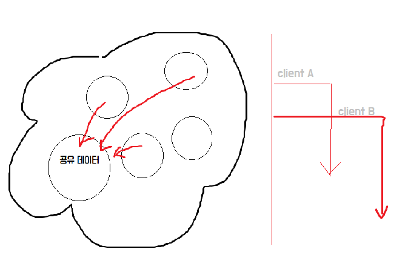
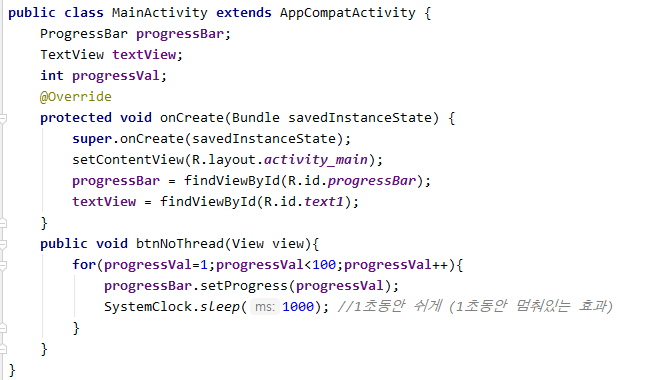
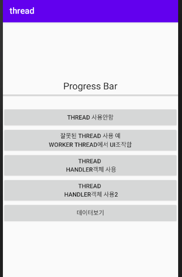
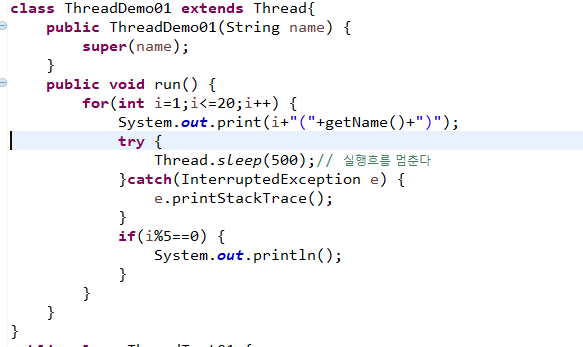
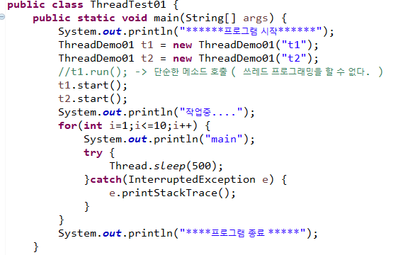

# Thread

* 동시에 프로그램의 **여러 실행 흐름**을 가지고 있다.

* 실행중인 프로그램 : 프로세스

  * 각각의 프로세스는 서로 관여를 할 수 없다.

* 멀티 쓰레드 : 하나의 프로그램 안에서 동시에 여러 개의 실행 흐름을 가지고 있는 방식

  * Java에서는 2가지 쓰레드 처리방식이 있다.  

    * Thread 클래스 상속

    * Runnable인터페이스 구현 ( 일반적)

      * Thread를 상속받으면 다른 클래스를 상속받을 수 없기 때문에

      *cf ) 코틀린 - modern java  + javascript*

      

      

- public void run()

  If this thread was constructed using a separate  `Runnable` run object, then that  `Runnable` object's `run` method is called; otherwise, this method does nothing and returns.  

   Subclasses of `Thread` should override this method.

  - Specified by:

    `run` in interface `Runnable`

 멀티쓰레드 프로그래밍
 * 1. Thread 클래스를 상속
 * 2. Run 메소드를 오버라이딩
 * 		=> 쓰레드 프로그래밍으로 작업하고 싶은 내용을 구현 (동시의 실행 흐름으로 표현하고 싶은 내용을 구현)
 * 3. Thread 클래스의 (Thread의 하위 클래스) start 메소드를 호츌
 * 		=> 동시 작업 시작
 * 		=> run을 직접 호출하지 않고 start 메소드를 호출하면 JVM이 실행할 수 있는 상태가 되면
 * 		   자동으로 Thread클래스의 run 메소드를 호출

[실습]

 1.쓰레드 프로그래밍을 구현

- 1부터 100까지 출력하는  DigitThread
- A~Z까지 출력하는 AlphaThread
- ThreadExam01의 main메소드에서 DigitThread 와 AlphaThread를 동시에 실행해보자