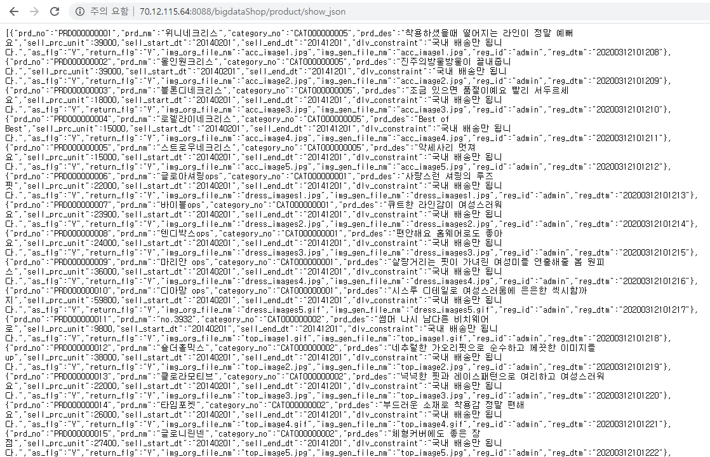
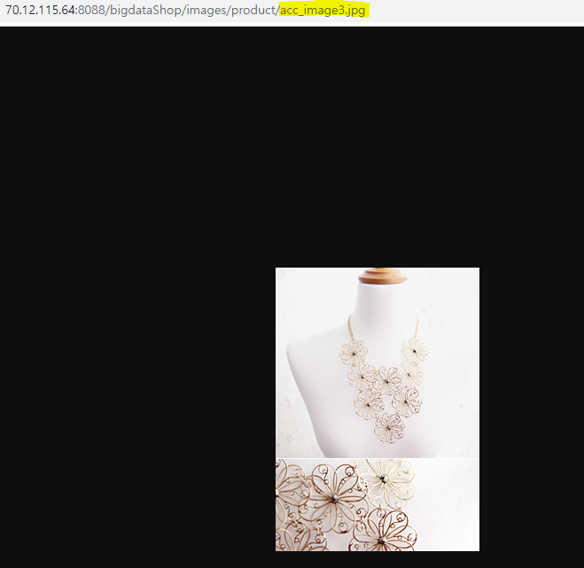
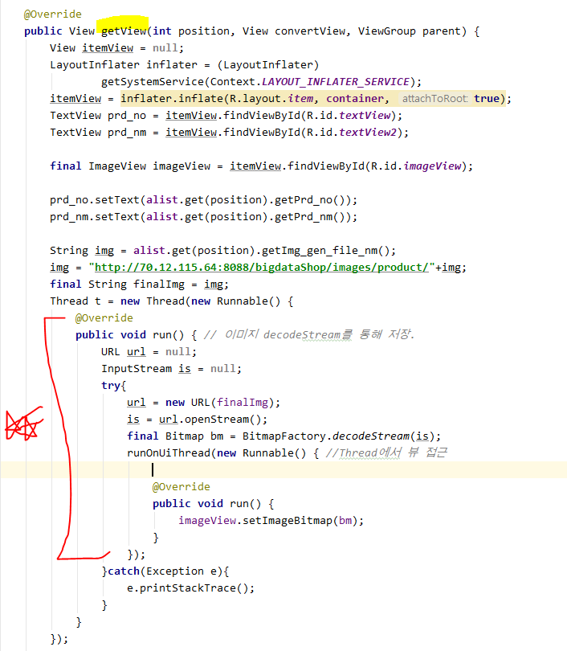
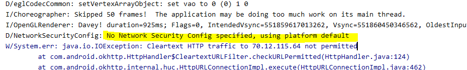
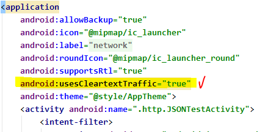

## Oracle을 이용해서 DB구현하기

>  ORACLE Web Server 이용

* Pom.xml 추가 - **json변환기**

```xml
		<dependency>
			<groupId>com.fasterxml.jackson.core</groupId>
			<artifactId>jackson-core</artifactId>
			<version>2.4.6</version>
		</dependency>
		<dependency>
			<groupId>com.fasterxml.jackson.core</groupId>
			<artifactId>jackson-databind</artifactId>
			<version>2.4.6</version>
		</dependency>
```

* Controller 작성

  * 일반 메소드 리턴하는 것처럼 List<BoardDTO>를 리턴하면서

    @ResponseBody로 설정하면 jackson라이브러리가 자동으로 json객체로 변환

```java
	@RequestMapping(value = "/product/show_json", method = RequestMethod.GET, produces = "application/json;charset=utf-8")
	public @ResponseBody List<ProductDTO> categoryboardlist(String category) {
		String result = "";
		List<ProductDTO> prdlist = service.productlist(category);
		System.out.println("ajax통신" + prdlist);
		return prdlist;
	}
```


[결과]

이렇게 Json 형태로 보이는 것을 알 수 있다.




* 이미지 파일명을 통해 데이터 가져오기



* ```
  안드로이드에서 별도의 작업은 전부 Thread로 처리해준다.
  ```

* getView()

  * Row 하나 만들어주는 작업

  


* `https` 프로토콜만 받아올 수 있다 -, http 통신을 하니 오류 발생



* `usesCleartextTraffic`  조건을 추가해주어야 한다.

