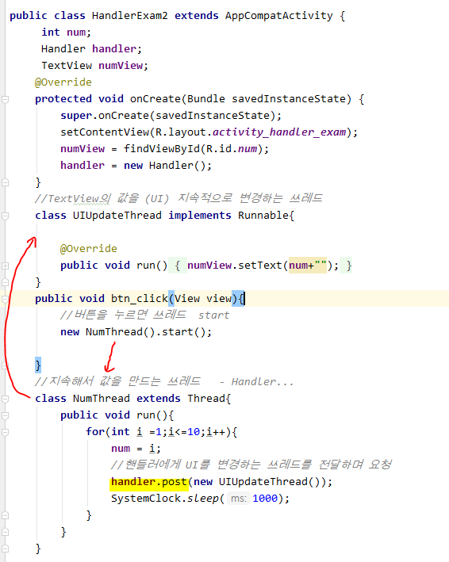
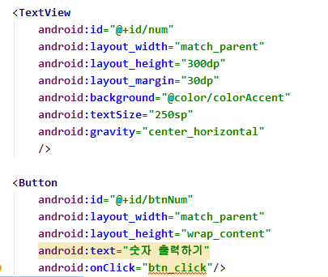
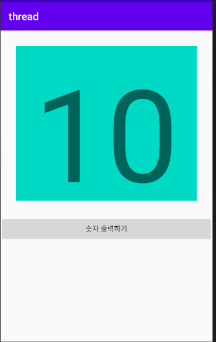
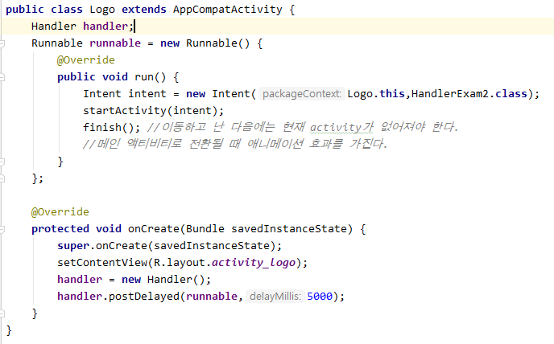
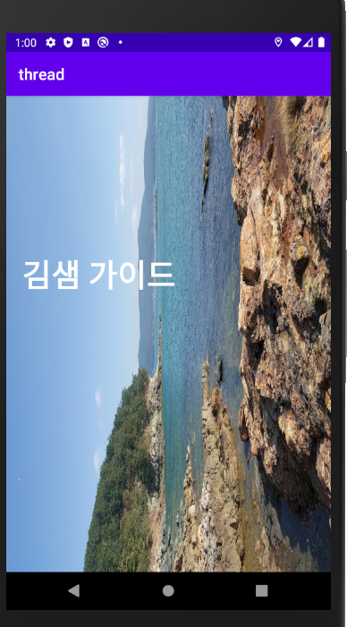
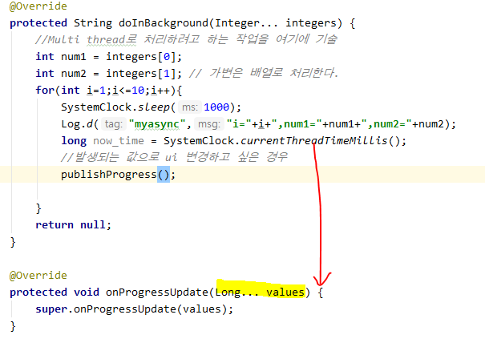
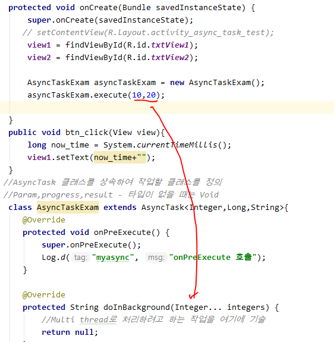
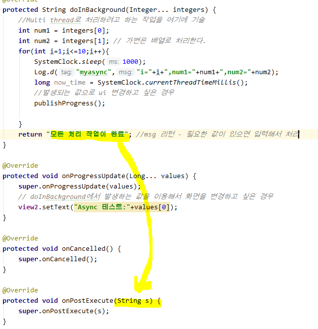
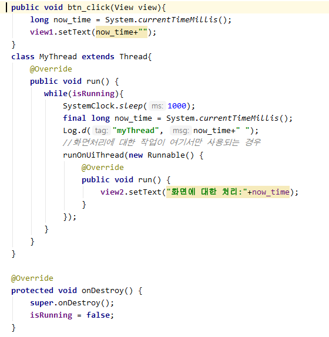

## Handler 실습





[ 결과 ]



## Logo 만들기

* 5초 후에 처리해야 하는 작업을 쓰레드 정의





## AsyncTask

1) **AsyncTask를 상속받는 클래스를 정의**

 - AsyncTask에 제네릭을 적용해서 변수 세 개의 타입을 정의 ( 사용자가 임의로 )

    - `<Param,progress,result>` - 타입이 없을 때는 Void

    - 첫 번째 제네릭 : `execute`를 호출해서 AsyncTask 를 실행할 때 필요한 매개변수의 타입

      ​							이 매개변수가 `doInBackground` 를 호출할 때 전달된다.

   - 두 번째 제네렉 : publishProgress 매개변수 타입

     ​						    publishProgress 가 호출할 onProgressUPdate의 매개변수

     ​						    즉, `doInBackground`메소드 내부에서 발생되는 값들로 화면에 출력되기 위해 필요한 값

   - 세 번째 제네릭 : `doInBackground`가 종료되고 리턴되는 값의 타입

     ​					`doInBackground`가 종료되면 자동으로 onPostExecute가 호출되며 매개변수로 전달된다.


2) **메소드를 오버라이딩**

* **onPreExecute** : **doInBackground** 메소드가 호출되기 전에 실행되는 메소드
  * 일반 쓰레드로 처리할 일들(`doInBackground`에서 처리되는 작업)이 실행되기 전에 사전 작업을 해야 하는 경우 구현
  * 메인쓰레드(UI쓰레드)에서 호출되는 메소드이므로 화면처리 가능
  * UI쓰레드에서 호출하기 때문에 시간이 오래 걸리는 작업을 하면 안된다.

 - **doInBackground** : Background에서 실행될 작업을 정의

    - 일반 thread에서 `run`메소드에 정의했던 코드를 구현
    - 네트워크 처리, 시간이 오래 걸리는 작업을 여기서 처리
    - 화면 관련 처리는 할 수 없다. (절대 x)
      	- 매개변수가 가변형이고 배열로 처리된다.

- **onProgressUpdate** : `doInBackground`가 실행되는 중에  UI를 변경해야 할 일이 있는 경우에 호출되는 메소드

  - `doInBackground` 내부에서 화면을 변경해야 할 일이 생길 때 `publishProgress`메소드를 호출하면 

    자동으로 `onProgressUpdate`가 호출된다

* **onCancelled** : 작업이 취소되는 경우 호출되는 메소드
* **onPostExecute** : `doInBackground `메소드의 처리가 끝나면 호출되는 메소드
  * UI 쓰레드에서 호출하기 때문에 시간이 오래걸리는 작업을 하면 안된다. (뷰를 변경할 수 있다.)


3) **AsyncTask 의 하위객체를 생성**


4) **생성된 AsyncTask를 실행**

 - AsyncTask 의 execute메소드를 실행

   *execute - onPreExecute - doInBackground  흐름*

   






## 멈춤에 대한 작업 처리



[결과]

* 뒤로가기 해서 AVD를 나오면 작동이 멈춘다.

```java
 @Override
        protected Integer doInBackground(Integer... integers) {
            int cnt = integers[0].intValue();
            int sum = 0;
            for(int i=0;i<50;i++){
                if(isCancelled() == true){
                    break;
                }
                try {
                    Thread.sleep(100);
                } catch (InterruptedException e) {
                }
                sum += i;
                publishProgress(i);
            }
            return sum;
        }
```


