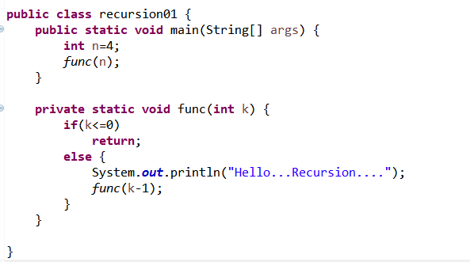
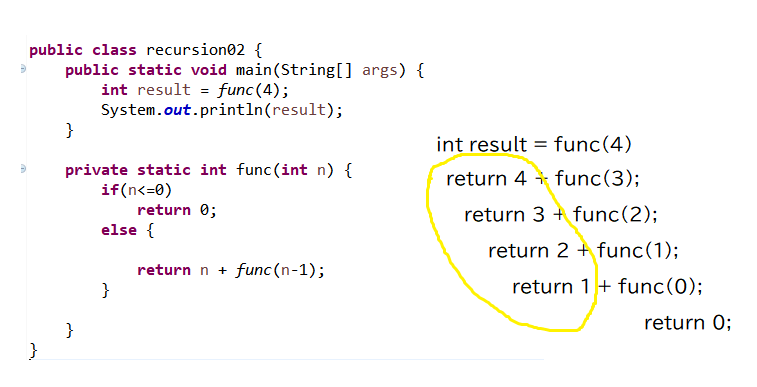
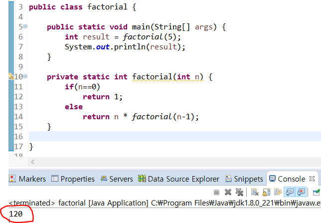
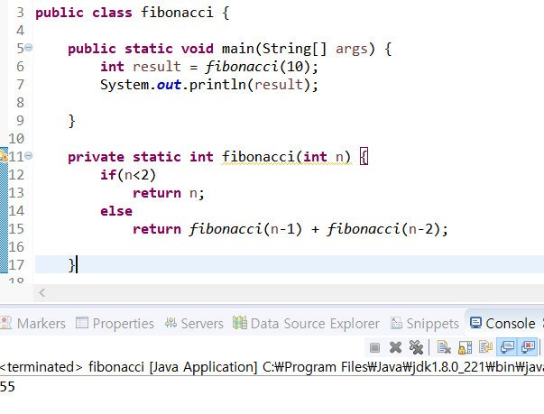
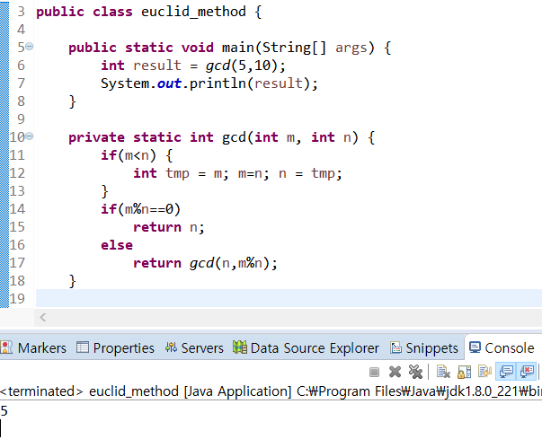
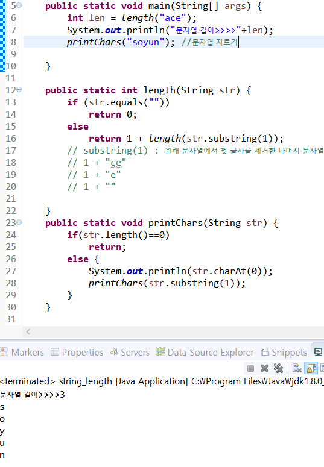

# Recursion

> 순환, 재귀함수
>
> 자기 자신을 호출하는 함수
>
> 0! = 1
>
> **n! = n*(n-1)!**     (n>0)

* recursion이 항상 무한루프에 빠지지는 않는다.
  * **base case** : 적어도 하나의 recursion에 빠지지않는 경우가 존재해야 한다.
  * **recursive case** :  recursion을 반복하다보면 base case로 수렴해야 한다.

* 0~ n까지의 합 구하기

>  음이 아닌 정수 n에 대해서 합 구하기 

[ 결과 ] : 10

* factorial

* 피보나치 수열

> f0 = 0
>
> f1 = 1
>
> fn = fn-1 + fn-2   (n>1)

* 최대공약수

> m>=n인 두 양의 정수 m과 n에 대해서
>
> m이 n의 배수이면 gcd(m,n) = n
>
> 그렇지 않으면 gcd(m,n) = gcd(n,m%n)

## Recursive Thinking

> 순환적으로 사고하기! 
>
> * 반복문 대신 recursive 사용할 수 있음

### 1. 문자열

* 길이 계산
* 문자열 character로 자르기

