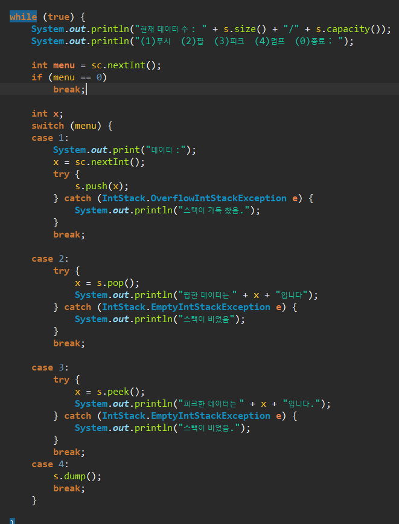
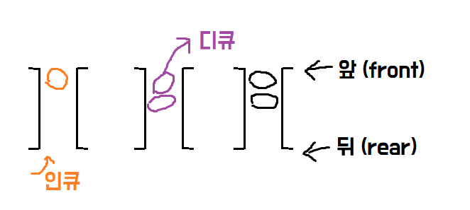
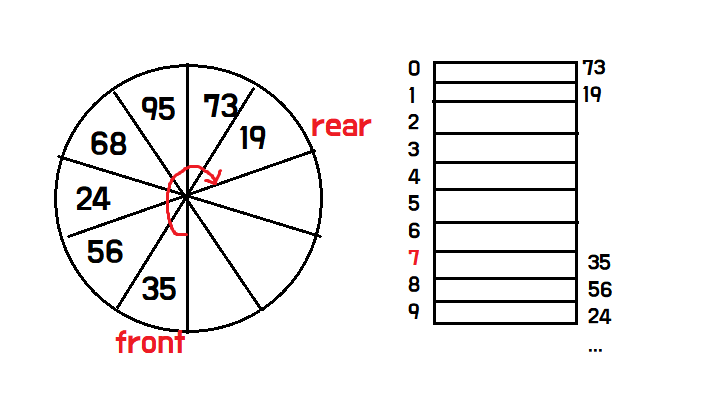

# 스택

> 데이터를 일시적으로 저장하기 위한 자료구조, 가장 나중에 넣은 데이터를 가장 먼저 꺼낸다.

## 스택이란 ?

* Stack은 데이터를 일시적으로 저장하기 위해 사용하는 자료구조로, 데이터의 입력과 출력 순서는 **후입선출(LIFO,Last In First Out)**이다.
* 데이터를 넣는 작업 : **푸시(push)**
* 데이터를 꺼내는 작업 : **팝(pop)**


* Java에서 메서드를 호출하고 실행할 때 프로그램 내부에서는 스택을 사용.

### 스택 과정

* **생성자**
  * stk = new int[max] - stk[0],  stk[1],  stk[2] ,...,  stk[max - 1] 생성

```java
public IntStack(int capacity) {
		ptr = 0;  // 생성 시 스택은 비어있다. 
		max = capacity;
		try {
			stk = new int[max];				// 스택 본체용 배열을  생성
		} catch (OutOfMemoryError e) {		// 생성할 수 없음
			max = 0;
		}
	}
```

* x **push**
  * 스택이 가득 차서 푸시할 수 없는 경우 : 예외  `OverflowIntStackException`
  * 전달받은 x를 배열요소 `stk[ptr]`에 저장하고 스택 포인터`ptr`을 증가시킨다.

```java
public int push(int x) throws OverflowIntStackException {
		if (ptr >= max)									
			throw new OverflowIntStackException();
		return stk[ptr++] = x;
	} //메서드의 반환값은 푸시한 값.
```

* x **pop**
  * 스택에서 데이터를 팝(정상에 있는 데이터를 꺼냄)
  * 스택이 비어있는 팝을 할 수 없는 경우에 `EmptyIntStackException`을 던진다.
  * 스택포인터를 먼저 감소시키고 그 때 stk[ptr]에 저장된 값을 반환한다.

```java
	public int pop() throws EmptyIntStackException {
		if (ptr <= 0)									// 스택이 비어 있음
			throw new EmptyIntStackException();
		return stk[--ptr];
	}
```

* **peek**
  * 스택의 꼭대기에 있는 데이터 '몰래 엿보는' 메서드
  * 스택이 비어있는 경우 예외 `EmptyIntStackException` 던진다.
  * 데이터의 입 출력이 없으므로 스택포인터는 변화하지 않는다.

```java
	// 스택에서 데이터를 피크(정상에 있는 데이터를 들여다봄) 
	public int peek() throws EmptyIntStackException {
		if (ptr <= 0)									// 스택이 비어 있음
			throw new EmptyIntStackException();
		return stk[ptr - 1];
	}//스택이 비어있지 않으면 꼭대기의 요소 stk[ptr - 1] 반환.

```

* 검색 메서드 **index of**
  * 스택 본체의 배열 stk에 x와 같은 데이터가 포함되어 있는지, 포함되어 있다면 배열의 어디에 들어 있는지를 조사하는 메서드 입니다. 

```java
	public int indexOf(int x) {
		for (int i = ptr - 1; i >= 0; i--)				// 정상 쪽에서 선형 검색
			if (stk[i] == x)
				return i;								// 검색 성공
		return -1;										// 검색 실패
	}
```

* 스택의 모든 요소 삭제 : **clear**

```java
	public void clear() {
		ptr = 0;
	}
```

* 스택의 용량확인 **capacity**

```java
	public int capacity() {
		return max;
	}
```

* 스택에 쌓여 있는 데이터 수를 반환

```java
	public int size() {
		return ptr;
	}
```

* 스택이 비어 있는가 **isEmpty**

```java
public boolean isEmpty() {
		return ptr <= 0;
	}
```

* 스택이 가득 찼는가 **isFull**


```java
	public boolean isFull() {
		return ptr >= max;
	}
```

* 스택 출력 **dump**
  * 스택 안의 모든 데이터를 바닥 → 꼭대기 순서로 출력

```java
	public void dump() {
		if (ptr <= 0)
			System.out.println("스택이 비어 있습니다.");
		else {
			for (int i = 0; i < ptr; i++)
				System.out.print(stk[i] + " ");
			System.out.println();
		}
	}
```



# 큐

스택과 마찬가지로 데이터를 일시적으로 쌓아 놓는 자료구조이다.

가장 먼저 넣은 데이터를 가장 먼저 꺼내는 **선입선출**(FIFO,First In First Out) 구조

## Queue란 ? 

* 큐에 데이터를 넣는 작업 : 인큐(enqueue)
* 데이터를 꺼내는 작업 : 디큐(dequeue)
* 데이터를 꺼내는 쪽 : 프런트(front)
* 데이터를 넣는 쪽 : 리어(Rear)



* 디큐 시 queue[0]에 저장된 데이터를 꺼낸 다음, 두 번째 이후의 요소를 맨 앞으로 옮긴다.
  * 이 때의 복잡도 O(n)이 발생하며, 데이터를 꺼낼 때마다 이런 작업을 하면 효율이 떨어진다.
* 배열 요소를 앞쪽으로 옮기지 않는 큐 구현 : **링 버퍼**

## Ring Buffer

* `front` 와 `rear`는 물리적인 순서가 아니라 **논리적인 데이터 순서**를 말한다.



* 7개의 데이터 (35,56,24,68,95,73,19) 가 차례대로 q[7],q[8],q[9]...q[11],q[0],q[1] 에 저장된다.
  * 프론트 값은 7이고 리어는 2
  * 만약 82를 `인큐`하려고 하면, q[2]`(rear)`에  82를 저장한 다음 리어 값을 1만큼 증가.
  * 35 `디큐`를 한다면 프런트 요소 q[7] 의 값 35를 빼고 프런트 값 1만큼 증가시킨다. 
* 이렇게 큐 구현 시 프런트와 리어 값을 업데이트하며 인큐와 디큐를 수행하여 앞에서 발생한 요소 이동 문제 해결 가능.