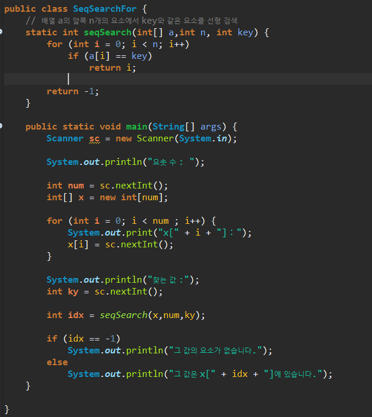
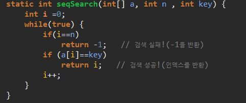
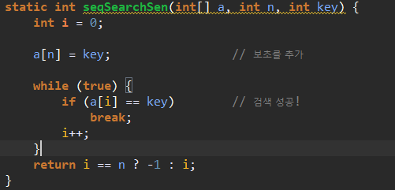
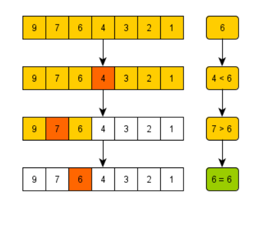
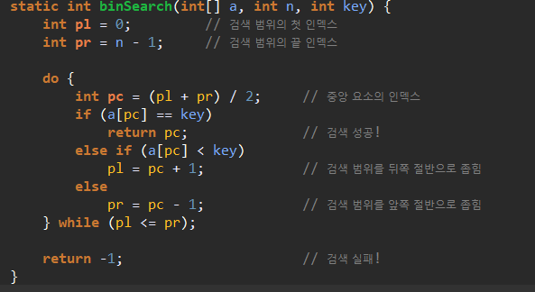
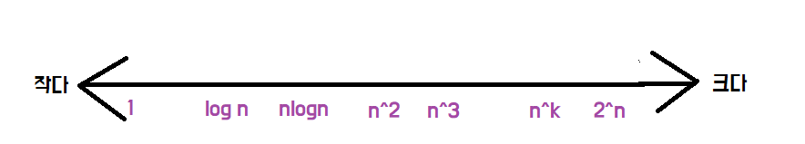
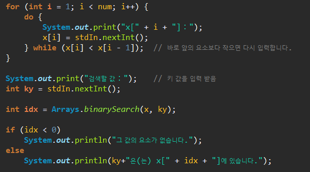
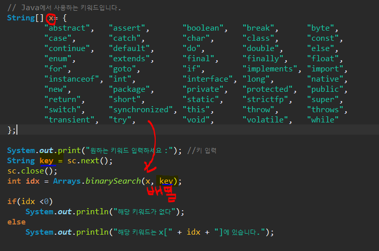

# 검색

## 1. 선형 검색

> 무작위로 늘어놓은 데이터 모임에서 검색 수행

* 배열 검색의 종료 조건
  * 검색할 값을 발견하지 못하고 배열의 끝을 지나간 경우 `(n+1)`
  * 검색할 값과 같은 요소를 발견 `n`
* 배열의 요소 수가 `n` 개일 때, 조건을 판단하는 횟수는 평균 `n/2` 회





* 메서드 SeqSearch 는 배열 a의 처음부터 끝까지 n개의 요소를 대상으로 값이 key인 요소를 선형 검색하고 검색한 요소의 인덱스 반환.

###  - 보초법

> 검사 비용을 반(50%)으로 줄이는 방법으로 , 반복문에서 종료 판단 횟수를 2회에서 1회로 줄이는 역할.



* while에서 찾은 값이 배열의 원래 데이터인지 아니면 보조 데이터인지 판단해야 한다. 
  * 변수 i 값이 n이면 찾은 값이 보초이므로 -1 반환한다.

## 2. 이진 검색

> 일정한 규칙으로 늘어놓은 데이터 모임에서 아주 빠른 검색을 수행
>
> * 오름차순 or 내림차순으로 정렬된 배열에서 검색.

* 배열의 중앙(배열 길이가 n이라고 할 때, `(처음0 + 끝n-1)/2)`에 찾는 값이 저장되어 있는지 확인



* binSearch 메소드



### - 복잡도

> 알고리즘의 성능을 객관적으로 평가하는 기준
>
> 복잡도를 표시할 때 **O**는 Order에서 따온 것이다.
>
> *ex ) O(1) : 한번만 실행하는 경우*

* n/2 실행했을 때 복잡도를 O(n)으로 표현하는 이유는 n 이 무한히 커진다고 가정했을 때 그 값의 차이가 무의미해지기 때문이다.
* n이 커지면 O(n)에 필요한 계산 시간은 n에 비례하여 길어진다.

```Text
O(f(n)) + O(g(x)) = O(max(f(n),g(n)))

O(1) + O(n) + O(n) + O(1) + O(n) + O(1) = O(max(1,n,n,1,n,1)) = O(n)
```



### - API

* java.util.Arrays 클래스의 **binarySearch** 메서드가 있다.
  * `binarySearch `메서드는 **오름차순**으로 정렬된 배열 a를 가정하고 key값인 요소를 이진 검색한다. 
  * `int`나 `long`형과 같은 기본 자료형 배열에서 이진 검색.



* 객체의 배열에서 검색하기

  * **자연정렬** : static int **binarySearch**(Object[] a,Object key) 
    * x는 문자열 배열로 , 문자열을 key에 입력
    * 배열 x와 키 값 key를 binarySearch메서드에 전달.
    * binarySearch가 전달받는 자료형은 **Object**형으로, **어떤 형태의 클래스도 전달받을 수 있다.**

  

  * static<T> int binarySearch(T[] a, T key,Comparator<? super T> c)

  #### comparator 메서드

* java.util.Comparator 메서드

* 객체의 대소 관계 판단하는 Comparator 직접 구현하려면 Comparator인터페이스를 구현한 클래스를 정의하고, 그 클래서형의 인스턴스를 생성해야 한다.

```java
package.java.util;
public interface Comparator <T>{
    int compare(T o1, T o2);
    boolean equals(Object obj);
}
```

* 결과를 반환하는 compare메서드 구현

```java
public int compare(T d1, T d2){
    if(d1>d2) return 양수;
    if(d1<d2) return 음수;
    if(d1=d2) return 0;
}
```

* Comparator 구현

```java
class X {
// 필드, 메소드 등
public static final Comparator<T> COMPARATOR = new Comp();
private static class Comp implements Comparator<T> {
		public int compare(T d1, T d2) {
            // d1이 d2보다 크면 양의 값 반환
			// d1이 d2보다 작으면 음의 값 반환
			// d1이 d2와 같으면 0 반환
		}
	}
}
```


## 3. 해시법

> 추가, 삭제가 일어나는 데이터 모임에서 아주 빠른 검색 수행
>
> * 체인법 : 같은 해시 값의 데이터를 선형 리스트로 연결
> * 오픈 주소법  : 데이터를 위한 해시 값이 충돌할 때 재해시 하는 방법.


