# 알고리즘

* **자료 구조** : 데이터 단위와 데이터 자체 사이의 물리적 또는 논리적인 관계

## 1. 기본 알고리즘

* `while` 문:  어떤 조건이 성립하는 동안 처리를 반복하여 실행.
* `for`문: 하나의 변수를 사용하는 반복문은 `while`보다 `for`문 사용 
* `doWhile` : 일단 루프 본문을 한번 실행한 다음, 계속 반복할 것 인지를 판단하는 사후 판단 반복문.
* 드모르간

> x&&y 와 !(!x||!y)는 같다.

* 논리 부정 연산자 `!` 를 사용한다.

  ```java
  // 두자리 출력
  do{
      
  }while(no>=10||n<=99);
  
  do{
      
  }while(!(no>=10||n<=99));
  ```

### 배열

* 배열 ?   

  ```java
  a = new int[5];  //구성 요소의 개수가 5인 배열
  ```

  * `int` 형의 배열 본체를 생성하고, 그것을 변수 a가 참조하도록 설정
  * a[0] , a[1], ... 는 `int `형 , a 는 `int[5] `형이다.

* 배열 요소 초기화하며 선언하기

  ```java
  int[] a = {1,2,3,4,5}
  //int[] a = new int[]{1,2,3,4,5};
  for (int i = 0; i < a.length; i++)
  	System.out.println("a[" + i + "] = " + a[i]);
  ```

* 배열의 복제(클론)

  * `배열이름.clone();`

  ```java
  int[] b = a.clone();
  //배열 변수 b는 a가 참조하는 배열 본체의 복제를 참조한다.
  ```

* 배열 요소의 최댓값

  ```java
  max = a[0];
  if(a[1]>max) max = a[1]
  if(a[2]>max) max = a[2]
  ```

  ```java
  //for문 이용
      for(int i=0;i<n;i++){
           if(a[i]>max)
               max = a[i];
      } 
  //요소가 n개면 if문 n-1개 작성
  ```

### 다차원 배열

```java
//2차원 : 배열의 배열
int[][] x = new int[2][4];
//3차원 
int[][][] x = new int[2][3][4];
```

* 확장된 for 문 = **for-in** 문, **for-each** 문
  * i는 index를 나타내는 것이 아니라 스캔 시 주목하고 있는 요소라고 생각하면 된다.
  * 배열의 요소수(길이)를 조사하는 수고를 덜 수 있다
  * iterator와 같은 방법으로 스캔 가능.
    *  `인덱스 자체의 값이 필요하지 않을 때`는 for-each 사용하는 것이 좋다.

```java
for(double i : a)
    sum += i;
//배열 a의 처음부터 끝까지 모든 요소를 한 개씩 스캔
//for(int i=0;i<a.length;i++)
//   sum +=a[i];
```


### Random 클래스

* `java.util.Random`

  * `nextInt()`가 반환하는 것은 0부터 n-1까지의 난수.

    ex) `rand.nextInt(90)` : 0~89까지의 난수 생성

    ex) `1 + rand.nextInt(20)` :     1~20의 난수 생성

```java
		int num = sc.nextInt();		// 배열의 요솟수
		int[] height = new int[num];
		
		for(int i=0;i<num;i++) {
			height[i] = 100+rand.nextInt(90);
			System.out.println("height[" + i + "]：" + height[i])
		}
```

## 2. String 클래스

* char charAt(int i) : 인덱스가 i인 곳의 문자를 가져온다
* int length()  : 문자열의 문자 수(길이)를 가져온다

### 1. 배열 비교 메서드 equals

* 두 배열 a와 b의 모든 요소가 같은가 판단.

* 메서드 반환형 : `boolean`

  * 모든 요소의 값이 같으면 `true`
  * 그렇지 않으면 `false`

  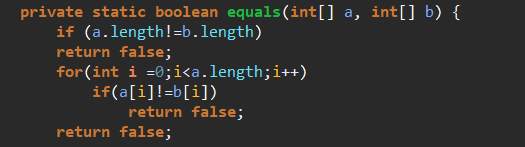

  

### 2. toCharArray()

* 문자열을 **char형 배열**로 바꾼다.
* 배열을 생성 해야하므로 처리속도가 느릴 수 있다

```java
public class tochararray{
    public static void main(String[] args){
        String str = "helloworld";
        //toCharArray() 메서드를 이용한 문자열 나누기
        char[] arr = str.toCharArray();
        
        System.out.print("toCharArray()로 나누어진 값");
        for(int i=0;i<arr.length;i++){
            System.out.print(arr[i]+" ");
        }
        //new String 으로 배열을 문자열로 만들기
       	String newStr = new String(arr);
        System.out.print("new String으로 만들어진 값 :"+newStr)
    }
}
```

## 3. 클래스

* 클래스 본체에는
  * 멤버변수 
  * 클래스 초기화 / 인스턴스 초기화
  * 생성자                                                             선언 가능.

```JAVA
class XYZ{
    int x; 
    long y;
    double z;
}
//선언
XYZ a = new XYZ();
```

* 생성자는 새로 선언한 인스턴스의 초기화를 위해 사용된다.
* **final** 클래스  : 서브 클래스를 가질 수 없다. ( 상속 불가능 )
* 상속 : extends
* 인터페이스 : implements
* 추상 클래스 (abstract) : 불완전한 클래스이므로 인스턴스를 만들 수 없다.

### - 메서드

>  **클래스 메서드**와 **인스턴스 메서드**

* 인스턴스 ( 비정적 ) 메서드
  * static을 붙이지 않고 선언한 메서드
* 클래스 (정적) 메서드

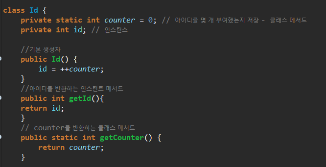

## 4. 응용

* `java.lang` 패키지는 자동 import : `Integer`, `String`

### 1. 소수

* **소수** : 2부터 n-1까지 어떤 정수로도 나누어 떨어지지 않는다.

  * 나누어 떨어지는 정수가 하나 이상 존재하면 **합성수** 이다.

[version 1]

* 처음부터 다 나누어보는 알고리즘

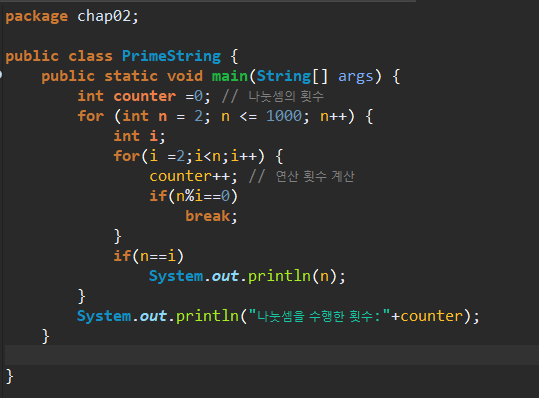

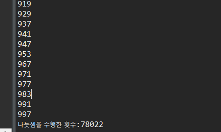

[version 2]

* 값이 소수로 나누어 지는지를 판단하는 알고리즘

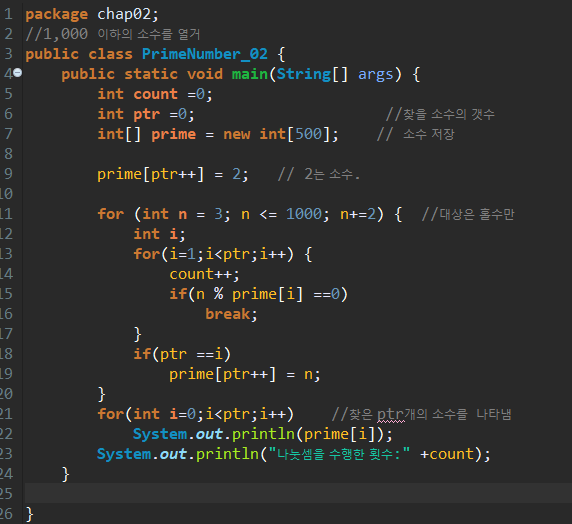

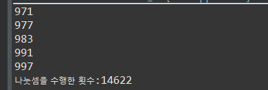

[version 3]

* n의 제곱근 이하의 어떤 소수로도 나누어 떨어지지 않으면 소수.

* counter : 곱셈과 나눗셈 횟수의 합계 

  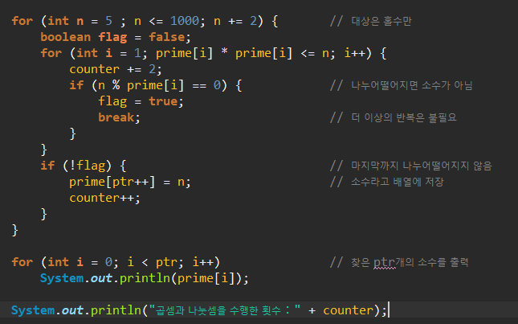

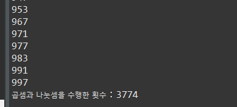

### 2. 한 해의 경과 일 수

*ex ) 4월 15일  : 1월의 일 수 + 2월의 일 수 + 3월의 일 수 + 15*

*2월의 평년 : 28일, 윤년은 29일*

```java
// 각 달의 일 수
		static int[][] mdays = {
				{31, 28, 31, 30, 31, 30, 31, 31, 30, 31, 30, 31},	// 평년
				{31, 29, 31, 30, 31, 30, 31, 31, 30, 31, 30, 31}	// 윤년
		};
```

```java
// 서기 year년은 윤년인가? (윤년：1／평년：0)
		static int isLeap(int year) {
			return (year %4 ==0 && year %100 != 0 || year %400 ==0)?1:0;
		}
```

```java
// 서기 y년 m월 d일의 그 해 경과 일수를 구함
		static int dayOfyear(int y, int m, int d) {
			int days = d;
			for(int i = 1; i < m; i++)          // 1월~(m-1)월의 일 수를 더함
				days += mdays[isLeap(y)][i-1];
			return days;
		}
```

```java
//while문 사용시
        static int dayOfYear(int y, int m, int d) {
                while(--m!=0)
                    d+=mdays[isLeap(y)][m-1];
                return (d);
            }
```

* 만약 그 해의 남은 일 수를 구하고 싶으면 

```java
return 365 + isLeap(y) - days; 
```

### 3. 시력검사

* 기본 생성자 생성

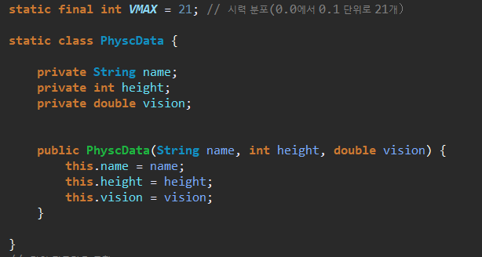

* 배열  (main)

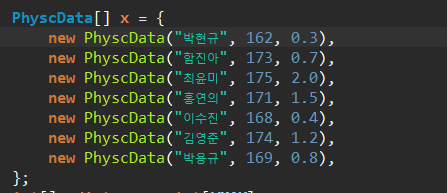

* 메소드 생성

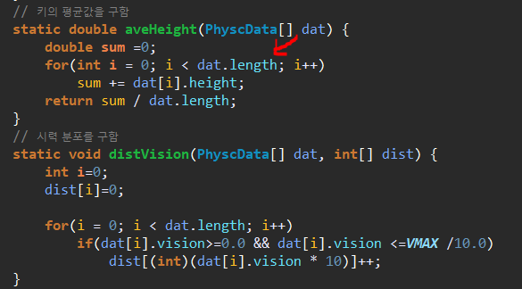

* main()

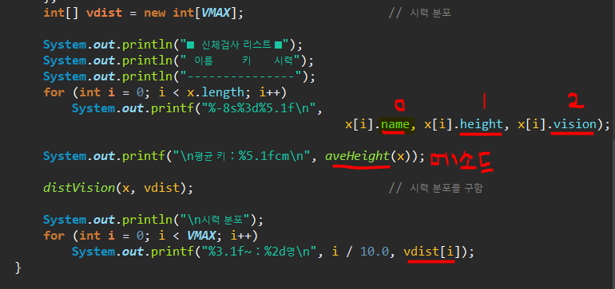

* 결과

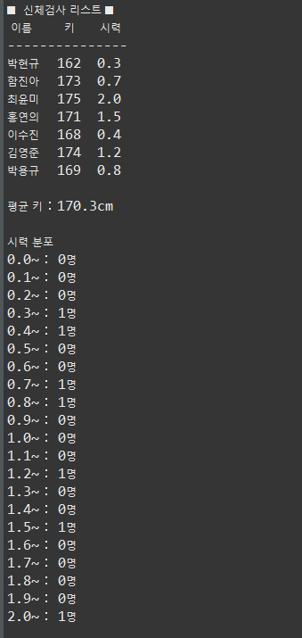