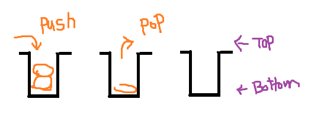

# 스택

> 데이터를 일시적으로 저장하기 위한 자료구조, 가장 나중에 넣은 데이터를 가장 먼저 꺼낸다.

## 스택이란 ?

* Stack은 데이터를 일시적으로 저장하기 위해 사용하는 자료구조로, 데이터의 입력과 출력 순서는 **후입선출(LIFO,Last In First Out)**이다.
* 데이터를 넣는 작업 : **푸시(push)**
* 데이터를 꺼내는 작업 : **팝(pop)**

* Java에서 메서드를 호출하고 실행할 때 프로그램 내부에서는 스택을 사용.