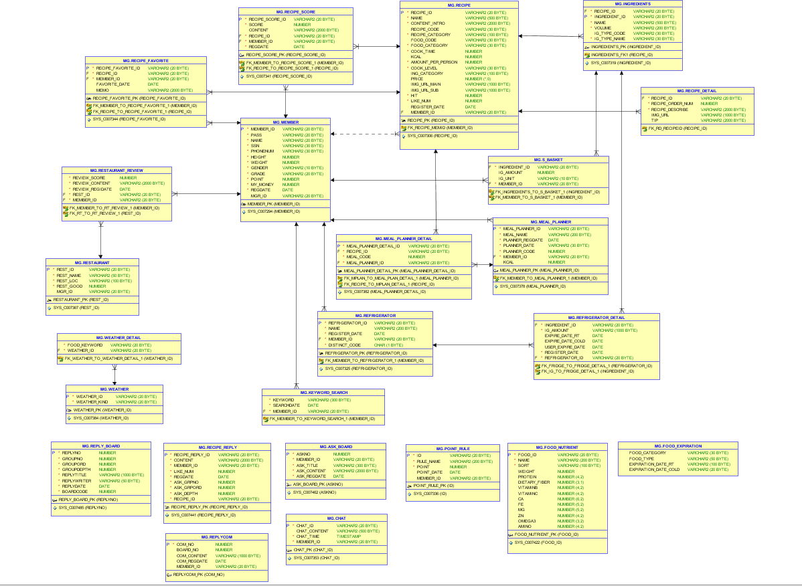
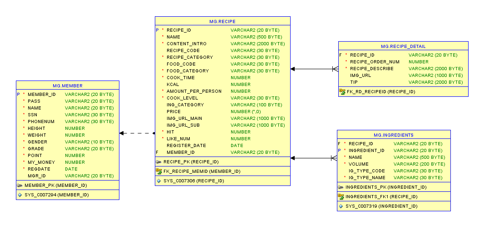
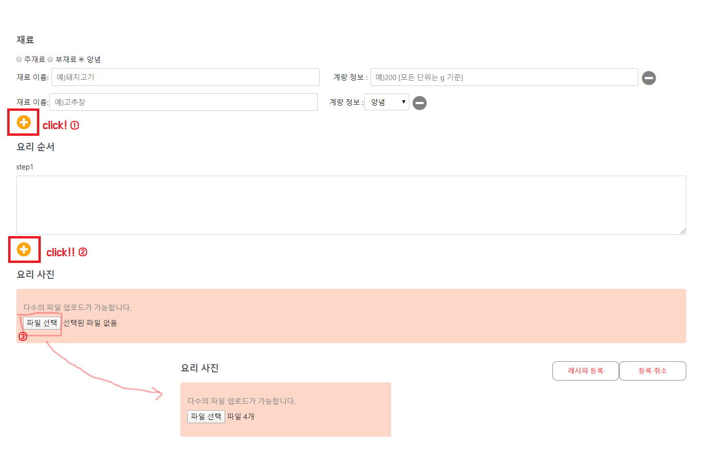
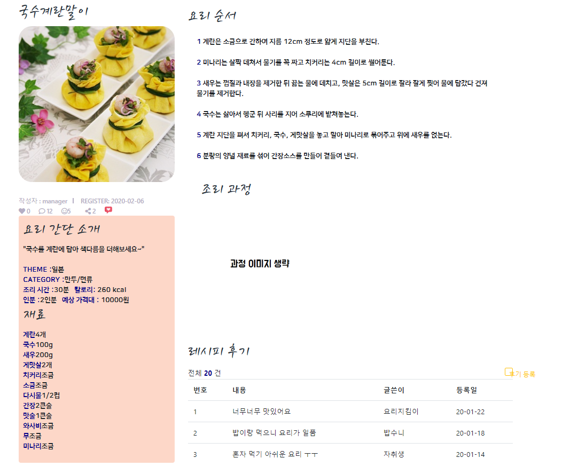

* 전체 테이블 

* 내가 사용한 테이블

* 메인 페이지

* 조회 수에 따라 가장 핫한 레시피를 보여주며,  부가적으로 회원들의 좋아요 수 까지 보여 준다.

* 숙취에 가장 좋은 비타민 B 가 가장 많이 들어있는 레시피들을 기준으로 음식을 추천해준다.

*  Pagenum과 contentnum에 따른 페이징 처리 
  * 즉, 총 페이지 수와 그 페이지 속에 보여줄 게시물의 수를 기준으로 페이지를 처리함으로써 당장 필요한 페이지만 메모리에 적재하기 때문에 메모리 사용량이 감소한다. 
* ajax와 DB를 연동하여 카테고리와 검색어에 따른 리스트를 불러올 수 있도록 제작

* 레시피 기본 정보

  

① 재료 종류 라디오 버튼 클릭 후 , plus 버튼 클릭 시 그에 따른 재료 추가 노드가 뜬다. 

② 레시피 마다 다를 수 있기 때문에 동적으로 요리 순서를 추가할 수 있도록 제작

③ 레시피에 따라 최소 한 개부터 여러 개의 파일 업로드 가능.

* 해당 레시피 클릭 시 레시피 조회가 가능

③ 좋아요 수 : 로그인 session 기능을 통해 로그인을 하지 않은 상태일 시 ,좋아요 버튼 비활성화가 되어 로그인이 필요하다는 alert창이 뜬다.

로그인 시 활성화가 되어 클릭을 하면 ①  ♥ 숫자가 +1 이 된다.

②조회수 : update 문을 이용해서 레시피를 조회할 때마다 +1씩 증가한다.

* 레시피에 맞는 요리 과정 순서를 제공한다.

* 조리 과정의 이미지는 만약 작성자가 올리지 않았을 때는 [과정 이미지 생략 ] 이라는 문구가 뜨며, 

  해당 과정의 요리 tip을 제공해 준다.